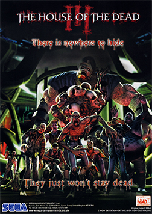
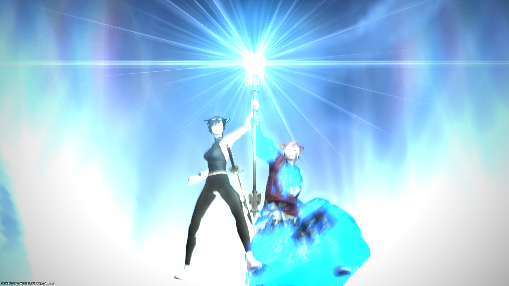
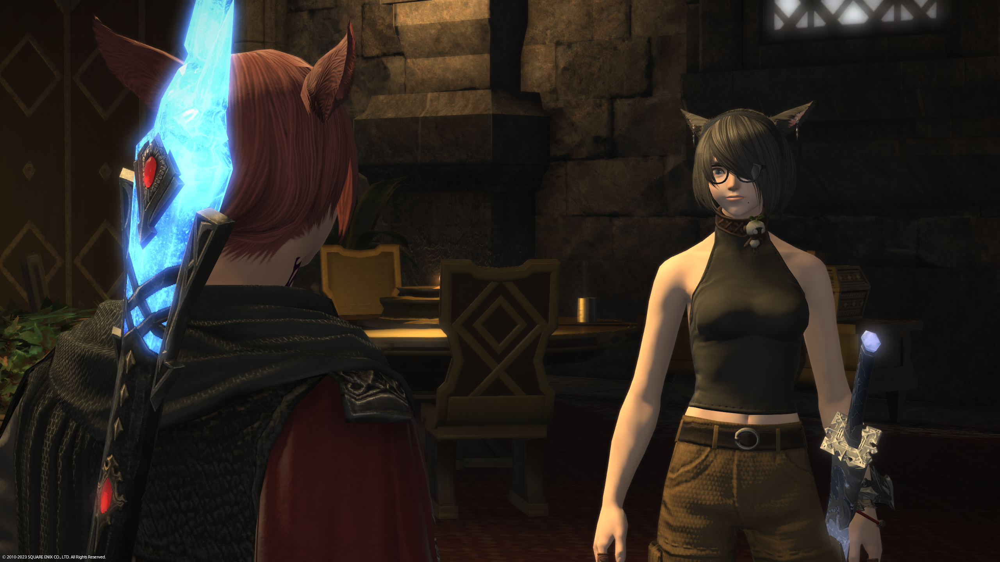

## Who am I? 

I am currently a sophomore in New York University, majored in computer science (planned to be an honored track).

### Huge fan of video/computer games.
I always dream of becoming a game designer some day. I played my first game when I was 6. (The House of the Dead III)  

Later on I played huge amount of games on tablet including various kind, like Final fantasy series, gameloft games... I played computer games as well, including MMORPG games like Final fantasy 14 (it is now my favorite), FPS like Overwatch and Rainbow 6 Siege, Fighting game like Street Fighter 6.

Games brings me so much and solidified my personlity. I enpowered me every moment when I got to depression -- That can also be said: "I cannot be the real myself without games." 