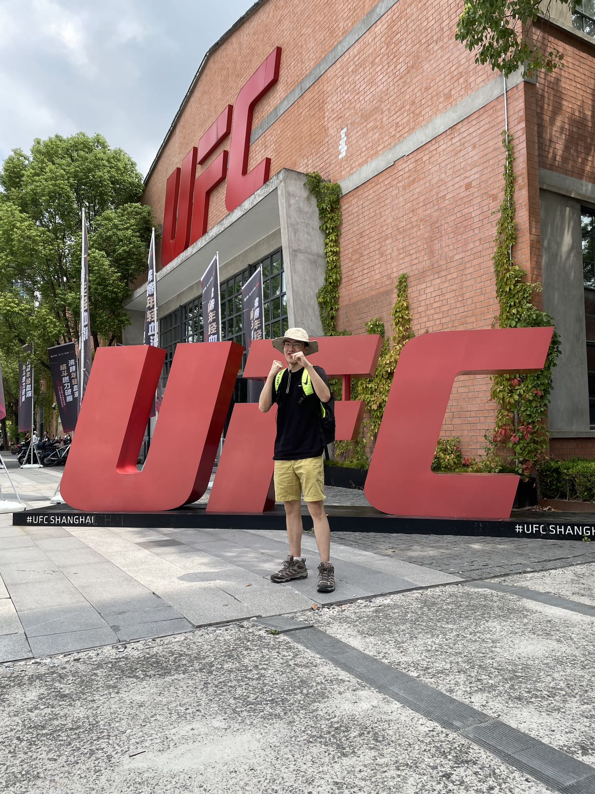

## Who am I? 

I am currently a sophomore in New York University, majored in computer science (planned to be an honored track). I am a traveller who've been to America, China, Australia, Swizerland, and Greece. 

### Huge fan of Computer games/ Computers 
I always dream of becoming a game designer some day. I played my first game when I was 6. (The House of the Dead III)  

Later on I played huge amount of games on tablet including various kind, like Final fantasy series, gameloft games... I played computer games as well, including MMORPG games like Final fantasy 14 (it is now my favorite), FPS like Overwatch and Rainbow 6 Siege, Fighting game like Street Fighter 6.

Games brings me so much and solidified my personlity. I enpowered me every moment when I got to depression -- That can also be said: "I cannot be the real myself without games." 

**Coding.**
Coding is the biggest hobby I found in my college life. The profound feeling of connecting the logics using spells are crazy. By being able to see the most intelligent hackers solving the most important problems are thrilling, and I am trying to pursue my career to become a **hacker**. I loved this feeling so much, which is completely another experience other than what games brings to me. Other than gaining insights and laying up building blocks of logics, there is growth of coding ability, and feelings of huge achievement. 

### Other than computers.
**UFC.** After one year's training of boxing last year, I became a fan of UFC(Ultimate Fighter championship). Stylebender, Weili Zhang, Covington, Oliveria and Makhachev are all my favorite fighters. 

**Philosophy.** I am a fan of philosophy, especially interested in problems related to value and metaphysics. 