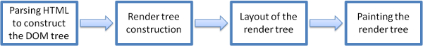
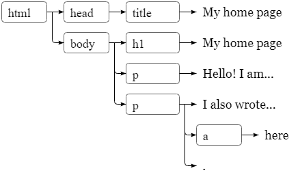

## HTML

HTML 就其本身也是一个工具集。

> - adds new semantic elements, such as video, nav, etc.
> - adds additional attributes, such as new input types - number, range, date, etc.
> - removes purely presentational elements, such as font and center
> - simplifies some markup, such as the introductory doctype line, which is now merely <!doctype html>
> - (this doctype tells browsers to render the document based on a standards compliant mode)

render过程大概是这样:


render HTML过程：很像硬件中断。

> - it will stop parsing the HTML (dealing with scripts blocks the HTML parsing process)
> - it'll download the script (if applicable)
> - …then run the script
> - and finally, go back to parsing the document

加入js的方式很简单：

```html
// 1
<script src="main.js"> </script>

// 2
<script> 
var x = 10;
alert(x);
</script>

<button onclick="alert('hello!');>Say hello</button>
```


## DOM !! 
首先，我们可以把写的HTML看作是一个骨架。层层包裹的html就是一个树数据结构。


**DOM**是一个js用户可以用来和html结构交互的一个对象，一个data structure.
> * it's language independent! (…it's not tied to JavaScript) and cross platform
> * the DOM is a fully object-oriented representation of a web page
> * it provides a structured representation of the document and defines the way that the document can be accessed programmatically
> * this access allow the reading and modification of a document's content, structure and even visual presentation
> * it's essentially the bridge between a web page and a programming language!

DOM + the programming language = 牛逼。 

### js的dom接口。
* global object：**document**！！！！！

然后这个object分三分；
* documentElement - the root of the tree; represents the HTML element (the tags that enclose the entire document)
* body - the body element
* head - the head element

