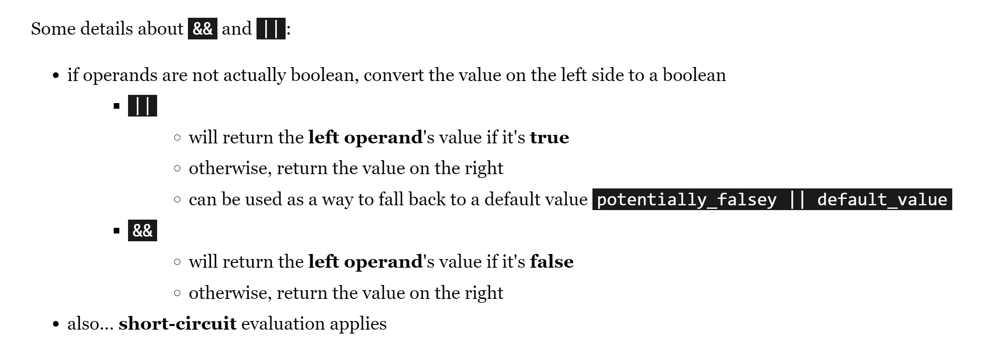
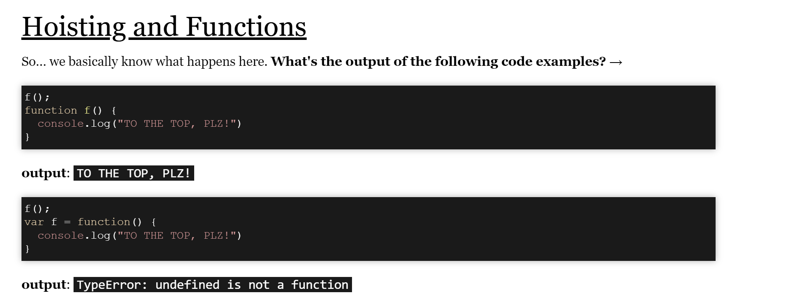
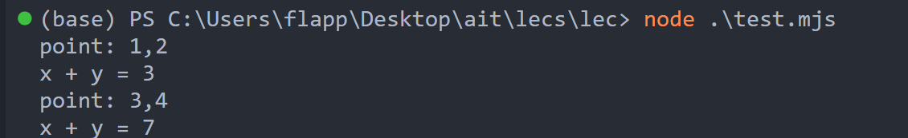
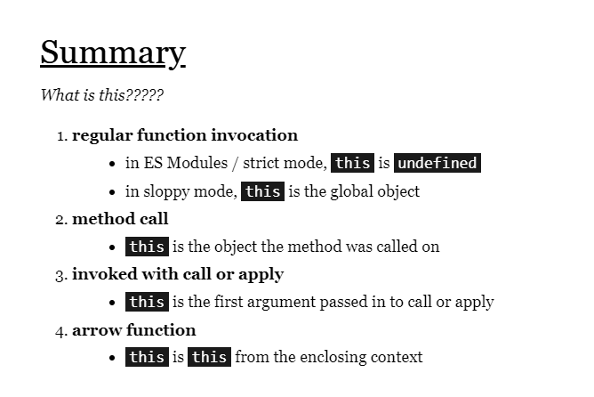
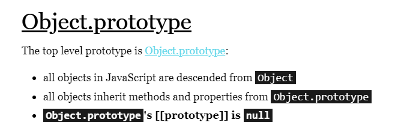
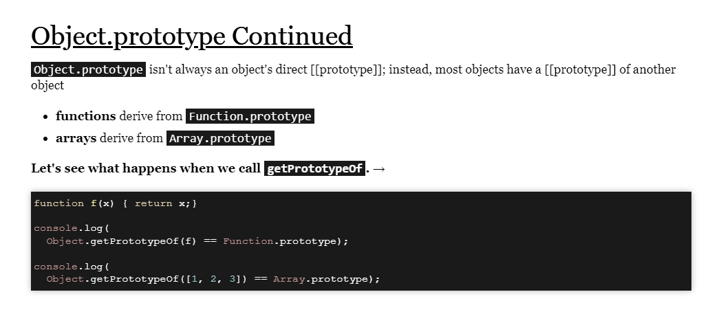

```js
typeof undefined → "undefined"
typeof null → "object"
typeof [1, 2, 3, 4] → "object"

NaN | 2 // evaluates to 2
Infinity & 10 // evaluates to 0
```

For bitwise operators… Nan, Infinity, and -Infinity are all converted to 0.

**string indexing的几种方法。**

```js
"emoji"[3];
```

**|| 和 &&**。

**注意以下几点**:

- short-circuit依然成立，但是返回的不是boolean type而是原先expression的值。

那么，哪些是对的，哪些是错的呢？

> 0, NaN, empty string (""), and undefined/null are false
> other values are true-ish



- 对于 A || B, if A 对，then 输出A（short circuit），如果两者都错输出B。
- 对于 A && B, if A 错，then 输出A（short circuit），如果两者都错输出B。

```js
> 5 - 6 || 2
-1
> 5 - 5 || 2
2
> false && 2
false
> 0 && 2
0
>
> "hello" || "goodbye"
'hello'
> "hello" && "goodbye"
'goodbye'
```

这个可以用于写default值。

```js
// we haven't seen objects yet, but you get the idea
const obj = { prop1: "a value" };
const val1 = obj.prop1 || "default value";
const val2 = obj.prop2 || "default value";
```

**check whether it is NaN**, using isNaN.


Function如果是传统地被declared了，那就是可以无视declare的位置。如果是variable，那就要注意定义在前面。

**Object.**

Accessing:

```js
const course = {
  name: "Applied Internet Technology",
  section: 8,
  undergraduate: true,
};
console.log(course.name);
console.log(course["name"]);
```

Destructuring:

```js
const points = [
  [1, 2],
  [3, 4],
];
// note that there would normally be curly braces wrapping the console.log
// but the quiz feature uses curly braces as special characters
// (note that this is still syntactically correct)
for (const p of points) {
  console.log(`point: ${p}`);
  const [x, y] = p;
  console.log(`x + y = ${x + y}`);
}
```



## Function 

首先js铸币的地方 -- function只要被正规地declared了，那么它就会被完整地hoisted（也就是放到最上面。）

> This f() can be accessed.

```js
f(5);
function f(x) {
  console.log(x);
}
```

```js
let g = 7;
function f() {
  console.log(`g before ->`, g);
  g = 5;
  function g() {}
  console.log(`g after ->`, g);
}
f();
console.log(g);
```

Output：

> g before -> [Function: g]
> g after -> 5
> 7

因为在f里面，g这个variable name已经是function了，所以之后g = 5 改的也是local variable的g，而不是外面的g。

**Function's implicit params**. 
1. this (在后面有介绍)
2. arguments. (和我们在括号里用`...args`的作用一样。)
 


## HOF

```js
var numbers = [1, 2, 3];
function forEach(arr, action) {
  for (var i = 0; i < arr.length; i++) {
    action(arr[i]);
  }
}
// instead of just logging each number as is, log the square of ever number
forEach(numbers, function (arrayElement) {
  console.log(arrayElement * arrayElement);
});
 ```
这是foreach的implementation。HOF比较精妙的一点是：abstraction。你所designed passed-in function完全不知道有一个foreach function在用它。其实这和unix的哲学很像。

**ForEach作为array obj的inheritance的性质。**因为object inheritance是js库中实现的，所以它自动support一些功能，比如，下面的logArrayElements你可以pass in一些支持的参数，顺序依次是每个looping的element，index，和array自己。注意：顺序一定被遵守。

``` js

const logArrayElements = (e, i,  array) => {
  console.log(`The given arr -> ${array}`);
  console.log(`a[${i}] = ${e}`);
};

// Notice that index 2 is skipped, since there is no item at
// that position in the array.
[2, 5, , 9].forEach(logArrayElements);

// Output
// The given arr -> 2,5,,9
// a[0] = 2
// The given arr -> 2,5,,9
// a[1] = 5
// The given arr -> 2,5,,9
// a[3] = 9

 ```

**Reduce**，用来把一个function按顺序压缩。

```js
// prototype of reduce we've invented.
function reduce(arr, combine, start) {
  let accum = start;
  arr.forEach(function (ele) {
    accum = combine(accum, ele);
  });
  return accum;
}

const numbers = [-5, -2, -1, -10, -3];

// accum saved as resulst of the minimun of all eles we've met.
console.log(
  reduce(
    numbers,
    // 这里是reduce的callback function，
    function (accum, ele) {
      if (accum < ele) {
        return accum;
      } else {
        return ele;
      }
    },
    numbers[0]
  )
);
```

平时我们就这么用。`[2, 5, 4, 3,].reduce(function(product, currentNumber ){
	return product * currentNumber;
}, 1);`. This is the built-in func.

```js
const debuggedParseInt = (oldFn) => {
  // now we send ...args  => like argv in C.
  // retunn this new function
  return (...args) => {
    constole.log("u pass in", args);
    return oldfn(...args);
  };
};
```

**Decorator**: just run as original function with original args and accompaneid with some extra "customized features". Like above, is logging.

log时间。
``` js
  function logExecutionTime(f) {
	return function(arg) {
		console.time('function timing');
		const val = f(arg);
		console.timeEnd('function timing');
		return val; 
	};
}

function wasteTime(limit) { for(let i=0;i < limit; i++) { }}
wasteTime = logExecutionTime(wasteTime);
wasteTime(5000000);
 ```
但是如果pass in function是有多个参数的怎么办？ 
``` js
  function logExecutionTime(f) {
	return function(...args) {
		console.time('function timing');
		const val = f(...args);
		console.timeEnd('function timing');
		return val; 
	};
}

function wasteTime2(start, limit) { 
	for(let i = start; i < limit; i++) { } 
}
wasteTime = logExecutionTime(wasteTime2);
wasteTime(-5000000, 5000000);
 ```
ans：直接上spread operator, 写wrapper的时候，里面带入的function 我们直接给他传入一个array的参数```...args```


One cache example of decorator. This decorator cached result of functions with the given arguments.

js has local variable stack. When same function is called, then all local variables are retrieved. That's why cache declared locally can work.

```js
function cachify(oldfn) {
  const cache = {};
  const newfn = function (...args) {
    console.log(`cache called`);
    const k = JSON.stringify(args);
    if (Object.hasOwn(cache, k)) {
      console.log(`cache hit`);
    } else {
      console.log(`cache miss`);
      const returnval = oldfn(args);
      cache[k] = returnVal;
      console.log(`cache miss: return val saved`);
    }
    return cache[k];
  };
  return newfn;
}
```


综合运用。
``` js
 const cards = [
  { suit: "♦", face: "4" },
  { suit: "♠", face: "J" },
  { suit: "♠", face: "Q" },
  { suit: "♣", face: "Q" },
  { suit: "♠", face: "2" },
  { suit: "♦", face: "7" },
  { suit: "♥", face: "K" },
];

const length = cards.reduce((size, val, index, arr) => {
    if ( ['K', 'Q', 'J'].indexOf(val.face) !== -1) 
        return size + 1
    else 
        return size;  
}, 0)

console.log(length)
 ```
算face k q j的个数。


```js 
const players = [
  { lastName: "Duncan", team: "Spurs", FGM: 5, FGA: 10 },
  { lastName: "Parker", team: "Spurs", FGM: 7, FGA: 18 },
  { lastName: "Ginobili", team: "Spurs", FGM: 6, FGA: 11 },
  { lastName: "James", team: "Heat", FGM: 10, FGA: 21 },
  { lastName: "Wade", team: "Heat", FGM: 4, FGA: 12 },
  { lastName: "Bosh", team: "Heat", FGM: 6, FGA: 14 },
];

function inTeam(teamname) {
    // This is the funciton that filter gonna takes in 
    return function (player) {
        return player.team === teamname; 
    }
}

function shootingPercentage(player) {
  return player.FGM / player.FGA;
}

function average(arr) {
  return arr.reduce((curTotal, num) => curTotal + num, 0) / arr.length;
}

console.log(average(players.filter(inTeam("Heat")).map(shootingPercentage)).toFixed(2));
console.log(average(players.filter(inTeam("Spurs")).map(shootingPercentage)).toFixed(2));
 ```
算马刺和热火球员的命中率。

function也有自己的object property和method。
其中一个是**base**。它take in一个argument然后fix它。
``` js 
const areaTriangleBase100 = areaTriangle.bind(null, 100);

// call with only one argument now
console.log(areaTriangleBase100(3));
 ```

**有关spread和rest operator**. ```...```这个符号可以是rest可以是spread，取决于后面跟的variable是什么。

如果后面跟的是一个array，那么大概率这个```...```是spread，当它passin function的时候，他就会变成一串arguments。

如果是

function (a, b, ... args)， 那么就是会把剩下的arguments变成arr塞进args里。

## 有关export。
```js 
import './moduleA.mjs'
console.log('between'
import './moduleB.mjs'
 ```
顺序还是A B 然后between，因为import的代码先执行。

例子
``` js
// mymodule.mjs
const a = 1;
const func = () => 2; 
export {a, func}

// main.mjs
import {func, a} from './test.mjs';
console.log(func());  
console.log(a);  

 ```

## 有关object和inheritance和this
**method**. object的method也只是一个property而已。

**This**. Calling a function is called as a method - such as object.someFunction() — the special variable this in its body will reference the object that the method was called on. What will be printed out in the code below?
``` js 

function speak() {
	if(this.nationality == "Japanese") {
		console.log("nyan");
	} else if (this.nationality == "American") {
		console.log("meow");
	} else {
		console.log("default cat noise");
	}
}
const japaneseCat = {nationality:"Japanese", speak:speak};
const americanCat = {nationality:"American", speak:speak};
japaneseCat.speak();
americanCat.speak();
 ```

1. 单单的**regular call**```speak()```那么```this```会是```undefined```，因为在ES module里，this在method之外都是**undefined**。
2. In **methods**, this refers to the object that the method was called on
3. 在function自带的method `call apply`中，this就是自带的第一个参数。
4. 如果this在arrowfunction中被invoked了，那么他所指的scope是arrowfunction被invoke的scope。

一个疑问：如果在constructor中创建method和在prototype中创建method有什么区别？那就是在之后用contructor创建的对象中 -> 如果你用了prototype创建的，你依然可以用prototype的method。

**function作为对象本身的method**。js提供了一些method的defaultmethod -- ```call apply```，用这个可以实现一样```obj.method```的功能，通过 ```method.call(obj, argv)```的方式。
``` js
function speak(how, toWho) {
    const d = {Japanese: "nyans", American: "meows"};
    const noise = d[this.nationality] || "default cat noise";
    console.log(noise, how, 'at', toWho);
}
const cat = {nationality: "American"}

speak.apply(cat, ['loudly', 'you']);
speak.apply({}, ['softly', 'me']);
 ```


**arrow function中的this和regular function的this**
``` js
// 在这里this实在内部的function被引用了，而内部的this是undefined，所以会出错。
const counter = {numbers: [1, 2, 3, 4], animal:'owl'};

counter.count = function() {
    this.numbers.forEach(function(n) {
        console.log(n, this.animal + (n > 1 ? 's' : ''));
    });
};
counter.count();
// arrow function 可以引用的this是它被创造的scope的this，也就是count method中的this。
// ----------------------------------------------------------------------
const counter = {numbers: [1, 2, 3, 4], animal:'owl'};

counter.count = function() {
    this.numbers.forEach((n) => {
        console.log(n, this.animal + (n > 1 ? 's' : ''));
    });
};
counter.count();

// ---------------------------------------------------------------------------
// 这里的foo output是undefined，因为这里的this引用的是foo的scope，which is undefined。所以会报错。
function foo() {
    const bar = (x) => { console.log(this.qux); };
    bar();
}
foo();


```


自己的几个小实验。
``` js 
// 这两种都正常return bob了。
const obj = { name: "bob", callname: function f(){
    console.log(this.name);
}};
obj.callname()


function f(){
    console.log(this.name);
}
const obj = { name: "bob", callname: f};
obj.callname()

// 以下两种都不正常 -- return undefined reference error
// 还是取决于是不是arrow function了。
const f = () => {
    console.log(this.name);
}
const obj = { name: "bob", callname: f};
obj.callname()

const obj = { name: "bob", callname: () => {
    console.log(this.name);
}};
obj.callname()
 ```

**prototype**. 




**lec notes**. 
`push in arr`是对的，因为它确实有；但是如果是用`obj.hasown`其实没有，因为他是被定义在arr的prototype里的-- `Array.prototype`

`Object.getPrototypeof(Array.prototype) === Object.prototype`
which means -> arr =====inherited from==> Array.prototype ===inherited from==> Object.prototype 
 
`console.log(Object.getPrototypeOf(Array.prototype) == Object.prototype)`
这是对的，说明array的prototype就是object prototype。

一些例子：
`Object.getPrototypeOf(f) === Function.prototype`  ====> true

一个trick。`Object.craete(null)`会直接创造Object.prototype上面的。导致了他连Object.prototype的tostring都没有。

``` js
// our "template" object
const protoWerewolf = { 
	description: 'hairy', 
	howl: function(thing) {
		console.log('The werewolf howls at the ' + thing + '.');
	}
};

// make a new werewolf with Object.create
const sadWerewolf = Object.create(protoWerewolf);
sadWerewolf.mood = 'sullen';
sadWerewolf.howl('moon');
 ```

**constructor.**
``` js
// This is the Werewolf constructor . 
function Werewolf(mood) {
    this.mood = mood;
}
Werewolf.prototype.howl = function(thing) {
	console.log('The werewolf howls at the ' + thing + '.');
}

// This is the SpaceWerewolf constructor . 
function SpaceWerewolf(mood) {
    // similar to calling super() 
    Werewolf.call(this, mood);
}
// set SpaceWerewolf's prototype to Werewolf prototype 
SpaceWerewolf.prototype = Object.create(Werewolf.prototype);
SpaceWerewolf.prototype.constructor = SpaceWerewolf;

const w = new SpaceWerewolf('in space');
console.log(w.mood);
console.log(w.constructor);

 ```

`Werewolf.prototype`是所有用Werewolf Constructor来创造的原型。上面的例子给prototype加入了一个prototype的method，js会在runtime中向上寻找这个method，如果obj自己没有的话。就像arr.push一样。

**class**
js真的是一个构思语言。class的type居然是Function。

note：如果使用new 创建出来的instance，他的prototype是那个function的name/ 或者是那个class的name
``` js
class Werewolf{
    constructor (mood) {
        this.mood = mood; 
    }
    howl() {

    }
}
const sadWolf = new Werewolf('sad');
console.log(Object.hasOwn(Werewolf.prototype, 'howl'))

// return true! 
 ```
proves 其实是Werewold hold的howl这个function而是不是object自己。

``` js
class Werewolf{
    constructor (name, mood) {
        this.name = name
        this.mood = mood; 
    }
    howl() {

    }
}

function f (a) {
    console.log(`lalala ${this.name} is called\n`)
}
const sadWolf = new Werewolf('bob', 'sad');
// bind 就是返回一个已经把f的对象绑定的function。【
f.bind(sadWolf)(123);

```