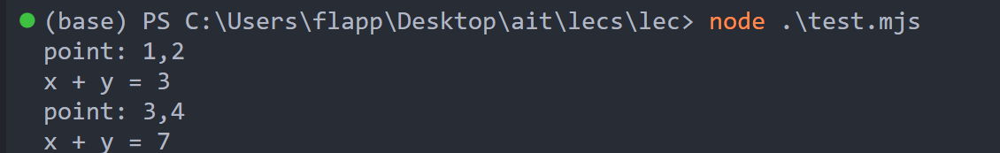

# 用于记录很刁钻的js语法/ other知识。

```js
typeof undefined → "undefined"
typeof null → "object"
typeof [1, 2, 3, 4] → "object"

NaN | 2 // evaluates to 2
Infinity & 10 // evaluates to 0
```

For bitwise operators… Nan, Infinity, and -Infinity are all converted to 0.

**string indexing的几种方法。**

```js
"emoji"[3];
```

**|| 和 &&**。

**注意以下几点**:

- short-circuit依然成立，但是返回的不是boolean type而是原先expression的值。

那么，哪些是对的，哪些是错的呢？

> 0, NaN, empty string (""), and undefined/null are false
> other values are true-ish


- 对于 A || B, if A 对，then 输出A（short circuit），如果两者都错输出B。
- 对于 A && B, if A 错，then 输出A（short circuit），如果两者都错输出B。

```js
> 5 - 6 || 2
-1
> 5 - 5 || 2
2
> false && 2
false
> 0 && 2
0
>
> "hello" || "goodbye"
'hello'
> "hello" && "goodbye"
'goodbye'
```

这个可以用于写default值。

```js
// we haven't seen objects yet, but you get the idea
const obj = { prop1: "a value" };
const val1 = obj.prop1 || "default value";
const val2 = obj.prop2 || "default value";
```

**check whether it is NaN**, using isNaN.


Function如果是传统地被declared了，那就是可以无视declare的位置。如果是variable，那就要注意定义在前面。

**Object.**

Accessing:

```js
const course = {
  name: "Applied Internet Technology",
  section: 8,
  undergraduate: true,
};
console.log(course.name);
console.log(course["name"]);
```

Destructuring:

```js
const points = [
  [1, 2],
  [3, 4],
];
// note that there would normally be curly braces wrapping the console.log
// but the quiz feature uses curly braces as special characters
// (note that this is still syntactically correct)
for (const p of points) {
  console.log(`point: ${p}`);
  const [x, y] = p;
  console.log(`x + y = ${x + y}`);
}
```



## 自己梳理，一些铸币js语法。

**Function argument objects.** Function自身有一个argument object作为default。
```js
const f = function(... a) {
    console.log(arguments);
    console.log(a);
}

f(1, 2, 3);

// output: [Arguments] { '0': 1, '1': 2, '2': 3 } 
// [ 1, 2, 3 ]
// 
 ```
在传入参数的时候如果我们不知道具体参数，那么就可以用spread syntax来access argument作为


**Hoised Functions**。function只要被正规地declared了，那么它就会被完整地hoisted（也就是放到最上面。）

> This f() can be accessed.

```js
f(5);
function f(x) {
  console.log(x);
}
```

```js
let g = 7;
function f() {
  console.log(`g before ->`, g);
  g = 5;
  function g() {}
  console.log(`g after ->`, g);
}
f();
console.log(g);
```

Output：

> g before -> [Function: g]
> g after -> 5
> 7

因为在f里面，g这个variable name已经是function了，所以之后g = 5 改的也是local variable的g，而不是外面的g。

## HOF

```js
var numbers = [1, 2, 3];
function forEach(arr, action) {
  for (var i = 0; i < arr.length; i++) {
    action(arr[i]);
  }
}
// instead of just logging each number as is, log the square of ever number
forEach(numbers, function (arrayElement) {
  console.log(arrayElement * arrayElement);
});
 ```
这是foreach的implementation。HOF比较精妙的一点是：abstraction。你所designed passed-in function完全不知道有一个foreach function在用它。其实这和unix的哲学很像。

**ForEach作为array obj的inheritance的性质。**因为object inheritance是js库中实现的，所以它自动support一些功能，比如，下面的logArrayElements你可以pass in一些支持的参数，顺序依次是每个looping的element，index，和array自己。注意：顺序一定被遵守。

``` js
const logArrayElements = (e, i,  array) => {
  console.log(`The given arr -> ${array}`);
  console.log(`a[${i}] = ${e}`);
};

// Notice that index 2 is skipped, since there is no item at
// that position in the array.
[2, 5, , 9].forEach(logArrayElements);

// Output
// The given arr -> 2,5,,9
// a[0] = 2
// The given arr -> 2,5,,9
// a[1] = 5
// The given arr -> 2,5,,9
// a[3] = 9

 ```
还有一个poker的例子。
``` js 
var generateCards = function() {
	var suits = ['♠','♥','♦','♣'],
        faces = ['2', '3', '4', '5', '6', '7', '8', '9', '10', 'J', 'Q', 'K', 'A'],
        cards = [];
	suits.forEach(function(suit) {
		faces.forEach(function(face) {
			cards.push({'suit':suit, 'face':face}); 
		});
	});
	return cards;
};
console.log(generateCards());
 ```

**map。**用来把每一个element通过callbackfn的方式生成一个新arr并返回。

**Reduce**，用来把一个function按顺序压缩。

```js
// prototype of reduce we've invented.
function reduce(arr, combine, start) {
  let accum = start;
  arr.forEach(function (ele) {
    accum = combine(accum, ele);
  });
  return accum;
}

const numbers = [-5, -2, -1, -10, -3];

// accum saved as resulst of the minimun of all eles we've met.
console.log(
  // reduce作为一个obj的method，它只需要takein两个args，
  // 1. callback
  // 2. initial value. 
  // mark：这里只是因为用了自己的reduce所以第一个param pass的是numbers。
  reduce(
    numbers,
    // 这里是reduce的callback function
    // 按顺序take in的参数有: 
    // accumulator
    // The value resulting from the previous call to callbackFn. On the first call, its value is initialValue if the latter is specified; otherwise its value is array[0].

    // currentValue
    // The value of the current element. On the first call, its value is array[0] if initialValue is specified; otherwise its value is array[1].

    // currentIndex
    // The index position of currentValue in the array. On the first call, its value is 0 if initialValue is specified, otherwise 1.

    // array
    // The array reduce() was called upon.
    function (accum, ele) {
      if (accum < ele) {
        return accum;
      } else {
        return ele;
      }
    },
    numbers[0]
  )
);
```

平时我们就这么用。`[2, 5, 4, 3,].reduce(function(product, currentNumber ){
	return product * currentNumber;
}, 1);`. This is the built-in func.

another ex of reduce：
``` js
const nums = [-3, -2, 2, 3, 4];
const x = nums
  .filter((n) => n % 2 === 0)
  // 1st arg accmu: res; 2nd arg elemtn: n; 
  // renew res as current smallest value we've met, start it as Infinity. 
  // so it return -2. 
  .reduce((res, n) => (n < res ? n : res), Infinity);
console.log(x);

 ```

**Decorator**: Basically a more complex wrapper function over the original function with original args and accompaneid with some extra "customized features". ex:

```js
const debuggedParseInt = (oldFn) => {
  // now we send ...args  => like argv in C.
  // retunn this new function
  return (...args) => {
    constole.log("u pass in", args);
    return oldfn(...args);
  };
};
```

One cache example of decorator. This decorator cached result of functions with the given arguments.

js has local variable stack. When same function is called, then all local variables are retrieved. That's why cache declared locally can work.

```js
function cachify(f) {
    const cache = {};
    return function(...args) {
        if(cache.hasOwnProperty(x)) {
            console.log(`Cache hit!`)
            return cache[x];
        } else {
            console.log(`Cache miss!`)
            const res = f(x);
            cache[x] = res;
            console.log(`Cache stored!`)
            return res;
        }
    };
}
const cachedSquare = cachify(function(n) { return n * n; });
const res = cachedSquare(8);
const res = cachedSquare(8);
console.log(res);
```

