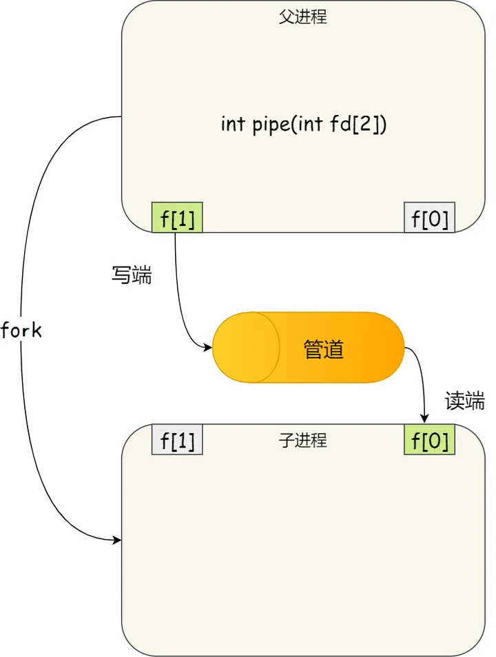

### *2024/01/10 凌晨1点 -- 旅途的开始~*

从寒假一开始一直在照顾朋友和玩，一直没心思干些正事，不过想了想从暑假开始好像就一直在给自己上压力，还是好好休整一段时间（半个月大概）吧。不过最近突然又想做做有关操作系统的学习了。一是感觉没有新知识的输入感觉就很不爽，二是下个学期就要开始学了，walfish的os课还是相当heavy的。

前段日子一直在肝星铁，真的是做的不错的游戏，直接给爷干沉迷了。明日就要出发去爬雪山了，在上学期就兜兜转转想要把这门课的实验写了但是还是都花时间在体系结构上了，虽然我的61c还是没有跟完，但是自己也跟着nyu的课造了些最基础的轮子，之后有空再把61c的lab给刷了吧。我想寒假后半段（1.13 - 1.22）是一个绝好的时机开始学习6.s081。稍微有点担心的是debug的事情，cs61c的很多课因为没有合理的debug方式我都是头铁一步一步看过去的，没有用gdb这种软件，不过据说很多blog都写了一些debug的手法和思路。我觉得自己经历过了思考之后不要头铁，尤其是在这种没有助教的情况下，自己能看懂并且自己手写一遍就可以变强，但是不要懒。**懒**才是最傻逼的，而不是看别人的代码。

我的学法大概是：

**目的**：把所有11个lab写完。

**方法**：第一次自己写，跑不动自己先想，然后debug，前三步不停轮回几遍，实在不行就看题解。看完题解后自己还是白纸状态写一遍，写完跑不动再看题解。

**心态**：快速实践，快速失败，踏实的思考。

想的是目前先用6.s081的知识来拓宽自己的眼界，之后掌握正确的debug手法之后就可以自己在下学期独立0学好os和cs162了，数据库的事情之后再说吧，不急。现在先火速开始6.s081吧，事不宜迟。

## 1/15 
今日发生了一些小冲突，就看了lec1
一些感悟：

* 重要的是内心得有这个清晰的想法 -- 自己写的所有c代码也都是instruction被存在了内存里。很多魔法操作（比如fork就是把一模一样的instruction load进新的physical mm space里）。

* shell也不过是一串instruction，深刻理解到了shell也不过是一个user app的事实 -- 我们若是直接在其中调用exec那会直接覆盖了内存空间，于是shell就会消失， 所以我们才先fork再exec。

* shell中的redirect很神奇是吧。也只不过是把原本（fd = 1）的stdout换成了要输入的文件，然后echo程序做的事情也就是把fd0 不断地写东西

echo.c 
``` c
int
main(int argc, char *argv[])
{
  int i;

  for(i = 1; i < argc; i++){
    write(1, argv[i], strlen(argv[i]));
    if(i + 1 < argc){
      write(1, " ", 1);
    } else {
      write(1, "\n", 1);
    }
  }
  exit(0);
}

 ```
这里就是不断地从cmdline 除了echo之外的字符串开始写入到fd为1的bytestream中。

明日打算把lab1写了。

## 1/16 
pipe syscall的作用是创建两个fd，一个头用来读一个用来写。

```c 


#include "kernel/types.h"
#include "user/user.h"

// pipe2.c: communication between two processes

int
main()
{
  int n, pid;
  int fds[2];
  char buf[100];
  
  // create a pipe, with two FDs in fds[0], fds[1].
  pipe(fds);

  pid = fork();
  if (pid == 0) {
    write(fds[1] , "this is pipe2\n", 14);
  } else {
    n = read(fds[0], buf, sizeof(buf));
    write(1, buf, n);
  }

  exit(0);
}
 ```

我们常识的认知是读与写是分开的，但实际上是一个fifo的循环队列，若是父子进程同时读写，先后次序便不是固定的。

因此在写pingpong的时候，最好的方法是创建两个管道。

父 write --------> pipe1 -------> read 子

子 write --------> pipe2 -------> read 父

子进程通过复制父进程的fd table来得到已经在父进程实现的管道。



pipe的一些性质。
1. 我一开始粗浅的认识以为pipe如果一方先读了另一方后写怎么办？难道不会写入一些奇怪的数据吗？答案是：linux中循环队列的实现确保了读指针永远不会超过写指针。如果“read 1 byte”先在进程A中发生了，那么他会等待另一端的write进入，这样永远可以保证每一个byte都是一个一个传进去的。

2. pipe的读端会等write端如果没有啥可以读的，如果所有write端都被关闭了，那么进程会监测到write端的变化，于是read端会返回0
ans: 
``` c
#include "kernel/types.h"
#include "kernel/stat.h"
#include "user/user.h"
#include "kernel/fs.h"

#define WRITEEND 1
#define READEND 0
int main(int argc, char *argv[])
{
    // local convention: p[1] is write end ; p[0] is read end
    int pp2c[2]; // write p -> read c
    int pc2p[2]; // write c -> read p
    int status; 
    pipe(pp2c);
    pipe(pc2p);
    char thatbyte;
    // c
    if (fork() == 0) {
        close(pp2c[WRITEEND]);
        close(pc2p[READEND]);

        read(pp2c[READEND], &thatbyte, 1);
        printf("%d: received ping\n", getpid());
        write(pc2p[WRITEEND], "a", 1);

        close(pc2p[WRITEEND]);
        close(pp2c[READEND]);
        exit(0);
    // p  
    } else {
        // write p -> read c
        close(pc2p[WRITEEND]);
        close(pp2c[READEND]);
    
        write(pp2c[WRITEEND], "a", 1);
        read(pc2p[READEND], &thatbyte, 1);
        printf("%d: received pong\n", getpid());
        wait(&status);

        close(pp2c[WRITEEND]);
        close(pc2p[READEND]);
    }
    exit(0);
}
 ```

Primes中令我困惑的只有一个问题。在最后reap children的时候先退出管道的读写端总是最safe的选择。我猜测我前几次失败的原因是：先reap children了，导致父进程后续退出写端的时候系统发现这个管道缺了一个读端（因为child的读端先被reap了）。

ans：
``` c
#include "kernel/types.h"
#include "kernel/stat.h"
#include "user/user.h"
#include "kernel/fs.h"

// primes needs recursion since it needs n-generation processes created
#define WRITEEND 1
#define READEND 0
void sieve(int pipe_in[2])
{
    // This close syscall is put here but not in below function is because 
    // we need to ensure the pipe that first call the function does close as well. 
    close(pipe_in[WRITEEND]);
    int n, num, status;
    // read if encountered 0, then there is no more numbers needs sieving, then we quit.
    if (read(pipe_in[READEND], &num, sizeof(int)) != sizeof(int)){
        exit(0);
    }

    // if not exited, the first num is prime, we print
    printf("prime %d\n", num);
    int pipe_out[2];
    pipe(pipe_out);
    // send number that can pass the sieve to pipe_out

    // child 
    if (fork() == 0)
    {
        sieve(pipe_out); 
    }
    // parent
    else
    {
        close(pipe_out[READEND]);
        // stops reading until there is no more. 
        while (read(pipe_in[READEND], &n, sizeof(int)) == sizeof(int))
        {
            if (n % num == 0) continue;
            else {
                write(pipe_out[WRITEEND], &n, sizeof(int));    
            }
        }
        close(pipe_out[WRITEEND]);
        // wait must be put after close(pipe_out[WRITEEND]); is executed otherwise pipe_out cannot be closed since
        // child has already been reaped, pipe cannot be closed. 
        wait(&status);
        close(pipe_in[READEND]);
    }
    exit(0);
}

// main send num 2 - 35 to the first pipe_in 
int main(int argc, char *argv[])
{
    int status, i;
    int pipe_out[2]; 
    pipe(pipe_out);
    
    if (fork() == 0) {
        sieve(pipe_out);                
    } else {
        close(pipe_out[READEND]);
        for (i = 2; i <= 35; i++) {
            write(pipe_out[WRITEEND],&i, sizeof(int));
        }
        close(pipe_out[WRITEEND]);
        wait(&status);
    }
    exit(0);
}
 ```

**find**. 这题让我知道dir和file没有本质区别，他都是一串字节而已。以下是xv6 ls的实现。

``` c
#include "kernel/types.h"
#include "kernel/stat.h"
#include "user/user.h"
#include "kernel/fs.h"

// return formatted name of the path 
char*
fmtname(char *path)
{
  // size of formatted name 
  static char buf[DIRSIZ+1]; 
  // ptr 
  char *p;

  // Find first character after last slash.
  for(p=path+strlen(path); p >= path && *p != '/'; p--)
    ;
  p++;

  // Return blank-padded name.
  if(strlen(p) >= DIRSIZ)
    return p;
  memmove(buf, p, strlen(p));
  memset(buf+strlen(p), ' ', DIRSIZ-strlen(p));
  return buf;
}

void
ls(char *path)
{
  char buf[512], *p;
  int fd;
  struct dirent de;
  struct stat st;

  if((fd = open(path, 0)) < 0){
    fprintf(2, "ls: cannot open %s\n", path);
    return;
  }

  if(fstat(fd, &st) < 0){
    fprintf(2, "ls: cannot stat %s\n", path);
    close(fd);
    return;
  }

  switch(st.type){
  case T_FILE:
    printf("%s %d %d %l\n", fmtname(path), st.type, st.ino, st.size);
    break;

  case T_DIR:
    // I dont get it 
    if(strlen(path) + 1 + DIRSIZ + 1 > sizeof buf){
      printf("ls: path too long\n");
      break;
    } 
    strcpy(buf, path);
    p = buf+strlen(buf);
    *p++ = '/';
    while(read(fd, &de, sizeof(de)) == sizeof(de)){
      if(de.inum == 0)
        continue;
      memmove(p, de.name, DIRSIZ);
      p[DIRSIZ] = 0;
      if(stat(buf, &st) < 0){
        printf("ls: cannot stat %s\n", buf);
        continue;
      }
      printf("%s %d %d %d\n", fmtname(buf), st.type, st.ino, st.size);
    }
    break;
  }
  close(fd);
}

int
main(int argc, char *argv[])
{
  int i;

  if(argc < 2){
    ls(".");
    exit(0);
  }
  for(i=1; i<argc; i++)
    ls(argv[i]);
  exit(0);
}

 ```

最后的xargs有点被搞了。。大概思路知道但是c语言还是不太熟练导致我思来想去很久都没写出来。暂时先空着吧。。等我c语言熟悉一波再回来写。

## 1/17 
*摸鱼健身去了*

## 1/18 
syscall: 这个lab让你在内核代码中加入一些printf函数帮助你理解内核代码。

emmmmmmmmm感觉这个没啥好讲的，就是纯看hint写出来的，本质上也是找猫画虎的感觉。

之前的lecture说的有点理论了啊，只有做过这个lab才感觉自己对内核代码结构有了一个粗浅的认知。

*syscall lab完成*

# 1/19
