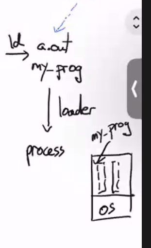
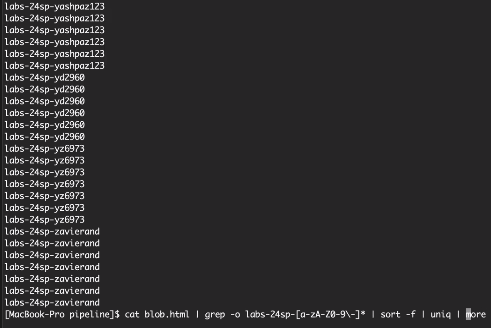
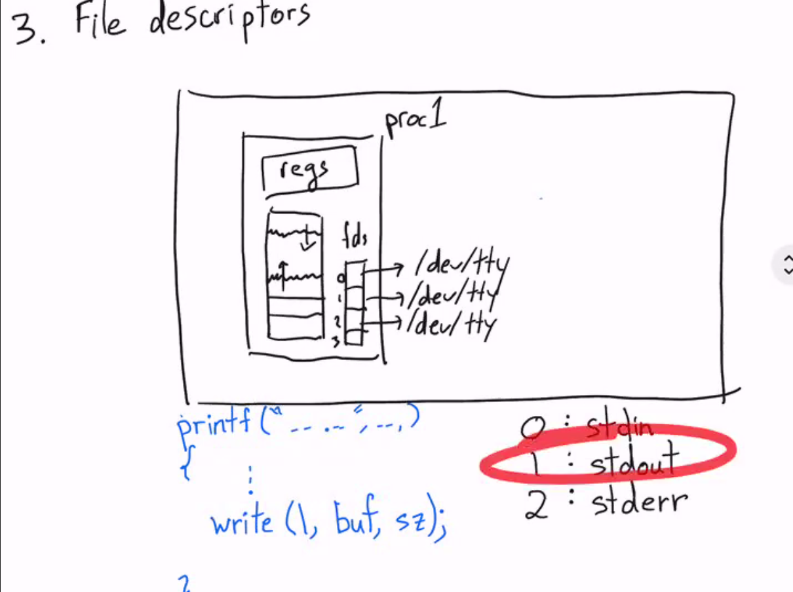
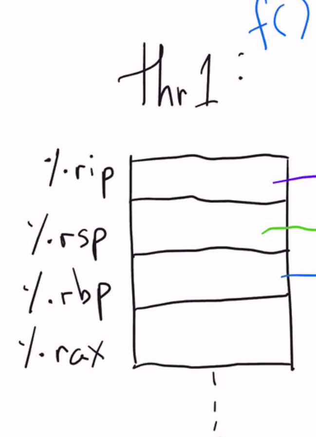
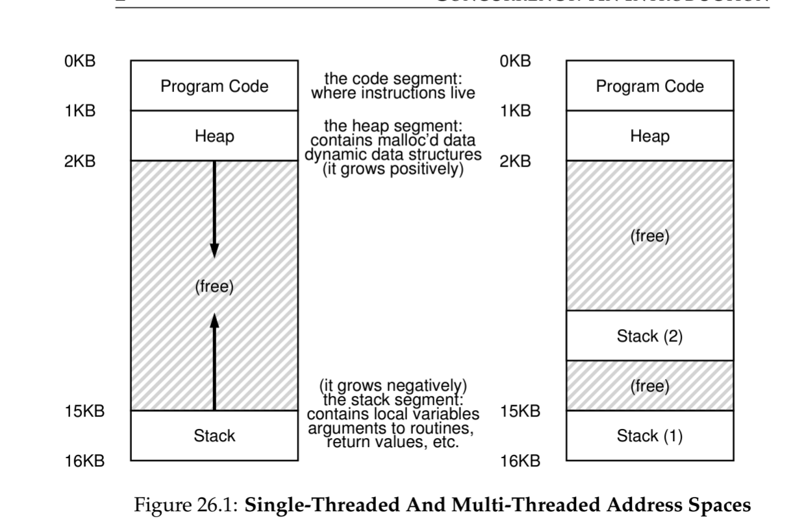
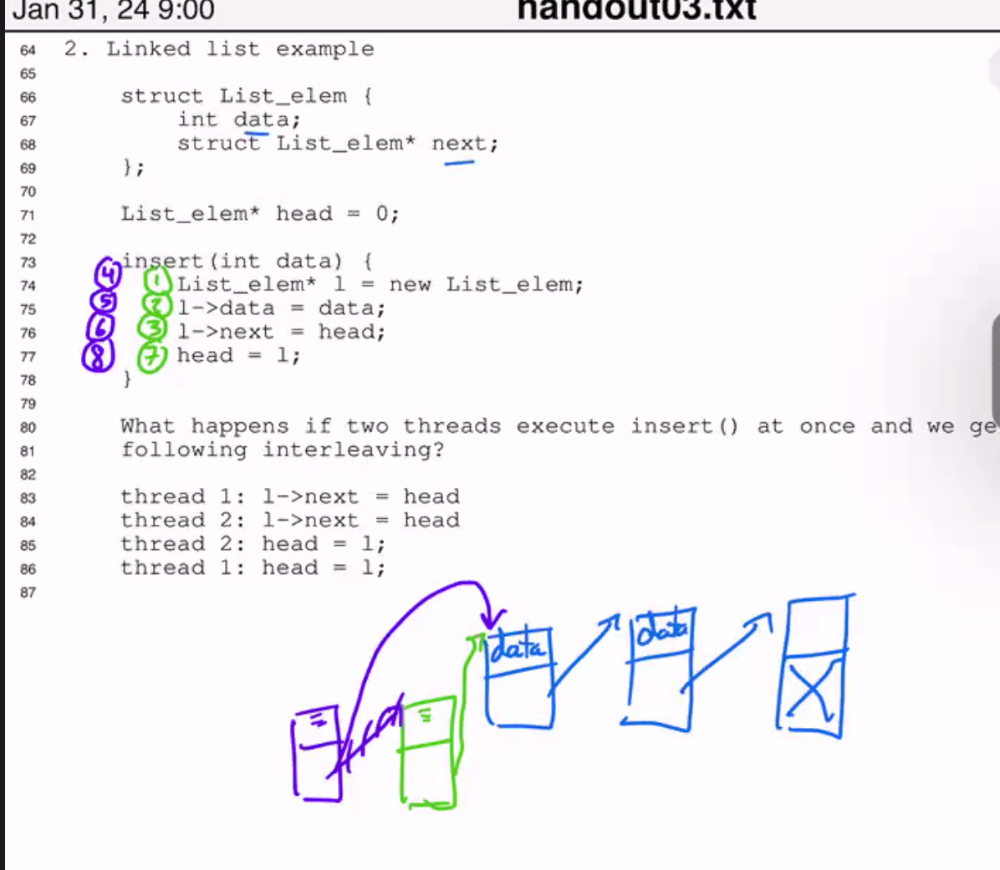
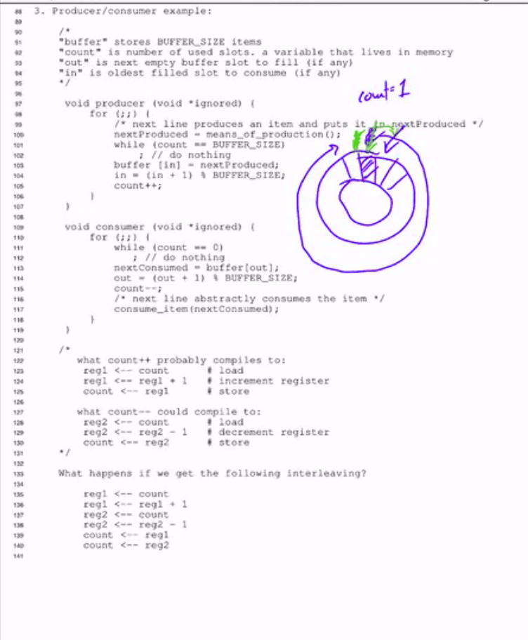
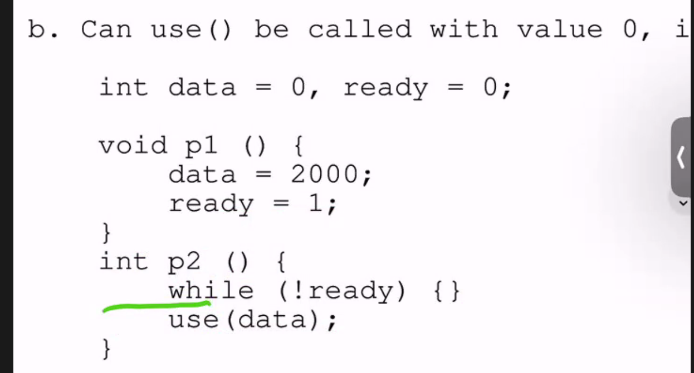

*这个log就不涉及具体lab实现和setup的detail了，我主要讲一些对设计理念/ 做lab/ 上课时候的一些感悟。*

如果有人感兴趣，可以看一下课程主页，作业的环境也几乎docker里配好的。
webpage: https://cs.nyu.edu/~mwalfish/classes/24sp/
lab： https://github.com/nyu-cs202/labs

## Lecture 1 
没讲啥特殊的, good intro =。=

walfish教授分别讲了 unix历史，为什么要学os/sys，以及os的一些构成。

walfish教授真的是非常热情。在讲为什么要学os/sys的时候几句话听的我像打了鸡血，我觉得相当值得分享在blog里。

1. Mike中间放了一张梗图。“我们都是要成为AI engineer的，为什么要学os?" mike说正是AI engineer需要和硬件交朋友。首先require大算力的应用只会越来越被需要，这个时候学会和真正的物理资源打交道是很有必要的，这种只会被无限的需求，因为在抽象层是充满了很多细节要被优化的。最要被替代的是那些只会照猫画虎调参的。这是从实用角度为什么要学os/sys的原因。**算力本身是电力，学会如何和算力打交道是大势所趋**，因为他相当基础且需求大，它很少会被替代。

2. hardware是ugly的，从软件工程师的角度。如果没有好的design，那么deal with hardware everyday无疑是一个劳动密集的工作。正是因为有这层抽象，让写码本身变得优雅了很多。这是从美学的角度的一个为什么学os的原因。它**简单，强大，优雅。**

3. os demonstrate了不少软件工程中重要的概念。比如scheduler是经典的调度问题/ 在和processes打交道的时候会接触到并行。这些都是在很多健壮的代码库中demonstrate的概念。

## Lecture 2

walfish课上直接把从src到变成byte load到os中的过程具象化了，有点像csapp中的第一章。

csapp:


理解process的方式有两种:
1. 从processor的方式：无非就是loader在跑一段exeutable file.
2. 从os的方式：os as resource manager会把processes当成一些instances来管理。

感觉walfish对cpu如何运行的方式有一种美学的鉴赏 -- 一切漂亮的app，自始至终都是一堆bytes boil down之后都是cpu的pc在不断地指向下一步然后执行。事实就是如此，这些设计是**优雅，强大**的。

之后所有的的课都是csapp chap3的内容. 

**一次相当quick的对sys的intro。** 


* stack：记住%rsp永远指向非空addr。
* local variable access:

## Lecture 3
重新想了一下，Caller和Callee的设计很精妙。相当于用了一层人类的简单的规约去释放了很多设计空间，因为正常的temporary variable不可能不用，不可能全用stack的空间；但是又不能全部都搞成temporary variable，这样要saved variable太几把多了。所以干脆搞一个规约，让一半去负责特定的东西，frame ptr，stack ptr这种，而且callee得负责回去的时候全部的值都不变，让另外一半register让callee随便用，但是回到caller的时候让caller自己搞定。


**一些bug**

从stack的角度想，这里的x被放在了stack上。而我们如果要send一个variable addr，我们either在别的frame上，either在heap上allocate。


**syscall**是一种**user space** transfer to **kernel space**的一种方式。

Mike甚至贴心的给了环境的描述，我哭死。我觉得这很好，因为就这简单的一张图基本上足够破除学生对环境的疑惑和恐惧了。


有多少个process？
$2^{10}$



> 现场装逼.jpg

## Lecture 4
**shell**.

```c 
while(1) {
    write() // just write the dollar sign 
}
 ```
Something to notice:
1. `>`的实现很简单，这其实踩在了file descriptor的肩膀上。只不过就是把fs的1的指针指向了新的file。注意write这个fsyscall完全不知道发生了什么。
2. 为什么fork和exec要隔离开来?为什么不直接有一个craeteprocess？难道这样不更方便？
TODO
3. `background`的实现也只不过是`fork和wait`的syscall的妙用。如果shell parse到了&，shell直接不等了，直接让execve在后台运行。

**File Descriptor.** 每个process都会维护一个VM，fs table（实际上是指向真正的fs table的ptr）和registers。
 ]


**pipeline**
```sh 
# 奇怪的脚本，赶紧试试吧！
$ :(){:1:&};: 
 ```
 
回顾一下pipeline和fork的调用知识。
```c 
#include "kernel/types.h"
#include "user/user.h"

// pipe2.c: communication between two processes

int
main()
{
  int n, pid;
  int fds[2];
  char buf[100];
  
  // create a pipe, with two FDs in fds[0], fds[1].
  pipe(fds);

  pid = fork();
  if (pid == 0) {
    write(fds[1] , "this is pipe2\n", 14);
  } else {
    n = read(fds[0], buf, sizeof(buf));
    write(1, buf, n);
  }

  exit(0);
}
 ```

**一点点proc**。OS的角度来看Proc就是一个一堆Proc表，每次booting的时候都用表里的信息来load进去，表如下，可以看看xv6的代码。

//TODO 可以看看xv6的代码。


**一点点thread**。Thread从proc的角度来看，其实和proc差不多。


每个thread都会维护自己的registers。


但是我有个小问题是：创建一个新的thread会创建出过呢更多的register，这个register只是在软件层被维护吗？like vm? （TODO）


Notes：Thread也会把当前stack的所有全部复制了。

当x是一个global的时候，两个线程同时都可以access到一个地址。

这里所以会造成线程写的问题。

## Lab2 
## Lab2 ls

Personal Note for lab2

What I learnt:

- I found the learning process of a function is to **testing** them using different arguments. And That's it and even more sophisticated syscall needs testing. Learning by playing is the most interesting and the most valuable when learning some apis.

- **不要恐惧**。很多时候依附于某种语言的特性都会有一些 trick 让原本的代码变得难读。不要着急，一步一步调试后你就能理解其中的优美之处。所以，多多阅读优秀的源码并且理解是可以比读书收获很多的。

- **磨刀不误砍柴工**。在我们既有的抽象层细细的去了解自己的工具。在 lab2 我们的工作是 base on system calls -> implement user functions. So understanding those tools deeply has value in it.

### Argument parsing

getopt();

```c
#include <unistd.h>
#include <stdlib.h>
#include <stdio.h>

int main(int argc, char *argv[])
{
    int flags, opt;
    int nsecs, tfnd;

    nsecs = 0;
    tfnd = 0;
    flags = 0;
    // opt receives character if success, receives if failing.
    while ((opt = getopt(argc, argv, "nt:")) != -1)
    {
        switch (opt)
        {
        case 'n':
            flags = 1;
            break;
        case 't':
            // optarg is set as the argument if optstring has specified : after a flag
            nsecs = atoi(optarg);
            tfnd = 1;
            break;
        default: /* '?' */
            // getopt will retunr ? if some wield pattern occurs.
            fprintf(stderr, "Usage: %s [-t nsecs] [-n] name\n",
                    argv[0]);
            exit(EXIT_FAILURE);
        }
    }

    printf("flags=%d; tfnd=%d; nsecs=%d; optind=%d\n",
           flags, tfnd, nsecs, optind);

    if (optind >= argc)
    {

        fprintf(stderr, "Expected argument after options\n");
        exit(EXIT_FAILURE);
    }

    // optind is the index in argv of the first argv-element that is not an option
    printf("name argument = %s\n", argv[optind]);

    /* Other code omitted */

    exit(EXIT_SUCCESS);
}
```

getopt_long();

```c
int main(int argc, char **argv)
{
    int c;
    int digit_optind = 0;

    while (1)
    {
        // set optind to 1 if it is not set
        int this_option_optind = optind ? optind : 1;
        int option_index = 0;
        // this struct maps long options into int 0.
        static struct option long_options[] = {
            {"add", required_argument, 0, 0},
            {"append", no_argument, 0, 0},
            {"delete", required_argument, 0, 0},
            {"verbose", no_argument, 0, 0},
            {"create", required_argument, 0, 'c'},
            {"file", required_argument, 0, 0},
            {0, 0, 0, 0}};

        c = getopt_long(argc, argv, "abc:d:012",
                        long_options, &option_index);
        if (c == -1)
            break;

        switch (c)
        {
        case 0:
            // option_index is used to indexing the option struct .
            printf("option %s", long_options[option_index].name);
            if (optarg)
                printf(" with arg %s", optarg);
            printf("\n");
            break;

        // Short options
        case '0':
        case '1':
        case '2':
            if (digit_optind != 0 && digit_optind != this_option_optind)
                printf("digits occur in two different argv-elements.\n");
            digit_optind = this_option_optind;
            printf("option %c\n", c);
            break;

        case 'a':
            printf("option a\n");
            break;

        case 'b':
            printf("option b\n");
            break;

        case 'c':
            printf("option c with value '%s'\n", optarg);
            break;

        case 'd':
            printf("option d with value '%s'\n", optarg);
            break;

        case '?':
            break;

        default:
            printf("?? getopt returned character code 0%o ??\n", c);
        }
    }

    // optind should be checked since remember
    // c does not have limit check but it is leaves to you
    // we needs to ensures that optind is not pointing to other memory.
    if (optind < argc)
    {
        printf("optind -> %d\n", optind);
        printf("argc -> %d\n", argc);
        printf("non-option ARGV-elements: ");
        while (optind < argc)
            printf("%s ", argv[optind++]);
        printf("\n");
    }

    exit(EXIT_SUCCESS);
}
```

```sh
# 一些例子。
cs202-user@ac03bcbbed6b:~/cs202-labs/test$ ./exec --create 1
option c with value '1'
cs202-user@ac03bcbbed6b:~/cs202-labs/test$ ./exec --c 1
option c with value '1'

cs202-user@ac03bcbbed6b:~/cs202-labs/test$ ./exec -ab -c 123 123
option a
option b
option c with value '123'
non-option ARGV-elements: '123'
```

### Read Directories/ file systems api

Dir Stream 其实就是 an ordered sequence of all the directory entries in a particular directory，跟打开一个 fd 的感觉一样，都是抽象成一个流。
How to open dir Stream -> opendir

```c
#include <sys/types.h>
#include <dirent.h>
// open dir stream.
DIR *opendir(const char *name);
DIR *fdopendir(int fd);

// The underlying file descriptor of the directory stream can be obtained using dirfd(3).

// Filename entries can be read from a directory stream using readdir(3).

```

- dirp 是一个指针指向了这个流。（This stream can be specified as a linear sequence of struct directory）。而 Readdir 会返回给当前的 direct struct.

- Applications wishing to check for error situations should set errno to 0 before calling readdir().

- END: It shall return a null pointer upon reaching the end of the directory stream.

direct structure is ->

```c
struct dirent {
    ino_t          d_ino;       /* Inode number */
    off_t          d_off;       /* Not an offset; see below */
    unsigned short d_reclen;    /* Length of this record */
    unsigned char  d_type;      /* Type of file; not supported
                                    by all filesystem types */
    char           d_name[256]; /* Null-terminated filename */
};
```

```c
#include <dirent.h>
#include <stdio.h>
#include <stdlib.h> /* for exit */
#include <getopt.h>
#include <string.h>
void display(struct dirent *dp)
{
    printf("d_ino -> %ld\n", dp->d_ino);
    printf("d_off -> %ld\n", dp->d_off);
    printf("d_reclen -> %d\n", dp->d_reclen);
    printf("d_type -> %d\n", dp->d_type);
    printf("d_name -> %s\n", dp->d_name);
    putchar('\n');
}
int main(int argc, char **argv)
{
    // TODO: This opendir should check error but it does not  
    DIR *dirp = opendir(".");
    struct dirent *dp;
    int errno;
    // Read as null it reaches end 
    while ((dp = readdir(dirp)) != NULL)
    {
        display(dp);
    }
    printf("We've finished reading! \n");
    closedir(dirp);
    exit(0);
}

```

输出是下面：

```sh
d_ino -> 39986
d_off -> 2122451233231811000
d_reclen -> 32
d_type -> 8
d_name -> main.c

d_ino -> 29864
d_off -> 6629703606815583833
d_reclen -> 24
d_type -> 4
d_name -> ..

d_ino -> 31553
d_off -> 7336315452623241479
d_reclen -> 24
d_type -> 8
d_name -> exec

d_ino -> 39987
d_off -> 8301092125137062404
d_reclen -> 24
d_type -> 4
d_name -> .

d_ino -> 39988
d_off -> 9223372036854775807
d_reclen -> 32
d_type -> 8
d_name -> test.sh

We've finished reading!
```


*This following program looks for filenames in given directory* 
```c
#include <dirent.h>
#include <errno.h>
#include <stdio.h>
#include <string.h>

static void lookup(const char *arg)
{
    DIR *dirp;
    struct dirent *dp;

    if ((dirp = opendir(".")) == NULL) {
        perror("couldn't open '.'");
        return;
    }

    do {
        // set errno to 0 to enforce checking error 
        errno = 0;
        if ((dp = readdir(dirp)) != NULL) {
            if (strcmp(dp->d_name, arg) != 0)
                continue;

            (void) printf("found %s\n", arg);
            (void) closedir(dirp);
                return;
        }
    // end if dp is NULL  
    } while (dp != NULL);

    if (errno != 0)
        perror("error reading directory");
    else
        (void) printf("failed to find %s\n", arg);
    (void) closedir(dirp);
    return;
}

int main(int argc, char *argv[])
{
    int i;
    for (i = 1; i < argc; i++)
        lookup(argv[i]);
    return (0);
}
```


**stat 调用**。

```c
int main(int argc, char *argv[])
{
    struct stat sb;

    if (argc != 2)
    {
        fprintf(stderr, "Usage: %s <pathname>\n", argv[0]);
        exit(EXIT_FAILURE);
    }

    if (lstat(argv[1], &sb) == -1)
    {
        perror("lstat");
        exit(EXIT_FAILURE);
    }

    printf("ID of containing device:  [%jx,%jx]\n",
           (uintmax_t)major(sb.st_dev),
           (uintmax_t)minor(sb.st_dev));

    printf("File type:                ");

    switch (sb.st_mode & S_IFMT)
    {
    case S_IFBLK:
        printf("block device\n");
        break;
    case S_IFCHR:
        printf("character device\n");
        break;
    case S_IFDIR:
        printf("directory\n");
        break;
    case S_IFIFO:
        printf("FIFO/pipe\n");
        break;
    case S_IFLNK:
        printf("symlink\n");
        break;
    case S_IFREG:
        printf("regular file\n");
        break;
    case S_IFSOCK:
        printf("socket\n");
        break;
    default:
        printf("unknown?\n");
        break;
    }

    printf("I-node number:            %ju\n", (uintmax_t)sb.st_ino);

    printf("Mode:                     %jo (octal)\n",
           (uintmax_t)sb.st_mode);

    printf("Link count:               %ju\n", (uintmax_t)sb.st_nlink);
    printf("Ownership:                UID=%ju   GID=%ju\n",
           (uintmax_t)sb.st_uid, (uintmax_t)sb.st_gid);

    printf("Preferred I/O block size: %jd bytes\n",
           (intmax_t)sb.st_blksize);
    printf("File size:                %jd bytes\n",
           (intmax_t)sb.st_size);
    printf("Blocks allocated:         %jd\n",
           (intmax_t)sb.st_blocks);

    printf("Last status change:       %s", ctime(&sb.st_ctime));
    printf("Last file access:         %s", ctime(&sb.st_atime));
    printf("Last file modification:   %s", ctime(&sb.st_mtime));

    exit(EXIT_SUCCESS);
}
```

```sh
ID of containing device:  [8,20]
File type:                directory
I-node number:            39987
Mode:                     40755 (octal)
Link count:               2
Ownership:                UID=1000   GID=1000
Preferred I/O block size: 4096 bytes
File size:                4096 bytes
Blocks allocated:         8
Last status change:       Sat Feb  3 01:36:49 2024
Last file access:         Sat Feb  3 01:36:53 2024
Last file modification:   Sat Feb  3 01:36:49 2024
```

**inode**
Each file has an inode containing metadata about the file. An application can retrieve this metadata using stat(2) (or related calls), which returns a stat structure, or statx(2), which returns a statx structure.

在 manual 里写的最重要的无非是 -- `stat`中返回的 struct 中`st.mode`是 type, filemode 的 bitmask。我们可以通过一些 manual 中提供的 marco 去轻易获得。

```c
// S_IFMT     0170000   bit mask for the file type bit field
 stat(pathname, &sb);
if ((sb.st_mode & S_IFMT) == S_IFREG) {
    /* Handle regular file */
}

// if we want to check S_IRWXU     00700   if owner has read, write, and execute permission
if ((sb.st_mode & S_IFMT) == S_IFREG) {
    /* Handle  */
}

```
### Implementation
*2024/02/03* 
写了不少了，但是还是有很多常识的错误。
BUG：       
* implement目录的时候，想当然的把自己当成用户了（以为系统会自己帮我把前目录名加上，但是还是要自己手动加上的）。这个bug找了我30min。

ans: 在找到发现另一个目录前，请把目录名append到源路径后面并且加上‘/’。 
e.g. : 如果源路径是`./filesystem`，如果你在其中发现了一个dir，那么就是`./filesystem/<dirname>`. 

* 我神奇的静态示例一直把strcmp看成strcpy，内存反复爆炸。。。下次看到这种内存写

的错误大概就是strcpy这种写入方程的参数错误了，大概率是往指针里写。。所以最好还是定义成const预防一下。。（没想到之前书里看到了错误自己全部踩了一遍。。

神奇之处：
* 在root文件夹中的`..`并不是上一级目录，而是他自己，自己指向了自己。

感受：
* 最绝望的时候通常是无路可走的时候，而不是有一条艰辛的路的时候。前者像是在等死，后者有希望。但是在我相信在之后系统开发的过程中一定会有更看不懂的bug出现，而让自己成为编译器是不可能的，尽自己全力掌握debug tricks并汲取经验好好成长才是可行之道。心态是 --- 在找bug的时候一定要相信是自己的问题，而这种问题绝对是可以被解决的。

* 如何debug：尽可能地在自己能确认的地方打log。ex：看前面两行就是我在理解getopt这个api的时候加入的log，这样其实更加清晰，少了自己人肉编译的过程。所以这种方便自己理解的log越多越好。。


基本逻辑打好了，现在剩下
* 重新看一遍lab2，了解test（bats）的framework。
* 优化
   * -n有无更好的方法?
   * overflow的问题。（字符串怎么使用的更好）
   * recursive？检查。
   * 其余代码检查
<!-- ls lab用时约12小时。 -->


## Lecture 5



**Why using them?** TODO 

为什么会有这种错误？本质是因为global variable是被stack-shared。

ex: 已经很清晰了。


ex2: 假设这个Buffer以及其他3个variable都是在memory space中被shared。那么会有什么傻逼情况？




ex3: 


ans:sequential inconsistency because of the existence of multicore. 

MIke：这个例子并不会出现在单核cpu中，介绍这个example只是为了介绍concurrency的真正问题不只是存在程序员的设计的threadprogramming中，并且存在硬件中（multicore）。
 