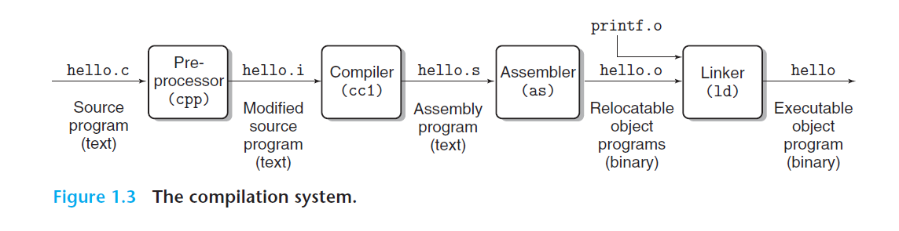
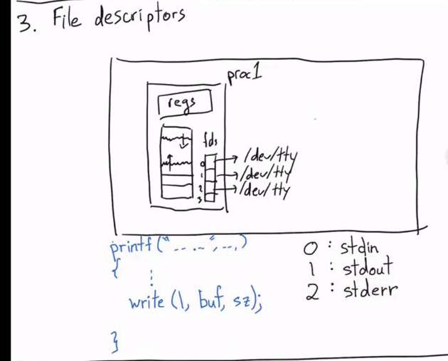
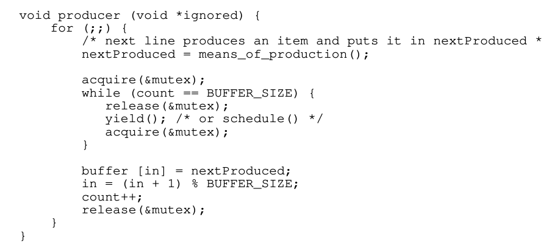

*这个log就不涉及具体lab实现和setup的detail了，我主要讲一些对设计理念/ 做lab/ 上课时候的一些感悟。*

如果有人感兴趣，可以看一下课程主页，作业的环境也几乎docker里配好的。
webpage: https://cs.nyu.edu/~mwalfish/classes/24sp/
lab： https://github.com/nyu-cs202/labs

## Lecture 1 
没讲啥特殊的, good intro =。=

walfish教授分别讲了 unix历史，为什么要学os/sys，以及os的一些构成。

walfish教授真的是非常热情。在讲为什么要学os/sys的时候几句话听的我像打了鸡血，我觉得相当值得分享在blog里。

1. Mike中间放了一张梗图。“我们都是要成为AI engineer的，为什么要学os?" mike说正是AI engineer需要和硬件交朋友。首先require大算力的应用只会越来越被需要，这个时候学会和真正的物理资源打交道是很有必要的，这种只会被无限的需求，因为在抽象层是充满了很多细节要被优化的。最要被替代的是那些只会照猫画虎调参的。这是从实用角度为什么要学os/sys的原因。**算力本身是电力，学会如何和算力打交道是大势所趋**，因为他相当基础且需求大，它很少会被替代。

2. hardware是ugly的，从软件工程师的角度。如果没有好的design，那么deal with hardware everyday无疑是一个劳动密集的工作。正是因为有这层抽象，让写码本身变得优雅了很多。这是从美学的角度的一个为什么学os的原因。它**简单，强大，优雅。**

3. os demonstrate了不少软件工程中重要的概念。比如scheduler是经典的调度问题/ 在和processes打交道的时候会接触到并行。这些都是在很多健壮的代码库中demonstrate的概念。

## Lecture 2

walfish课上直接把从src到变成byte load到os中的过程具象化了，有点像csapp中的第一章。

csapp:

理解process的方式有两种:
1. 从processor的方式：无非就是loader在跑一段exeutable file.
2. 从os的方式：os as resource manager会把processes当成一些instances来管理。

感觉walfish对cpu如何运行的方式有一种美学的鉴赏 -- 一切漂亮的app，自始至终都是一堆bytes boil down之后都是cpu的pc在不断地指向下一步然后执行。事实就是如此，这些设计是**优雅，强大**的。

之后所有的的课都是csapp chap3的内容. 

**一次相当quick的对sys的intro。** 

* stack：记住%rsp永远指向非空addr。
* local variable access:

## Lecture 3
重新想了一下，Caller和Callee的设计很精妙。相当于用了一层人类的简单的规约去释放了很多设计空间，因为正常的temporary variable不可能不用，不可能全用stack的空间；但是又不能全部都搞成temporary variable，这样要saved variable太几把多了。所以干脆搞一个规约，让一半去负责特定的东西，frame ptr，stack ptr这种，而且callee得负责回去的时候全部的值都不变，让另外一半register让callee随便用，但是回到caller的时候让caller自己搞定。

**一些bug**

从stack的角度想，这里的x被放在了stack上。而我们如果要send一个variable addr，我们either在别的frame上，either在heap上allocate。

**syscall**是一种**user space** transfer to **kernel space**的一种方式。

Mike甚至贴心的给了环境的描述，我哭死。我觉得这很好，因为就这简单的一张图基本上足够破除学生对环境的疑惑和恐惧了。

有多少个process？
$2^{10}$
