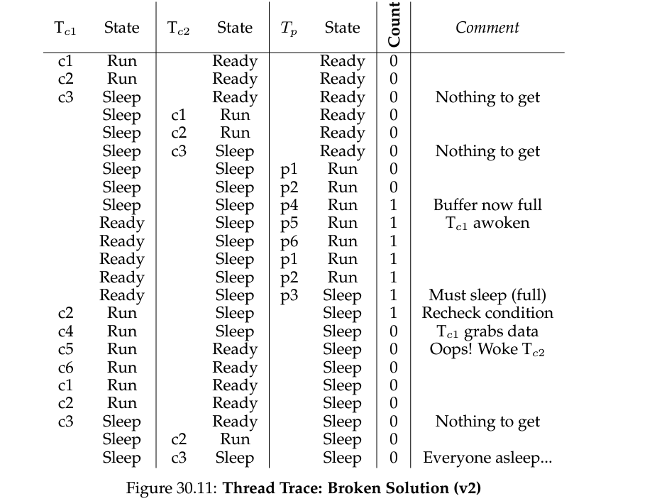
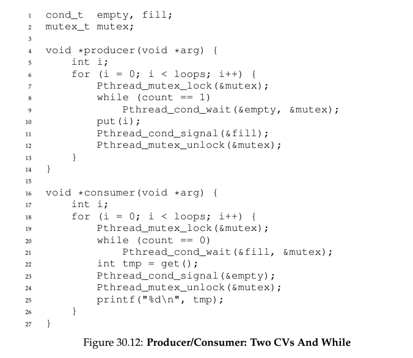
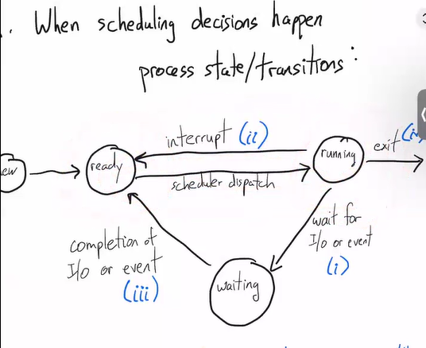
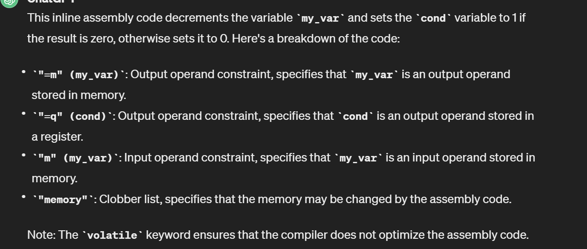

_这个log就不涉及具体lab实现和setup的detail了，我主要讲一些对设计理念/ 做lab/ 上课时候的一些感悟。_

如果有人感兴趣，可以看一下课程主页，作业的环境也几乎docker里配好的。
webpage: https://cs.nyu.edu/~mwalfish/classes/24sp/
lab： https://github.com/nyu-cs202/labs


## Lecture 1

Abstraction:

- file system:
  abstraction: seq of bytes.
  isolation: hiding user's files.

- text input:
  abstraction: linear stream
  isolation: chars go to the intended app

- memory:
  abstraction: very large conceivable memory
  isolation: processes cannot access each other's memory

- scheduling:
  abstraction: continuous execution  
  isolation: one heavy consumer cannot dominate the cpu.

### 为什么要学os/sys

walfish教授真的是非常热情。在讲为什么要学os/sys的时候几句话听的我像打了鸡血，我觉得相当值得分享在blog里。

1. Mike中间放了一张梗图。“我们都是要成为AI engineer的，为什么要学os?" mike说正是AI engineer需要和硬件交朋友。首先require大算力的应用只会越来越被需要，这个时候学会和真正的物理资源打交道是很有必要的，这种只会被无限的需求，因为在抽象层是充满了很多细节要被优化的。最要被替代的是那些只会照猫画虎调参的。这是从实用角度为什么要学os/sys的原因。**算力本身是电力，学会如何和算力打交道是大势所趋**，因为他相当基础且需求大，它很少会被替代。

2. hardware是ugly的，从软件工程师的角度。如果没有好的design，那么deal with hardware everyday无疑是一个劳动密集的工作。正是因为有这层抽象，让写码本身变得优雅了很多。这是从美学的角度的一个为什么学os的原因。它**简单，强大，优雅。**

3. os demonstrate了不少软件工程中重要的概念。比如scheduler是经典的调度问题/ 在和processes打交道的时候会接触到并行。

## Lecture 2/3 Review of assembly

首先编译链就不多说了：


引入process：

1. 从processor的方式：process是直接在cpu上运行的机器码而已。
2. 从os的方式：os as resource manager会把processes当成一些instances来管理。

*题外话。*cpu如何运行的方式是简单且优雅的 -- 一切漂亮的app，自始至终都是一堆bytes boil down之后都是cpu的pc在不断地指向下一步然后执行。事实就是如此，这些设计是**优雅，强大**的。

What is a process constructed of?


- Addr space: 每个process都会有一个独属于自己的$0 - 2^{48} - 1$的vmm。映射到一个页表，页表会指向真正的物理地址。
- 有自己的resigter。
  重要的是：他们其实物理意义上没有，但是os欺骗了它们。

### x86-64 assembly

- stack：记住%rsp永远指向非空addr。
- local variable access:

重新想了一下，Caller和Callee的设计很精妙。相当于用了一层人类的简单的规约去释放了很多设计空间，因为正常的temporary variable不可能不用，不可能全用stack的空间；但是又不能全部都搞成temporary variable，这样要saved variable太几把多了。所以干脆搞一个规约，让一半去负责特定的东西，frame ptr，stack ptr这种，而且callee得负责回去的时候全部的值都不变，让另外一半register让callee随便用，但是回到caller的时候让caller自己搞定。

**一个经典bug**：不要把指针放到stackframe上！


### **syscall**: user让kernel干一些事情。

总的来说:user没有特权操作硬件，kernel可以。

是一种**user space** transfer to **kernel space**的一种方式。

具体transfer操作方式：

1. 准备中断进入内核态代码，set好参数。
2. 查看硬件handler。
3. 调用指定handler并且把register的参数带回。
   

## Lecture 4: Shell I

- what does fork do?

fork很简单不赘述了。

- what does execve do?

> execve() executes the program referred to by pathname. This causes the program that is currently being run by the calling process to be replaced with a new program, with newly initialized stack, heap, and (initialized and uninitialized) data segments

execve(“/bin/sh”,0,0)是个系统调用，执行后，即使他发生在某个线程中，整个进程的程序也会被换掉，但进程号保留。

我们先来看一个简单的shell模型。

```c
while (1) {
    write(1, "$", 2);
    readcmd(cmd, args);
    // child
    if ((pid = fork()) == 0) {
        execve(command, args, 0);
    } else if (pid > 0) {
        wait(0);

        // error
    } else {
    }
}
```

原料：fork execve.

实现：让一个parent process来manage i/o，然后创造子进程来跑用户想跑的程序。

目的：为了脱离原始的batch computing，让用户有操作多个任务的能力。

**fs** -- file descriptor:  


接下来我们来看redirection和后台运行的实现

```c
while (1) {
    write(1, "$", 2);
    readcmd(cmd, args);
    // child
    if ((pid = fork()) == 0) {
        if (redirected) {
            close(1);
            open(redirected_file);
        }
        execve(command, args, 0);
    } else if (pid > 0) {
        if (fore_ground) {
            wait(0);
        }
        // error
    } else {
    }
}
```

**Redirection**: 它的实现踩在了file descriptor的肩膀上。只不过就是把fs的1的指针从指向terminal到指向了新的file。注意write这个syscall完全不知道发生了什么，他一样写入了fs为1的地方，只不过这次是用户指定的file而不是terminal。

**background**：它的实现是 --- 如果shell parse到了&，parent processes直接不等了，直接让execve在后台运行。

Question:

- 为什么fork和exec要隔离开来?为什么不直接有一个craeteprocess？难道这样不更方便？

**ans**: 其实这样给了用户更多的操作空间，一个用来创造新process，然后用户可以在fork中的函数中疯狂配环境，就像redirection是怎么实现的一样。

```sh
# 奇怪的脚本，赶紧试试吧！
$ :(){:1:&};:
```

**pipeline**.

```c
while (1) {
    write(1, "$", 2);
    readcmd(cmd, args);
    // child
    if ((pid = fork()) == 0) {
        if (redirected) {
            close(1);
            open(redirected_file);
        }
        execve(command, args, 0);
    } else if (pid > 0) {
        if (fore_ground) {
            wait(0);
        }
        // error
    } else {
    }
}

void handle_piepeline(left_cmd, right_cmd) {
    int fdArr[2];
    if (pipe(fdArr) < 0) //error
    if ((pid = fork()) == 0) {
        dup2(fdArr[1], 1); // now fd 0 -> dev, 1 -> write end, 2 -> dev
        close(fdArr[0]);
        close(fdArr[1]);
        // execute.
    } else if (pid > 0) {
        dup2(fdArr[0], 0); // now fd 0 -> dev, 1 -> write end, 2 -> dev
        close(fdArr[0]);
        close(fdArr[1]);
     // error
    } else {
    }
}
```

例子：

- left cmd = `ls -l`的输出原本是1，which is defaulted set to the terminal windo.
- right cmd = `grep 'pattern'`，grep在没有第三个arg的实现是用fd 0 作为自己的input，如果有第三个arg输进去，那他就会吧0 关闭，然后在调用open syscall。

然鹅我们再shell的实现中 -- 直接关闭ls -l side的1， 然后打开grep side的0，就可以实现pipe了。于是`ls -l | grep "hello"` 就会从ls -l 输入到管道中，然后grep再从fd=0读取（管道的输出）内容。

我们来深入理解一下pipe的机制，以下是ls lab的内容：

```c
 void hack()
{
    int status;
    // pipe from child to parent
    int c2p[2];
    pipe(c2p);
    printf("c2p[0] = %d\n", c2p[0]);
    printf("c2p[1] = %d\n", c2p[1]);

    // child
    if (fork() == 0)
    {
        // so instead of writing to terminal, it will write to the pipe.
        close(1);
        // let write end be assiged to fd=1
        dup(c2p[WRITEEND]);

        // close these two ends since we only needs the fd=1(write end) as the output.
        close(c2p[READEND]);
        close(c2p[WRITEEND]);
        char *lala[] = {"/usr/bin/ls", NULL, NULL};
        execve("/usr/bin/ls", lala, 0);
        printf("exec failed!\n");
        exit(1);
    }
    // parent
    else
    {
        // close it since we dont need it in parent process
        close(c2p[WRITEEND]);
        char buf[BUFSIZE];
        int n = read(c2p[READEND], buf, sizeof(buf));
        while (n)
        {
            write(1, buf, n);
            n = read(c2p[READEND], buf, sizeof(buf));
        }
        wait(&status);
    }
    exit(0);
}
```

### Process -- 从OS的角度

Proc就是一个一堆Proc表，每次booting的时候都用表里的信息来load进去，表如下，可以看看xv6的代码。

<!-- TODO 可以看看xv6的代码。 -->


### thread -- 从OS的角度

Thread从proc的角度来看，其实和proc差不多。


每个thread都会维护自己的registers和stack space，甚至在process的视角里，每个thread的不同只不过是它们的registers罢了。但是他们指向的.text and .data area都是一样的（也就是，他们share的code，和global variable是一样的）。这样程序员会觉得觉得他们在“同时”执行一些操作。


**线程写的问题**。当x是一个global的时候，两个线程同时都可以access到一个地方，所以会造成线程写的问题。


## HW 1/2

- Operations on files, such as read(), write(), and close(), are typically implemented as system calls. Describe two of the benefits of having these operations managed by the operating system instead of individual processes.

**ans**:
(1) Prevent user level processes from manipulating hardware
(2) Program will have good portability across machines
(3) Processes do not have to have redundant code

- What do you think are the differences between the implementation of thread_create(func) and the implementation of fork()? (here, func is the address of the function that the thread should begin at).

**ans**:

D1: thread_create doesn't need to make a copy of the invoking thread's memory. It will make both the original thread and created thread share the invoking thread's memory. By contrast, fork will make a copy of the parent process's memory, and the child will run using this copy.

D2: Both thread_create and fork will give the created thread/process a new stack. fork creates this stack from the parent process's stack, while thread_create creates a brand new stack. In other words, fork will set %esp to a copy of the current bottom of the stack, thread_create will set %esp to the top of a new stack within the same address space.

D3: As indicated in the interface, thread_create takes a function pointer as the parameter. thread_create will set the created thread's %eip to func, while fork will not touch %eip, since parent and child are running the "same" code located at the "same" address.

## Lab1/ Lab2 ls

**Unix Utilities**.

- basic shell command

* echo "echo hello $world"? $world will expand
* echo 'echo hello $world' world will not expand in single quote.
* echo \`echo hello $world\`? what is inside \`\` will be evaluted first.

```sh
echo a && echo b # it cares whether echo a execuets successfully
echo a ; echo b # it does not care whether echo a execuets successfully]

# Explanation: & will put 'echo a' in background and run 'echo b' in foreground.
echo a & echo b
```

- **find**: `find [flags] [path...] [expression]; `

```sh
find . -name "sched.h"
find . -name "sched.*"
find . -name "*.h" | wc -w


# 一些组合 output
cat member.txt | grep "^Name:[a-zA-Z']\+$" |  head -n100 | cut -d':' -f 2 | sort > name.txt
```

Personal Note for lab2

What I learnt:

- I found the learning process of a function is to **testing** them using different arguments. And That's it and even more sophisticated syscall needs testing. Learning by playing is the most interesting and the most valuable when learning some apis.

- **不要恐惧**。很多时候依附于某种语言的特性都会有一些 trick 让原本的代码变得难读。不要着急，一步一步调试后你就能理解其中的优美之处。所以，多多阅读优秀的源码并且理解是可以比读书收获很多的。

- **磨刀不误砍柴工**。在我们既有的抽象层细细的去了解自己的工具。在 lab2 我们的工作是 base on system calls -> implement user functions. So understanding those tools deeply has value in it.

### Argument parsing

getopt();

```c
#include <unistd.h>
#include <stdlib.h>
#include <stdio.h>

int main(int argc, char *argv[])
{
    int flags, opt;
    int nsecs, tfnd;

    nsecs = 0;
    tfnd = 0;
    flags = 0;
    // opt receives character if success, receives if failing.
    while ((opt = getopt(argc, argv, "nt:")) != -1)
    {
        switch (opt)
        {
        case 'n':
            flags = 1;
            break;
        case 't':
            // optarg is set as the argument if optstring has specified : after a flag
            nsecs = atoi(optarg);
            tfnd = 1;
            break;
        default: /* '?' */
            // getopt will retunr ? if some wield pattern occurs.
            fprintf(stderr, "Usage: %s [-t nsecs] [-n] name\n",
                    argv[0]);
            exit(EXIT_FAILURE);
        }
    }

    printf("flags=%d; tfnd=%d; nsecs=%d; optind=%d\n",
           flags, tfnd, nsecs, optind);

    if (optind >= argc)
    {

        fprintf(stderr, "Expected argument after options\n");
        exit(EXIT_FAILURE);
    }

    // optind is the index in argv of the first argv-element that is not an option
    printf("name argument = %s\n", argv[optind]);

    /* Other code omitted */

    exit(EXIT_SUCCESS);
}
```

getopt_long();

```c
int main(int argc, char **argv)
{
    int c;
    int digit_optind = 0;

    while (1)
    {
        // set optind to 1 if it is not set
        int this_option_optind = optind ? optind : 1;
        int option_index = 0;
        // this struct maps long options into int 0.
        static struct option long_options[] = {
            {"add", required_argument, 0, 0},
            {"append", no_argument, 0, 0},
            {"delete", required_argument, 0, 0},
            {"verbose", no_argument, 0, 0},
            {"create", required_argument, 0, 'c'},
            {"file", required_argument, 0, 0},
            {0, 0, 0, 0}};

        c = getopt_long(argc, argv, "abc:d:012",
                        long_options, &option_index);
        if (c == -1)
            break;

        switch (c)
        {
        case 0:
            // option_index is used to indexing the option struct .
            printf("option %s", long_options[option_index].name);
            if (optarg)
                printf(" with arg %s", optarg);
            printf("\n");
            break;

        // Short options
        case '0':
        case '1':
        case '2':
            if (digit_optind != 0 && digit_optind != this_option_optind)
                printf("digits occur in two different argv-elements.\n");
            digit_optind = this_option_optind;
            printf("option %c\n", c);
            break;

        case 'a':
            printf("option a\n");
            break;

        case 'b':
            printf("option b\n");
            break;

        case 'c':
            printf("option c with value '%s'\n", optarg);
            break;

        case 'd':
            printf("option d with value '%s'\n", optarg);
            break;

        case '?':
            break;

        default:
            printf("?? getopt returned character code 0%o ??\n", c);
        }
    }

    // optind should be checked since remember
    // c does not have limit check but it is leaves to you
    // we needs to ensures that optind is not pointing to other memory.
    if (optind < argc)
    {
        printf("optind -> %d\n", optind);
        printf("argc -> %d\n", argc);
        printf("non-option ARGV-elements: ");
        while (optind < argc)
            printf("%s ", argv[optind++]);
        printf("\n");
    }

    exit(EXIT_SUCCESS);
}
```

```sh
# 一些例子。
cs202-user@ac03bcbbed6b:~/cs202-labs/test$ ./exec --create 1
option c with value '1'
cs202-user@ac03bcbbed6b:~/cs202-labs/test$ ./exec --c 1
option c with value '1'

cs202-user@ac03bcbbed6b:~/cs202-labs/test$ ./exec -ab -c 123 123
option a
option b
option c with value '123'
non-option ARGV-elements: '123'
```

### Read Directories/ file systems api

Dir Stream 其实就是 an ordered sequence of all the directory entries in a particular directory，跟打开一个 fd 的感觉一样，都是抽象成一个流。
How to open dir Stream -> opendir

```c
#include <sys/types.h>
#include <dirent.h>
// open dir stream.
DIR *opendir(const char *name);
DIR *fdopendir(int fd);

// The underlying file descriptor of the directory stream can be obtained using dirfd(3).

// Filename entries can be read from a directory stream using readdir(3).

```

- dirp 是一个指针指向了这个流。（This stream can be specified as a linear sequence of struct directory）。而 Readdir 会返回给当前的 direct struct.

- Applications wishing to check for error situations should set errno to 0 before calling readdir().

- END: It shall return a null pointer upon reaching the end of the directory stream.

direct structure is ->

```c
struct dirent {
    ino_t          d_ino;       /* Inode number */
    off_t          d_off;       /* Not an offset; see below */
    unsigned short d_reclen;    /* Length of this record */
    unsigned char  d_type;      /* Type of file; not supported
                                    by all filesystem types */
    char           d_name[256]; /* Null-terminated filename */
};
```

```c
#include <dirent.h>
#include <stdio.h>
#include <stdlib.h> /* for exit */
#include <getopt.h>
#include <string.h>
void display(struct dirent *dp)
{
    printf("d_ino -> %ld\n", dp->d_ino);
    printf("d_off -> %ld\n", dp->d_off);
    printf("d_reclen -> %d\n", dp->d_reclen);
    printf("d_type -> %d\n", dp->d_type);
    printf("d_name -> %s\n", dp->d_name);
    putchar('\n');
}
int main(int argc, char **argv)
{
    // TODO: This opendir should check error but it does not
    DIR *dirp = opendir(".");
    struct dirent *dp;
    int errno;
    // Read as null it reaches end
    while ((dp = readdir(dirp)) != NULL)
    {
        display(dp);
    }
    printf("We've finished reading! \n");
    closedir(dirp);
    exit(0);
}

```

输出是下面：

```sh
d_ino -> 39986
d_off -> 2122451233231811000
d_reclen -> 32
d_type -> 8
d_name -> main.c

d_ino -> 29864
d_off -> 6629703606815583833
d_reclen -> 24
d_type -> 4
d_name -> ..

d_ino -> 31553
d_off -> 7336315452623241479
d_reclen -> 24
d_type -> 8
d_name -> exec

d_ino -> 39987
d_off -> 8301092125137062404
d_reclen -> 24
d_type -> 4
d_name -> .

d_ino -> 39988
d_off -> 9223372036854775807
d_reclen -> 32
d_type -> 8
d_name -> test.sh

We've finished reading!
```

_This following program looks for filenames in given directory_

```c
#include <dirent.h>
#include <errno.h>
#include <stdio.h>
#include <string.h>

static void lookup(const char *arg)
{
    DIR *dirp;
    struct dirent *dp;

    if ((dirp = opendir(".")) == NULL) {
        perror("couldn't open '.'");
        return;
    }

    do {
        // set errno to 0 to enforce checking error
        errno = 0;
        if ((dp = readdir(dirp)) != NULL) {
            if (strcmp(dp->d_name, arg) != 0)
                continue;

            (void) printf("found %s\n", arg);
            (void) closedir(dirp);
                return;
        }
    // end if dp is NULL
    } while (dp != NULL);

    if (errno != 0)
        perror("error reading directory");
    else
        (void) printf("failed to find %s\n", arg);
    (void) closedir(dirp);
    return;
}

int main(int argc, char *argv[])
{
    int i;
    for (i = 1; i < argc; i++)
        lookup(argv[i]);
    return (0);
}
```

**stat 调用**。

```c
int main(int argc, char *argv[])
{
    struct stat sb;

    if (argc != 2)
    {
        fprintf(stderr, "Usage: %s <pathname>\n", argv[0]);
        exit(EXIT_FAILURE);
    }

    if (lstat(argv[1], &sb) == -1)
    {
        perror("lstat");
        exit(EXIT_FAILURE);
    }

    printf("ID of containing device:  [%jx,%jx]\n",
           (uintmax_t)major(sb.st_dev),
           (uintmax_t)minor(sb.st_dev));

    printf("File type:                ");

    switch (sb.st_mode & S_IFMT)
    {
    case S_IFBLK:
        printf("block device\n");
        break;
    case S_IFCHR:
        printf("character device\n");
        break;
    case S_IFDIR:
        printf("directory\n");
        break;
    case S_IFIFO:
        printf("FIFO/pipe\n");
        break;
    case S_IFLNK:
        printf("symlink\n");
        break;
    case S_IFREG:
        printf("regular file\n");
        break;
    case S_IFSOCK:
        printf("socket\n");
        break;
    default:
        printf("unknown?\n");
        break;
    }

    printf("I-node number:            %ju\n", (uintmax_t)sb.st_ino);

    printf("Mode:                     %jo (octal)\n",
           (uintmax_t)sb.st_mode);

    printf("Link count:               %ju\n", (uintmax_t)sb.st_nlink);
    printf("Ownership:                UID=%ju   GID=%ju\n",
           (uintmax_t)sb.st_uid, (uintmax_t)sb.st_gid);

    printf("Preferred I/O block size: %jd bytes\n",
           (intmax_t)sb.st_blksize);
    printf("File size:                %jd bytes\n",
           (intmax_t)sb.st_size);
    printf("Blocks allocated:         %jd\n",
           (intmax_t)sb.st_blocks);

    printf("Last status change:       %s", ctime(&sb.st_ctime));
    printf("Last file access:         %s", ctime(&sb.st_atime));
    printf("Last file modification:   %s", ctime(&sb.st_mtime));

    exit(EXIT_SUCCESS);
}
```

```sh
ID of containing device:  [8,20]
File type:                directory
I-node number:            39987
Mode:                     40755 (octal)
Link count:               2
Ownership:                UID=1000   GID=1000
Preferred I/O block size: 4096 bytes
File size:                4096 bytes
Blocks allocated:         8
Last status change:       Sat Feb  3 01:36:49 2024
Last file access:         Sat Feb  3 01:36:53 2024
Last file modification:   Sat Feb  3 01:36:49 2024
```

**inode**
Each file has an inode containing metadata about the file. An application can retrieve this metadata using stat(2) (or related calls), which returns a stat structure, or statx(2), which returns a statx structure.

在 manual 里写的最重要的无非是 -- `stat`中返回的 struct 中`st.mode`是 type, filemode 的 bitmask。我们可以通过一些 manual 中提供的 marco 去轻易获得。

```c
// S_IFMT     0170000   bit mask for the file type bit field
 stat(pathname, &sb);
if ((sb.st_mode & S_IFMT) == S_IFREG) {
    /* Handle regular file */
}

// if we want to check S_IRWXU     00700   if owner has read, write, and execute permission
if ((sb.st_mode & S_IFMT) == S_IFREG) {
    /* Handle  */
}

```

### Implementation

_2024/02/03_
写了不少了，但是还是有很多常识的错误。
BUG：

- implement目录的时候，想当然的把自己当成用户了（以为系统会自己帮我把前目录名加上，但是还是要自己手动加上的）。这个bug找了我30min。
  
  ans: 在找到发现另一个目录前，请把目录名append到源路径后面并且加上‘/’。
  e.g. : 如果源路径是`./filesystem`，如果你在其中发现了一个dir，那么就是`./filesystem/<dirname>`.

- 我神奇的静态示例一直把strcmp看成strcpy，内存反复爆炸。。。下次看到这种内存写
  
  的错误大概就是strcpy这种写入方程的参数错误了，大概率是往指针里写。。所以最好还是定义成const预防一下。。（没想到之前书里看到了错误自己全部踩了一遍。。

神奇之处：

- 在root文件夹中的`..`并不是上一级目录，而是他自己，自己指向了自己。

感受：

- 最绝望的时候通常是无路可走的时候，而不是有一条艰辛的路的时候。前者像是在等死，后者有希望。但是在我相信在之后系统开发的过程中一定会有更看不懂的bug出现，而让自己成为编译器是不可能的，尽自己全力掌握debug tricks并汲取经验好好成长才是可行之道。心态是 --- 在找bug的时候一定要相信是自己的问题，而这种问题绝对是可以被解决的。

- 如何debug：尽可能地在自己能确认的地方打log。ex：看前面两行就是我在理解getopt这个api的时候加入的log，这样其实更加清晰，少了自己人肉编译的过程。所以这种方便自己理解的log越多越好。。
  
  

基本逻辑打好了，现在剩下

- 重新看一遍lab2，了解test（bats）的framework。
- 优化
  - -n有无更好的方法?
  - overflow的问题。（字符串怎么使用的更好）
  - recursive？检查。
  - 其余代码检查

_2024/02/12_
没想到下一次写lab居然是一周之后了啊。。。上周实在是太水了。。

#### Testing framework

mktest.sh

```sh
#!/bin/bash
set -e
TEST_DIR=$1
if [ -e ${TEST_DIR} ]; then
    echo "Cowardly refusing to change an existing directory ${TEST_DIR}"
    exit 1
fi
# Create base directory.
mkdir ${TEST_DIR}
# Create some files.
touch ${TEST_DIR}/a
touch ${TEST_DIR}/b
touch -t 1912301230.03 ${TEST_DIR}/c
touch -t 1810251600.00 ${TEST_DIR}/d
dd if=/dev/urandom of=${TEST_DIR}/s1 bs=1024 count=1 status=none > /dev/null
dd if=/dev/urandom of=${TEST_DIR}/s2 bs=1024 count=2 status=none > /dev/null
dd if=/dev/urandom of=${TEST_DIR}/s3 bs=1024 count=3 status=none > /dev/null
dd if=/dev/urandom of=${TEST_DIR}/s4 bs=1024 count=4 status=none > /dev/null
mkdir ${TEST_DIR}/in0
mkdir ${TEST_DIR}/in0/in1
mkdir ${TEST_DIR}/in0/in1/in2
touch -t 1912301230.03 ${TEST_DIR}/in0/a
touch  ${TEST_DIR}/in0/b
touch ${TEST_DIR}/in0/in1/in2/x
touch ${TEST_DIR}/.boo
mkdir ${TEST_DIR}/bad
touch ${TEST_DIR}/bad/bad_user
sudo chown 2002 ${TEST_DIR}/bad/bad_user
touch ${TEST_DIR}/bad/bad_group
sudo chown :2220 ${TEST_DIR}/bad/bad_group
touch ${TEST_DIR}/bad/bad_ugroup
sudo chown 2002:2220 ${TEST_DIR}/bad/bad_ugroup
mkdir ${TEST_DIR}/.hidden
touch ${TEST_DIR}/.hidden/a
touch ${TEST_DIR}/.hidden/b
touch ${TEST_DIR}/.hidden/c

touch ${TEST_DIR}/ungrwx
chmod 070 ${TEST_DIR}/ungrwx
touch ${TEST_DIR}/urwxgn
chmod 700 ${TEST_DIR}/urwxgn
touch ${TEST_DIR}/urwgrwarw
chmod 666 ${TEST_DIR}/urwgrwarw
touch ${TEST_DIR}/urwgrar
chmod 644 ${TEST_DIR}/urwgrar

```

_ls lab用时约12小时_。

## Lecture 5/6/7: Concurrency I/II/III

在介绍处理并行的方法前，先介绍一个常见的硬软件错误：

Q1：Can data be called with 0?
assumption:

1. compiler produce sequential code
2. single cpu

```c
int data = 0, ready = 0;
void p1() {
    data = 2000;
    ready = 1;
}

int p2 () {
    while (!ready) {}
    // can data be called with 0?
    use(data);
}
```


Mike：这个例子并不会出现在单核cpu中，介绍这个example只是为了介绍concurrency的真正问题不只是存在程序员的设计的threadprogramming中，并且存在硬件中（multicore）。但是之后介绍的control primitives会优雅地解决这些硬软件并行问题。

### 第一个措施：**lock**

**note：注意虽然被夹在lock中间的代码是“atomic”，但是实际上他们的执行顺序依旧是不固定的，取决于scheduler。**

也就是说acquire() 和release() 之间，只能有一个thread running。

锁的作用是配合了programmer设计的invariant。他能保证“某些shared memory中”会被executed atomicaly, 保证了invariant的正确性。

**lock的机制**：

- if a lock wants to acquire a lock: it needs to wait for the lock to be unlocked by some other threads.
- only the thread who acquire the lock can unlock it.


```c
pthread_mutex_tlock = PTHREAD_MUTEX_INITIALIZER;
pthread_mutex_lock(&lock);
x= x + 1;
pthread_mutex_unlock(&lock);
```


小问题：为什么这里的yield()还要require() 和acquire()？
因为如果一个进程似了，他还拿着lock，别的进程如果要进入critical section，只能陪它一起似了。（当然，更好的还是使用wait primitive）

### 第二个措施：**cv**

**Why do we learn Conditional variable?**

- 通常是因为两个thread之间有dependency形成了一种拓补关系。
- 但是通常的spin等待太铸币了，需要一种硬件上的解决方式，直接让thread sleep。

因此就有了以下的api。

```c
intpthread_cond_wait(pthread_cond_t *cond, pthread_mutex_t *mutex);
intpthread_cond_signal(pthread_cond_t *cond);
```

一个thread执行的状态有：

1. sleep：似了。CPU不管这个，省clock cycle。
2. ready：被lock挡住了。CPU不管这个，省clock cycle。要么是被wait之后叫醒，要么是要锁的时候被block了，但是已经排在queue中了。如果锁一开，有可能哥们直接上。
3. run：正在跑的thread。
   **multithread的目的：就是让parallelism好好执行/ 但是不让相关逻辑的critical section影响。**

- wait：一个thread觉得自己进行不下去了，release自己的lock（这也是为什么wait要带一个mutex作为argument的原因）然后hold一个约定（conditional variable）。
- signal：另一个thread想要唤醒持有规约的那个睡觉的thread（可能有很多个）。

* 为什么要有done？
  ans：如果没有，若signal比wait先call，那么父进程会永远进入睡眠。所以我们要维护一个状态变量（in this case，it is `done`）

* 为什么signal的时候还是要有lock？
  ans：下面的例子：child会再parent执行公务的时候，sleep的时候，立马interupt，然后把done给改了。这样当parent搞完sleep之后，会发现他永远wait了。这是一个围绕signal wait的race condition。所以我们要做的是在
  - parent: check done之前，wait之后
  - child：改done之前，signal之后。

1. either child先执行完，parent发现了已经done了。
2. or parent先执行完，child在中途signal。

这是一个好的synchronization。

```c
pthread_cond_t  c = PTHREAD_COND_INITIALIZER;
pthread_mutex_t m = PTHREAD_MUTEX_INITIALIZER;
int done = 0;

void *child(void *arg) {
    printf("child: begin\n");
    sleep(1);
    done = 1;
    printf("child: signal\n");
    Cond_signal(&c);
    return NULL;
}
int main(int argc, char *argv[]) {
    pthread_t p;
    printf("parent: begin\n");
    Pthread_create(&p, NULL, child, NULL);
    Mutex_lock(&m);
    printf("parent: check condition\n");
    while (done == 0) {
	sleep(2);
	printf("parent: wait to be signalled...\n");
	Cond_wait(&c, &m);
    }
    Mutex_unlock(&m);
    printf("parent: end\n");
    return 0;
}

```

- 为什么这里是while包住？
  ans:
  
  仔细观察，如果c1在buffer空的时候wait了，之后因为buffer被p1填满进入了ready状态。如果锁之后开了第一个被唤醒的是这个蠢蠢欲动的，但是无处可拿（因为buffer空）的c1，那么是不是很尴尬？因此我们要在wait唤醒之后继续进行while check。

- 为什么要使用不同的conditional variable？
  
  ans: 会导致如上的consumer唤醒consumer的情况，这样我们就进入了死process中。我们需要让conditional variable具有指向性，让合理的逻辑动起来。
  

note in class:

- why wait() releases mutex and goes into waiting states atomically?

**ans**: if not, when mutex is released, the other thread can executes immediately and signals, so when current thread tries to wait, it will always in waiting state.

- Will it be good to replace broadcast with signal?

**ans**: Since we want multiple threads qualified to work together.

### Combined primitive: monitor

_SKIP_

### 一些练习。

### **Implementation of lock**

Perterson's algorithm? See textbook.

Disable Interrupts? Not work for multicpu.

Note: User cannot turn off interrupts because of monopolizing the resources.

critiria:

- mutual exclusion.
- fairness: 所有ready threads都能有相等的机会被唤醒吗？
- performance。

### spin lock

我们用硬件提供的testandset可以写个spinlock.

相当于：我们用了一个隐形的硬件锁同时完成了比较和赋值。

testandset:

1. get oldval
2. return oldval
3. setnewval into oldval

你也可以用更加强大的comandset。
testandset(\*oldptr, testval, newval)

1. get oldval from oldptr
2. return oldval
3. if oldVal == testVal, setnewval into oldptr, else do nothing.

```c
typedef struct lock {
    int flag;
} lock_t

int init(lock_t *lock) {
    lock->flag = 0;
}

// using testandset.
int lock(lock_t *lock) {
    while (testandset(lock->flag, 1) == 1) {
        // spin()
    }
    lock->flag = 1;
}

// using compareandset.
int lock(lock_t *lock) {
    while (compareandset(lock->flag, 0, 1) == 1) {
        // spin()
    }
    lock->flag = 1;
}


int unlock(lock_t *lock) {
    lock->flag = 0;
}
```

还有彩票lock, 用的是fetchandadd primitive
fetchandadd:

1. fetch from oldptr
2. add one to it
3. return oldval

```c
typedef struct lock {
    int turn;
    int ticket;
} lock_t

int init(lock_t *lock) {
    lock->turn = 0;
    lock->ticket = 0;
}

// using fetchandadd.
int lock(lock_t *lock) {
    while (fetchandadd(lock->ticket) != lock->turn) {
        // spin()
    }
}

int unlock(lock_t *lock) {
    lock->turn ++;
}
```

mutual exclusive? yes
fair? yes since every locked thread is in a queue.
performance? still no because of spinning.

一个较为符合直觉的方法是与其spin不如直接让cpu停用那个thread。

cpu -> thread1
cpu -context switch--> thread2
yield()
thread2 go into ready state.
cpu -context switch--> thread1
thread1 running.

但是它的cost依旧很高因为context switches。

### spinlock -- Lecture stuff

xchg --> load and store atomically

```c
struct Spinlock {
    int locked;
}
void acquire(Spinlock *lock) {
    while (1) {
        // spin ;
        if (xchg_val(&lock->locked, 1) == 0) {
            break;
        }
    }
}
void release(Spinlock *lock) {
    lock->locked = 0;
}
```

When two threads try to acquire the lock (write 1 to a lock):

only read a 0 ---> can proceed.

only one will read 0 and write 1 at a time.

### Spinlock-based mutex

```c
struct Mutex {
    // helper
    thread_t *owner;

    // Queue of threads that wait the lock -- ensrues fairness
    STAILQ(thread_t) waiters;

    // ensures atomicity
    struct Spinlock splock；
}

void acquire(struct Mutex *m) {
    acquire(&m->splock);
    if (m->owner == 0) {
        // if no one waiting, i admit it.
        m->owner = tid_of_this_thread;
        release(&m->splock);
    } else {
        // if someone owns it, i wait
        // it is the scheduler that actually blocks
        sched_mark_blocked(&id_of_this_thread);
        release(&m->splock);
        sched_swtch();
        // continue executes when waking up
    }
}

void release(struct Mutex *m) {
    acquire(&m->splock);
    // owner must be in critial section
    // because owner will be waked all at once.

    m->owner = STALIQ_GET_HEAD(&m->waiters);
    // if we do get some waiting thread, wake that thread, since
    // invariant here is all the waiters are sleeping in perspective of scheduler.
    if (m->owner) {
        sched_wake(&m->owner);

        // And that is officially executing
        STALIQ_REMOVE_HEAD(&m->waiters);
    }
    release(&m->splock);
}
```

## HW 3/4/5

### 1. The uses of threading

"For a given workload, a multi-threaded process has lower time-to-completion than the equivalent single-threaded process." Explain your answer in 2-3 sentences.

**ans**: Depends on how the overhead-synchrnozation takes.
single cpu: multithread < single thread
multiple cpu: multithread (maybe) > single thread because of parallelism.

### 2. practice

```c
/* ADD SOME THINGS HERE */
mutex
cond
bool if_foo = 0;

void
foo(void *)
{
    printf("I am foo!!!\n");
    if_foo = 1;
    // if_foo 必须在signal前面为了防止死机。

    signal(cond, mutex);
    /* ADD SOME CODE HERE */
}

void
boo(void *)
{
    /* ADD SOME CODE HERE */
    while (!if_foo) {
        wait(cond, mutex);
    }
    printf("I am boo!!!\n");
}

int
main(int argc, char** argv)
{
    create_thread(foo);
    create_thread(boo);

    // wait for threads to finish
    // before exiting
    join_thread(foo);
    join_thread(boo);

    exit(0);
}
```

### 3. Time-of-check-to-time-of-use (TOCTTOU) bugs

```c
bool
transferBob2Alice(double trans) {
  if (bob_balance > trans) {
    smutex_lock(&mtx);
    bob_balance = bob_balance - trans;
    alice_balance = alice_balance + trans;
    smutex_unlock(&mtx);
    return true;
  }
  return false;
}
```
* lock should be inside. 
* interleaving: j

<!-- ### 3. Smoker
Consider a system with three smoker processes and one agent process. Each smoker continuously rolls a cigarette and then smokes it. But to roll and smoke a cigarette, the smoker needs three ingredients: tobacco, paper, and matches. One of the smoker processes has paper, another has tobacco, and the third has matches. The agent has an infinite supply of all three materials.

The agent places two of the ingredients on the table. The smoker who has the remaining ingredient then makes and smokes a cigarette, signaling the agent on completion. The agent then puts out another two of the three ingredients, and the cycle repeats.

void chooseIngredients(int *paper, int *tobacco, int \*match);
to randomly select 2 of the 3 ingredients. The routine randomly sets 2 of the ints to "1" and one of them to "0". You don't have to write this routine.

Write a program to synchronize the agent and smokers:

What synchronization and state variables will you use in this problem? (For each variable, indicate the variable's type, the variable's name, its initial value (if any), and a short comment describing the variable's purpose.)
| Variable Name | Variable Type | Initial Value | Description|
|----|----|----|----|
| |  | | |

Write the routines Agent() and matchSmoker() (the routine for the smoker that has lots of matches). You don't have to write the routines paperSmoker() or tobaccoSmoker(), but your solution should be general enough so that those routines would be simple variations of matchSmoker(). -->

## Lecture 8 Scheduler

processes有以下几种状态，简洁明了不多说了：

- ready：就是scheler的候选。
- running：cpu在跑它。
- waiting：反正就是在等一个状态，非常像thread在等一个condition variable的状态。
  

以下是preemptive的scheduler。


nonpreemptive-preemptive的scheduler：只会在process wait或者exit的时候做出选择，否则就一直死磕在一个process上。

最简单的例子：**FIFO**
throughput: always 0.1, (number of processes) / time = 3 / 30 = 0.1s
avg turnaround time = time (first 1, then 2, then 3) = time / processes = (24 + 27 + 30) / 3 = 27s


例子：**SJF**


例子：**Round Robin**

这个问题是：太长了导致就失去了协调工作的特性，导致turnaround time太长了，太短了也会导致context switch的成本变大很多。

加入以下的机制：I/O
Intuition是：大多数时间个人用户不会拿电脑来一直做computational intensive的工作，而是和互联网交互，等待文件传输，邮件，code editing等等。（一个例子就是vscode）

我们进行以下分析：disk utilization -- Scheduler的决策怎么影响到disk使用率的。


FIFO明显不行：等的太久了。

RR(100ms/break)明显不行：disk utilization = 5%.

RR(1ms/break)行：disk utilization = 10/11 = 90%.
--------------------IO-------------10ms ------------------------------------------------
A(1ms) -> B(1ms) -> C(1ms) -> A(1ms) -> B(1ms) -> c waiting -> ... A -> B->... -> c

SJF行：disk utilization = 10/11 = 90%.


## Lecture 9 Virtual Nenory


整节OS我听下来最重要的是这句话。

大体上的memory alloc是这样的 -- process向kernel寻求帮助 --> kernel给每个process都有自己的page table（or other data structures） --> mmu读 page table然后做映射（hardware是不知道哪个·process的）

_掺杂一些小想法_：walfish在课程中反复的用戏谑的语气来嘲讽fullstack engineer工作的低智商，但是又无可奈何地承认这就是事实。我从中其实也感觉挺无奈的。可能现实世界并不需要多高的智商就能做的一些事情就能赚到钱。不过我总的来说高智商歧视其实也是蛮有毒的，大家各取所需，过好自己的生活就行了吗，希望自己看开一点吧。不可否认的是，对我来说，理解这些底层逻辑对我有一种自然的快乐感，我想这就是好奇心被满足的感觉吧。类似的感觉也出现在初探CSAPP，理解计网的大概逻辑的时刻，理解这些伟大设计让我感到愉悦，虽然之后结局也许大概率是和只选fullstack engineer的结局是一样的，放平心态吧 -- 仅仅为了愉悦去选择这些系统课，未来也可能不可避免地去面对是否读system phd的时刻, 到时候再做决定吧！

## Lecture 10 Virtual Nenory II

_略 ---我认为直接看ppt理解起来要好得多_
<object data="./vm-csapp.pdf" type="application/pdf" width="700px" height="700px">
<embed src="./vm-csapp.pdf">
<a href="./vm-csapp.pdf">Download PDF</a>.</p>
</embed>
</object>

## Lecture 11 Virtual Nenory III

**WeensyOS**：

一些常见的bug：

- 一定要记得先alloc 0给page table。（因为在vm不存在的世界，没有malloc）
  

课堂小问题：

- how many PTES that can 3MB virtual addr spaces allows it to hold?
  

ans：是256 + 512。$3MB / 2^{12} = 3 * 2^{8}$, 然后最底下的会拿2MB拿满，剩下的会在上面。


我的小问题：

- 这些page table存在哪里？

## Lab 4: Virtual MM: WeensyOS

### Stage 1: 读源码。。

（我现在读个asm都吃力的很，真的是非常敬佩以前慢慢打孔编程的前辈们，赞美你们。）

最基础的就是 inline asm，

```c
 __asm__ ("movl %eax, %ebx\n\t"
          "movl $56, %esi\n\t"
          "movl %ecx, $label(%edx,%ebx,$4)\n\t"
          "movb %ah, (%ebx)");
```

来自[GNU manual](https://www.ibiblio.org/gferg/ldp/GCC-Inline-Assembly-HOWTO.html#s1)

> This may help you to maximize performance in time-sensitive code or to access assembly instructions that are not readily available to C programs.

**Extended Asm**：

基础语法：

```c
 asm ( assembler template
           : output operands                  /* optional */
           : input operands                   /* optional */
           : list of clobbered registers      /* optional */
           );
```

以下的代码仅仅是gcc给我们allocate的register。

> Here our input is in ’x’. We didn’t specify the register to be used. GCC will choose some register for input, one for output and does what we desired. If we want the input and output to reside in the same register, we can instruct GCC to do so. Here we use those types of read-write operands. By specifying proper constraints, here we do it.

```c
asm ("leal (%0,%0,4), %0"
     : "=r" (five_times_x)
     : "0" (x)
     );
```

我们也可以指定在%rcx中。

```c
asm ("leal (%%ecx,%%ecx,4), %%ecx"
    : "=c" (x)
    : "c" (x)
    );
```

还有很多的contraint我们可以指导gcc：
[constraint](https://www.ibiblio.org/gferg/ldp/GCC-Inline-Assembly-HOWTO.html#toc6)

```c
 __asm__ __volatile__(  "decl %0; sete %1"
                      : "=m" (my_var), "=q" (cond)
                      : "m" (my_var)
                      : "memory"
                      );

```

直接问G哥 :)


attribute 关键字：
`int x __attribute__ ((aligned (16))) = 0;`
它是gcc给变量或者方程的施加的额外属性：具体来讲就是在后面增加一串attribute list。This keyword is followed by an attribute specification inside double parentheses.

具体看这个：[attribute](https://gcc.gnu.org/onlinedocs/gcc-4.1.2/gcc/Variable-Attributes.html)
