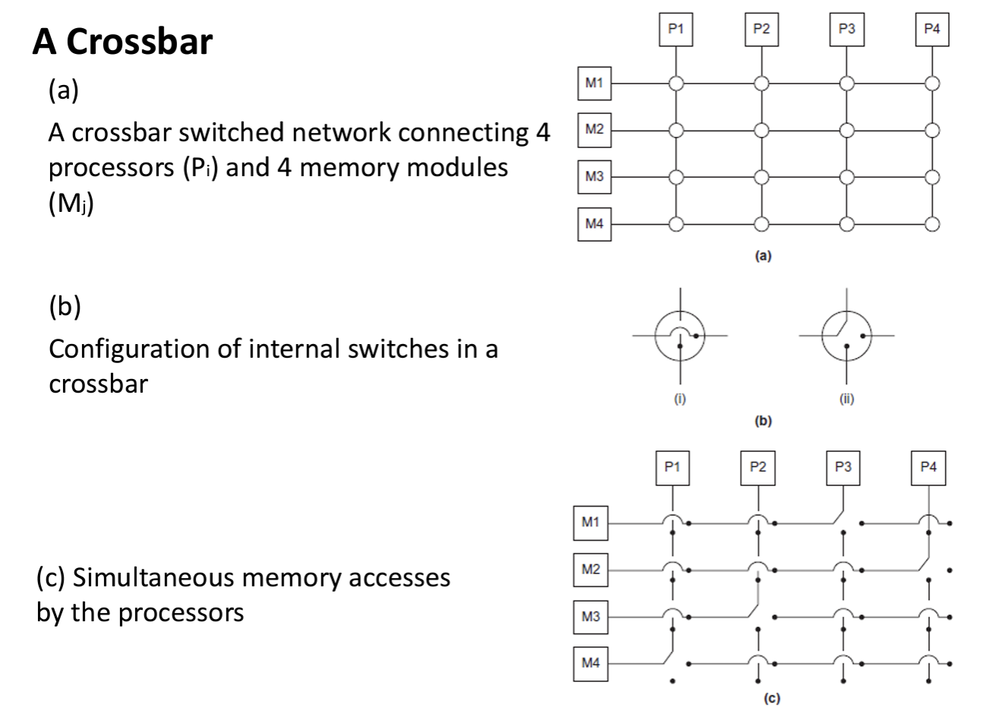

# Parallel Computing

## Lec advanced Hardware

- Memory access is still a big problem in parallel machines.

- Cache coherence (as we will see later) also has large negative effect on performance.

### SIMD

ex1:

ex2: vector
A vector processor is a type of central processing unit (CPU) or processing unit that is designed to perform operations on multiple data elements simultaneously, known as **vectors**. These processors excel at tasks that involve large amounts of data that can be processed in parallel, such as scientific simulations, image and video processing, and computer-aided design (CAD).

Vector processors typically have specialized instruction sets that allow them to efficiently process vectors. These instructions can perform operations on entire vectors of data in a single instruction. Modern CPUs and GPUs often incorporate vector processing capabilities to accelerate parallel computations.

- Vector registers -- Capable of storing a vector of operands and operating simultaneously on their contents.

- Vectorized execution units -- The same operation is applied to each element in the vector (or pairs of elements)

one big benefit: use **Memory bandwidth** well --- Bringing a bunch of values is better use for the bandwidth than bringing a value at a time.
**Memory bandwidth** refers to the rate at which data can be read from or written to memory.

- A very finite limit to their ability to handle ever larger problems. (scalability)

- The machine has a finite number of vectorized execution units -- The machine has a finite number of vectorized registers.

### MIMD

**MIMD** (Multiple Instruction, Multiple Data): In MIMD architectures, each processing element can execute a different instruction stream on different data streams. This allows for more general-purpose parallel processing and is commonly found in multi-core CPUs, clusters, and distributed computing systems.

- Supports multiple simultaneous instruction streams operating on multiple data streams.

- Typically consist of a collection of fully independent processing units or cores, each of which has its own control unit and its own ALU.

- Example: multicoreprocessors, multiprocessor systems

**Shared Memory System**:

**Distributed Memory System**:

Why bother? **Communication is very expensive.**
**interconnects**:
A collection of parallel communication wires together with some hardware that controls access to the bus.–Communication wires are shared by the devices that are connected to it.–As the number of devices connected to the bus increases: •Contention for use of the bus increases •Communication becomes unreliable due to noise. • Performance decreases.

#### **Bus Interconnect**:

In a bus-based shared memory system, **all processors are connected to a common bus**, which serves as the communication channel for transferring data between processors and memory.

In a bus-based architecture, processors typically use bus arbitration techniques to take turns accessing the bus and transferring data. When a processor wants to read from or write to memory, it must first request access to the bus. If the bus is currently being used by another processor, the requesting processor may have to wait until the bus is available.

**bottleneck** in systems with a large number of processors or high memory access rates: Bus bandwidth is shared among all processors, and contention for the bus can lead to **delays and reduced performance**.

As the number of devices connected to the bus increases:

- Contention for use of the bus increases
- Communication becomes unreliable due to noise.
- Performance decreases

#### **Shared memory interconnects**:

Shared memory interconnects are communication pathways that allow multiple processors to access a shared region of memory. This **shared memory space** enables efficient data sharing and communication between different parts of a system, such as processors, accelerators, and input/output devices.

**Switched interconnect**:
Uses switches:

- to control the routing of data among the connected devices.
- Those switches are connected by wireforming network of some topology.
- Example: **Crossbar** -- a Switched interconnect design
  - Allows simultaneous communication among different devices.
  - Faster than buses.
  - But the cost of the switches and links is relatively high.
    

Distributed memory interconnects: Two Types

- Direct interconnect
  - Each switchis directly connected to a processor-memory pair, and the switches are connected to each other.
- Indirect interconnect
  - Switches may not be directly connected to a processor.

**definition:**

- Latency–The time that elapses between the source’s beginning to transmit the data and the destination’s starting to receive the first byte.
- Bandwidth–The rateat which the destination receives data after it has started receiving the first byte

Message transmission time = $1 + n /b$.

### Cache coherence

The main goal of cache coherence is to ensure that:

**Reads are up-to-date**: When a processor reads a memory location, it should see the most recent write to that location, regardless of which processor performed the write.

**Writes are propagated**: When a processor writes to a memory location, its value should be propagated to all other caches that may have a copy of that memory location, ensuring that all processors see the update.

**The cores must share a bus**.

- Any signal transmitted on the bus can be “seen” by all cores connected to the bus.

- When core 0, or any other core, updates the copy of x stored in its cache it also broadcasts this information across the bus.

- If another core is “snooping” the bus, it will see that x has been updated and it can mark its copy of x as invalid.

## Parallel Software: Basics

- In shared memory systems: Start a single process and fork threads.
- In distributed memory systems： Start multiple processes.
- When using accelerators (e.g.GPUs)： Start a process with one or more threads.

Writing Parallel Programs double 、

1.  Divide the work among the processes/threads so that each process/thread gets roughly the same amount of work
2.  Arrange for the processes/threads to synchronize if needed
3.  Arrange for communication among processes/threads. Reduce communication as much as possible.

### Shared Memory

- Dynamic threads: Master **thread** waits for work, forks new threads, and when threads are done, they terminate Efficient use of resources. Thread creation and termination is time consuming.
  +Efficient use of resources
  -Thread creation and termination is time consuming

- Static threads: Pool of threads created and are allocated work, but do not terminate until cleanup. +Better performance
  -potential waste of system resources

有关thread和process的可以参考OSTEP。

### Build parallel programs.

**Foster’s methodology** (The PCAM Methodology)

1. **Partitioning**: divide the **computation** to be performed and the **data** operated on by the computation into small tasks. The focus here should be on identifying tasks that can be executed in parallel. This step brings out the parallelism in the algorithm

2. **Communication**: determine what communication needs to be carried out among the tasks identified in the previous step.
   

3. **Agglomeration** or **aggregation**: combine tasks and communications identified in the first step into larger tasks. For example, if task A must be executed before task B can be executed, it may make sense to aggregate them into a single composite task.
   

4. Mapping: assign the composite tasks identified in the previous step to processes/threads.

### Concurrency & Parallelism

**Concurrency**: At least two tasks are making progress at the same time frame. Not necessarily at the same time. Include techniques like time-slicing–Can be implemented on a single processing unit–Concept more general than parallelism

**Parallelism**: At least two tasks execute literally at the same time, Requiring hardware with multiple processing units

**Amdahl’s Law**:
How much of a speedup one could get for a given parallelized task?

If $F$ is the fraction of a calculation that is sequential then the maximum speed-up that can be achieved by using $P$ processors is $1/(F+(1-F)/P)$

这告诉我们，不要当一个傻逼硬堆cpu。

但是这个理论自然不完美：**Effect of Synchronization and Communication**

- Impact of sequential-to-parallel synchronization and inter-core communication on performance becomes more significant with parallelism.

- In applications with high degree of data sharing, leading to intense inter-core connectivity requirements: –The workload should be executed on a smaller number of **larger cores**.

For tasks with high inter-core communication requirements,–The workload should be assigned to a small number of cores,even if the parallelization fraction is close to 1.

For low arithmetic intensity tasks,–the workload may better be assigned to the sequential core, even if the parallelization fraction is close to 1.

### Analysis of a parallel program

用DAG。

我没看懂，讲的一坨，但是考试应该够用了，哎。

### Sources of Performance Loss in Parallel Programs

### 一些parallel的范式。

## Performance Analysis

PerformanceX = 1 / Execution timeX

X is n times faster than Y: " PerformanceX / PerformanceY = n

E(efficiency) = (Tserial / Tparallel) / P(#cores)

### Scalability

Scalability is the ability of a (software or hardware) system to handle a growing amount of work efficiently.

- If we keep the efficiency fixed by increasing the number of processes/threads and without increasing problem size, the problem is strongly scalable.

- If we keep the efficiency fixed by increasing the problem size at the same rate as we increase the number of processes/threads, the problem is weakly scalable.

### Timing

- Elapsed Time (aka wall-clock time)–counts everything (disk and memory accesses, I/O , etc.)–a useful number, but often not good for comparison purposes
- CPU time–doesn't count I/O or time spent running other programs–can be broken up into system time, and user time
- user CPU time –time spent executing the lines of code that are "in" our program

**Calculation: 直接看例子吧。**:

