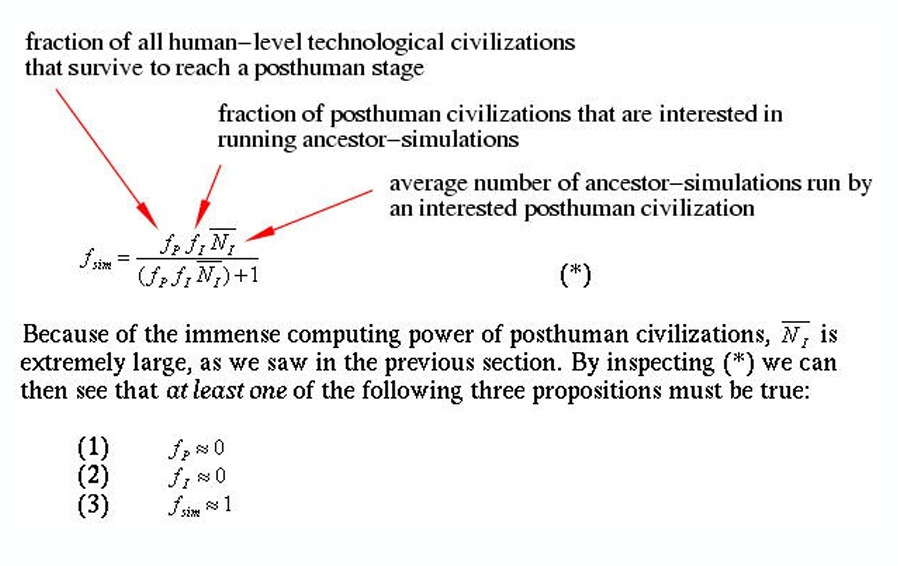
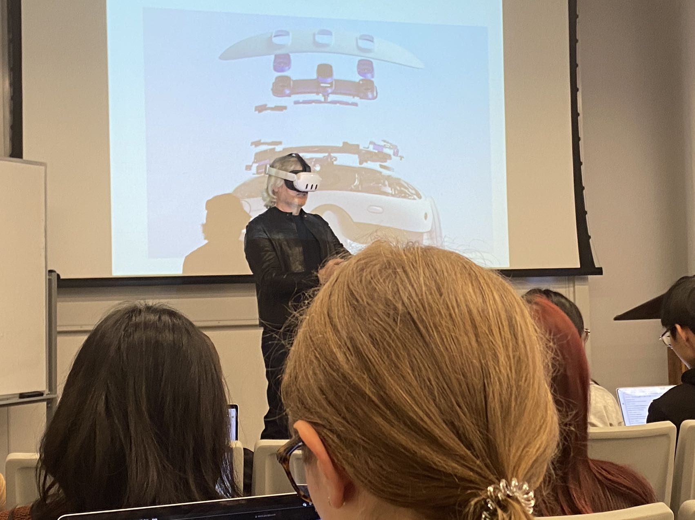

## Minds and Machines
这门课是今年心智影响最大的课，也是几乎整个学期最有趣的一门课，因此我专门写一篇blog。我在这门课开始时预期会dive into discussion and elaborate on arguments。但是上过之后才发现lecture大多都是通过现有的科技设备进行一个metaphysics，value，epistemologics的大思考，在lecture上对argument逻辑思考都是点到为止。（相当于是让你对哲学的基本问题有个认识，同时介绍了哲学史上一些有名的argument并且让你做一些小的辩证的思考）但是自己写paper的时候还是要注重logics。以下通俗的讲下对上完这门课总览，我的感受，我对哲学这门学科的理解，以及我从哲学中收获了什么。

1. 首先像普通的哲学课一样他会不断地question你去思考一个argument是否正确。这样我深刻的认识到相信一个信条的代价是非常大的。推出一系列看似合理的idea其实大部分人都可以，证明他是合理的很难。
   
2. 每个人心中都会有一个prefer的idea，你要去沉思，不断地思考为什么他是合理的，或者是，你心中的存在某些东西让它觉得是合理的，这样你能更加**理解自己，也能对一些问题有更深的洞察力**，这是有普遍的好处的。举个例子，在mind到底是什么的问题中，我prefer心物一体论，那么背后的原因是什么？我会深挖自己的过去，发现我其实高中大部分时间都花在了物理上，这种对经验科学的信任让我也无条件的对物理解释的喜爱。

（如果找不到自己的原因怎么办?）
* 站在巨人的肩膀上，看心物一体论的流行的paper。

3. 哲学好玩。哲学虽然硬核且对大部分人无意义，但是它确实好玩。比如很多奇怪的怀疑论让我对世界的认识多了一层神秘面纱，增加了更多的未知的乐趣。

比如这个模拟假说。

A statistical view of simulation hypothesis:
If there is a posthuman civilization and it is interested, it will run many simulations. 
If it runs many simulations, there will be many more simulated than nonsimulated beings.
So: either 
(i) there are no posthumans 
(ii) they’re not interested in simulations
(iii) most beings will be simulated

当然我觉得这个很大的问题是simulation的cost相当之大。假设你用了很多的内存来仅仅精准模拟一个原子的状态机，那么这个代价是天顶天的。很多非工科的学生对cost和performance之间的关系观察力很有限，他们并不会从这种偏经验的方向去argue against一个观点。

4. 有关思想实验。

_David Chalmers在用oculus来演示究竟有多沉浸哈哈哈哈哈哈哈_

在讨论实用主义的时候（An action is right if it produces the greatest good for the greatest number of people），教授引入了电车难题来challenge实用主义的观点，因为显然很多人并不是这么想的。

课堂里的反应都不相同：

1. 难题1：大部分拉下把手。
2. 难题2：你在一座桥上，面前是一个人，你如果把他推下去了，那5个在轨道上的人就不会死，但是你要切实地推下去。一半人拉下把手。
3. 难题3：你是一个医生，你的五个病人有五个关键器官严重损害，但是现在你的面前有一个完全健康的人，假设这五个器官可以被移植，你要杀了眼前这个人救五个人的命吗？没人举手。

其他的一些变种：
- 如果是5个模拟人，你会撞上去吗？还是拉下把手？显然大家认为都是有区别的，那么区别到底在哪里呢？那么，如果一个由硅基构成的，一切小至能和你的大脑肌肉都有一样的function的硅基人，到底和你有什么样的区别？你的歧视这是不是一种沙文主义？

- 如果桥上的人是你的至亲，你还会推她下去吗？实验中显然不会。
  
大部分的思想实验极端化了实验条件但是又相当合理，能够逼问出一些心里看似合理的观点背后逻辑的错误，一个设计的好的思想实验是很有价值的。

*12/19(add for the upcoming exams)*
**做哲学感受**。大部分时间写paper的时候我发现我对于自己非经验的，抽象的概念难以产生一些坚定的想法，立下hypothesis并且去强化这个hypothesis的合理性。相反的，我的体会大多是“我们怎么会产生这种看法”，我发现了我的性格更加适合学习教育 or 心理学 or 数学/工程这种形而下，经验所及范围之内的学科。以下是一些看法： 

- 我发现我对正确性的验证并没有很大的兴趣，所以基本排除了哲学作为minor的选项了，即使我内心认为增加自己的知识是令人开心的。我认为拒绝知识（事物之间的强逻辑联系）= 其实就是让自己变得更傻逼，但是我直觉上我觉得变得更傻逼 = 更多的不切实际的幻想 = 更多快乐。
- 我坚定不移的物质主义被打碎但是又重新愈合，它变得更加坚硬了。
- 众多怀疑论还是很有意思的，我认为不可否定它们的合理性。
- 如果为了真理舍弃了我成为一个有自我意识的人的一部分 --- 情感，对我来说是相当不值得的。很多时候思考的时候，我会发现我离开了这个世界太多，我收获的经验大多是一些抽象概念的时候，周遭的生活反而开始变得虚无且不真实。我认为这对幸福感是一个巨大的打击，我还是想写代码，做饭，和喜欢的朋友一起玩。
- 解构会让一部分完整运行的function变得支离破碎，缺乏自然的美感，而这种时候是解构的介入会破坏这种和谐，因为你对它脑中的认知已经是多个component占了大头，而不是一个完整的功能。我认为逻辑的利剑自始至终都应该指向人性中的糟粕。人类的情感中有一部分对于一个人来讲至关重要的部分，而我认为解构的利剑不应该让他们变得冰冷，不论他们是什么组成，当你们能够直观地感受到它的温度的时候，对他们再解构是一件对人来说残酷的事情。至于什么是情感中好的部分什么是坏的，每个人心里都有一个答案。

**如何变得更加杠精，偏攻击性**：
1. 因为哲学的语言十分的简练，因此即使是两个同义词之间的语义(semantics)也可以是天差地别。因此当一个使用逻辑的不怀好意的攻击者尝试在他的argument中使用同义词的话，那么你可以攻击他。

2. 通过众假设理清楚以及之间的ifthen关系，理出你为什么得到这个结论。如果你发现你的其中一个logical chain不合理，你可以改进它来得到一个更加合理的结论，你会对你的想法更加认同（当然这也只是你认同你的知识而已，你需要找另外一个讲逻辑的钢筋来增加你的知识）。(奇怪的知识增加了！)

Argument for Skepticism: 
1. I don’t know whether I’m in a simulation. 
2. If don’t know whether I’m in a simulation, I don’t know that I have hands.  
C: I don’t know that I have hands. 

Challenges: Premise two is false, simulated hands still own some properties about real hands. They are hands. To make it stronger, "hands" should be replaced with "real hands". Then the question becomes "what is real hands?"

我们再来看一个相当合理的argument。
Descartes: 
The Argument from Deception. 
1. The senses sometimes deceive me. 
2. If the senses sometimes deceive me, sensory beliefs aren’t knowledge. 
3. Sensory beliefs aren’t knowledge.

这些都是 **合理** 且 **有意义**的argument，他有意义是因为senses是大家认为有意义的东西，然后这个argument证明了sensory inputs不是获得knowledge的好途径，因此它有意义。

当然也有一些比较逗比的（无意义）argument：

again，x的意义的多少取决于相信x的对象。你如果相信x，那么x就有意义了。
你甚至可以搞一个这样的argument：

1. x's meaning is how many objects believes in values of x. 
2. Everything's value is believed. 
C: So everything is meaningful. 

**小总。**
显然逻辑的语言远远不止ifthen structure，但是我目前不太想前进了。这是一场大开眼见的旅行。感恩。