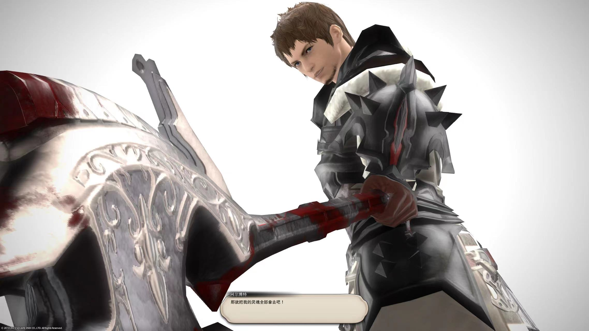

*这个好像是我的第一篇随想啊，那就写一下规则好了*

这里是草稿。
有些怀念高中时期。

### 喜欢。

#### 计算机学习。
从去年暑假开始接触cs61a开始，一年过去了，我就是零基础便到现在这个样子，也挺满意了吧。

去年的fall和spring学了数据结构，离散和算法，老师都挺负责任的（尤其是算法老头子），但是NYU的cs是真的水不要来学，但是好拿课好拿分那是肯定的。

总的来说就是，**在NYU上学能自学搞懂的就不要上课**。

然后在空闲时间自学了cs61b和algorithm的前半部分，嗯，很爽。

回顾整个暑假基本上用来彻底放松了，每天不是吃就是睡觉，纯纯的当了一个蓝狗

会起床找些时间翻翻csapp的书看看，lab做到shell lab就没心思继续做下去了，接下来像做一些unix网络编程的事情。

虽然看完csapp懂了一些皮毛，但是总的来说计算机系统对我来说还是像一个黑盒。

**学习不讲形式主义**。我都猜到了一些小资情怀的朋友会怎么杠我，“难道留学经历中刷题和学习是最重要的吗在这天天学习？”。这句话是没错的，和我价值观相符，但是我的生活习惯了非常割裂的状态 -- 学习的时候就好好学习，在NYC摸鱼和闲逛就彻底放松。学都学了还分啥心。
**兴奋感和焦虑**。学完csapp之后感觉整个人都想起飞，有很多感兴趣的地方，每一章我都想深入去了解，但是又抱着对未来没啥用的一种焦虑感，哎。。

我觉得我现在还是找一件事情开始**专注**的做比较好，就像当时开始翻阅csapp的动机一样。

高中班主任经常提一句话“办法总比困难多。”我们高中时期常常各种隐喻笑话我们班主任，但是他在心态上绝对是一个合格的班主任，要我说在天一这段时间学到了什么，那一定是实事求是的精神。和我一起上NYU的高中舍友就是很讲究实事求是精神的人（大雾），我从他身上学到了很多东西。这么说我还是很怀念高中的啊。

#### 游戏
过去的一年里因为某种中二情怀直接把我所有的游戏都删光了，把好友都删光了，但是我发现好像没了游戏，我这个人的底色都没有了。

想起来从小到大陪伴我最久的不是哪个身边的朋友，可能是gameloft手游，可能是4399，可能是一些垃圾页游，可能是彩虹六号和守望先锋。。。

这一年过去了，虽然我逼着我自己只用cpu和内存稍微好一点的电脑，拿的是集显玩的ff14。

也许另外一个时间线里我正在读游戏设计，和彦祖（我的一个朋友）成为了同学？ 

#### npy
这里就不爆了啊，反正没有，不知道未来会不会想要有。

### 坚定。

### 踌躇。
**有关找工作**
去美国学cs无非是为了更好的经济条件这无可厚非。毕竟想多了也没什么用，也不多说屁话了，放弃自己心里所谓的“反卷文艺情怀了”，（毕竟再不找工作我得饿死

最近的找工形势好差啊，地里知乎和网上几乎都是哀声载到

**政治**
政治上的事情谁都说不准，没准就赛博朋克了呢（笑

**个人未来**。
