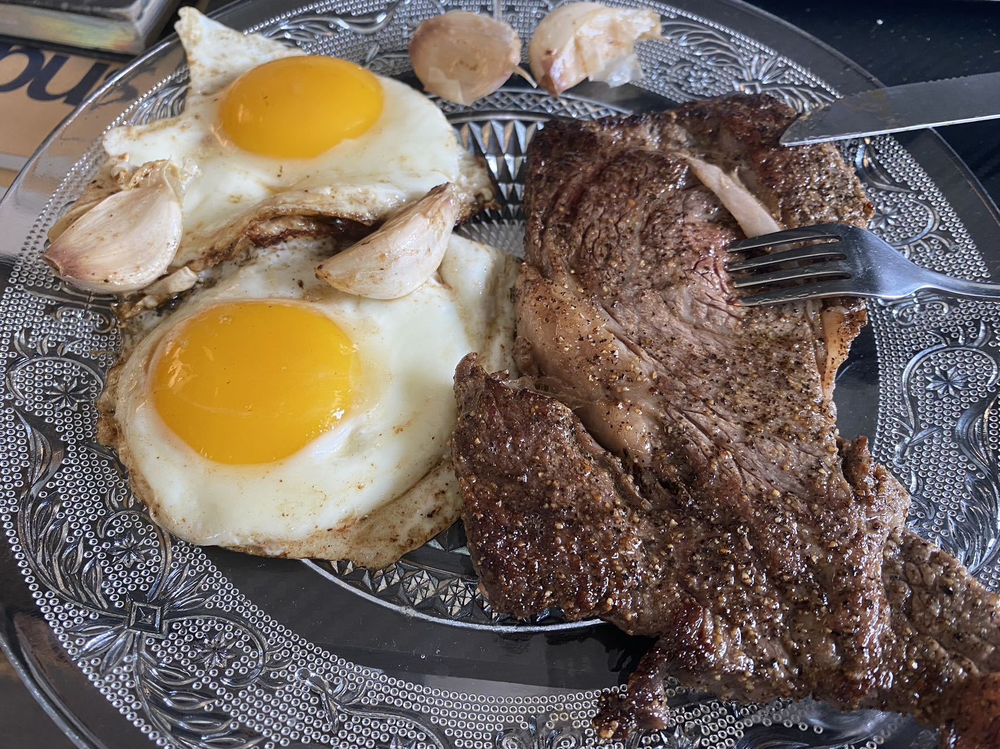
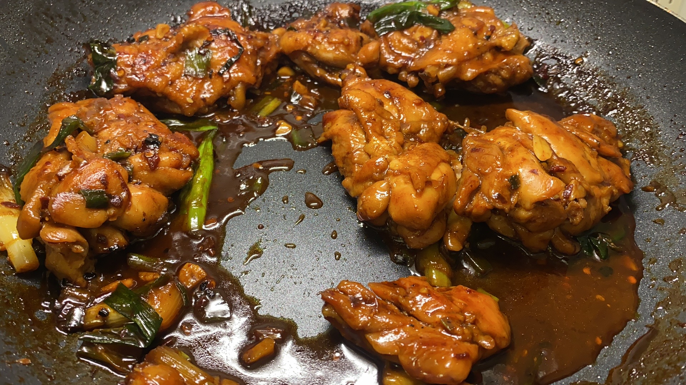

## 学了什么？ 
*此部分博文写于TODO*
**学校课程。**
Linear Algebra并没有学什么/ psycho是纯水课/ CSO权当复习了。

### **mind and machines**
这门课是今年心智影响最大的课，也是整个学期最有趣的一门课。我在这门课开始时预期会dive into discussion and elaborate on arguments。但是上过之后才发现lecture大多都是通过现有的科技设备进行一个metaphysics，value，epistemologics的大思考，并且argument都是点到为止，讲究的就是一个大而全而浅。（相当于是让你对哲学的基本问题有个认识，同时介绍了哲学史上一些有名的argument并且让你做一些小的辩证的思考）

但是这样的通俗介绍也非常不错，原因有以下几点： 
1. 首先像普通的哲学课一样他会不断地question你去思考一个argument是否正确。这样我深刻的认识到相信一个信条的代价是很大的。 
举个例子：在介绍“existence of the god”的问题上时，教授引入了一些曾经的人们坚信不疑的argument。其中一个argument通过世界是一个完美的design来证明神的存在。

> There exists so much intricate detail, design , and purpose in the world that we must suppose a creator. All of the sophistication and incredible detail we observe in nature could not have occurred by chance. 

这种argument在18世纪几乎是被当作dogma被很多人信奉的，但是我们这个祛魅已久，信奉科学价值观的世界对其嗤之以鼻。因为出现了很多tech design并不是原先世界的构造（比如飞机），也因为我们意识到很多世界的design并不是完美的（比如病毒）。因此可能并没有神创造这个世界。

2. 很多metaphysics的哲学观也让我对世界的认识多了一层黑盒和神秘的面纱，让自己的生活增加了更多的未知的乐趣。

举个例子: 如果世界是可以被模拟的（就像simscity一样，一个形象的比喻是我们的世界可能作为一个main function被一个电脑执行）。如果一个计算机有可能进行模拟的过程，那么至少有以下几种可能性：
可能会有很多的世界在被同时模拟着。
* 很多给模拟世界被压栈。
* 很多个“世界”程序并行执行（通俗的讲，你可以认为他们是**同时**的）。
* 有很多人在很多不同的计算机上做模拟。 

因此 $w_(n_1)$, $w_(n_2)$, $w_(n_3)$ ,$w_(n_i)$，在被一台computer同时进行着。

当我们从世界 $w_(n)$ 回到上一个世界 $w_(n - 1)$的时候，很有可能这个世界也是被模拟的。那么统计学意义上来讲，我们作为最初的那个为被模拟的世界的概率是很小的。


*David Chalmers在用oculus来演示究竟有多沉浸哈哈哈哈哈哈哈*

3. 我比较在意的还有value相关的问题。（因为我也时常拷问我自己什么才是meaningful life/./）
什么才是meaningful life? 

在讨论实用主义的时候（实用主义 -> 让更多的人最大化他们的享乐），教授引入了一个很经典的实验来challenge实用主义 --> 电车难题

在讨论电车难题的时候，Richard我们TA，给出了好几个电车变种，课堂里的反应都不相同：
1. 难题1(最经典的)：大家都会拉下把手撞死另一个轨道上的哪一个人。
2. 难题2（你在一座桥上，面前是一个人，你如果把他推下去了，那5个在轨道上的人就不会死，但是你要切实地推下去）：教室里举起的手少了一半。
3. 难题3（假设有个很长很长的轨道你会让另外一条轨道上的人痛苦的死去）：教室里只有一个人举手了（是我哈哈哈哈哈哈）

总结我的体验来讲：人归根到底是自私的。当你选择痛下杀手为了让更多的人能有更多的幸福的时候（在统计学上来讲让更多的人活下来肯定是幸福感能增强，也就是承认了实用主义(Utilitarianism)）。但是当你承受了杀手的身份，罪名自然归结到自己身上的时候，那么一个人的作为便大不一样了。就像上面不断进化的难题一般，他不断地挑战着人能够承受的责任的极限。

倘若你因为种种原因选择了不拉下杠杆，你就是选择了让更多的人死去，那么实用主义就被证伪了。（让更多的人最大化他们的享乐）

除此之外还有一些难题能给出一些insight：
* 如果是5个模拟人，你会撞上去吗？还是拉下把手？ （课堂里大多数人都是不拉）
* 难题2变种：如果桥上的人是你的母亲，你还会推她下去吗？ （在我心里，我绝对不会）

因此我发觉，每个哲学命题的给出其实都有发掘其中insight的目的，是很有价值的。

### **cs杂类**
*此部分博文写于TODO*
TODO 

### 有关未来的方向:
**有关心态**：
* **不要焦虑**。
  * 自己不可能从仅仅4年蜕变成工程方向的巨神，对自己心里有个数。
  * 我相信一个熟练的工程师是可以达到的。因此，要**自信**。
  * 不要过度焦虑/ 也不要过度规划。我的性格容易往长远思考，但是这样是不太好的。因为**做永远比等待选择更重要。**

大概picture是：
1. 下学期选课：os(walfish)，ait(还是想学点全栈), 235（学点概率打基础），480（水课）。还算比较tough。
2. gsoc之前自学：**15445**。确定自己喜不喜欢数据库内核方向。
3. 申请gsoc/ ospp（等待确定方向）
4. 暑假：
   1. gsoc
   2. 刷题 （查看刷题指南）
   3. 暑研（申请一下Research intern试试水 同时自学一下dl）（最近nyu新进了一个ap 感觉非常缺人 准备去试试水做做柯岩试试）

### 生活的细节
* 健身。
* 做饭。直接上图！！（虽然自己还是很菜，但是刚上路嘛！


* 游戏生活：街霸和ff14

### 有关生活的想法。 
**Question1：兴奋还是幸福？**
Ans：**幸福**。
对此，我认为：**因为多巴胺天平的存在，人一辈子的时间的“兴奋”的时间其实是有限的，但是人生的很长一段时间都可以保持“幸福”**。对于兴奋感，即使你什么事情都不做，甚至你认为的降低你的多巴胺（比如洗冷水澡），你的多巴胺（兴奋感）反而会上升。而但是幸福感不会，至少出于我的主观体验来讲，幸福感一直是**长期存在的**。

去真正的找一个真正的人而非利益的寄生虫开始相爱吧，你会收获幸福感。

**幸福是什么**？
这种幸福感可能是和自己的伴侣一起相处的时光但是什么都不干；可能是看到自己和自己孩子一起打游戏的照片而感到欣喜；可能是自己的真正的好homie结婚找到你作为伴郎。因为这些关系是基于真正的爱的而非利益关系，我想如果这些事情发生，我会感觉到的发自内心的幸福感。

### 你想要什么样的生活？ 
*此部分博文写于2023.10.14，求职季末期。*
我几乎在每个时间点都会对生活大概会是什么样有一种心理映像。

```
* 青春期 -> 我要的生活就一定要消费的更高才行（显卡，游戏，旅行等等）

* 成年第一年（去年） -> 必须要比现在的生活质素更加复杂，多样。（去各种博物馆，小众的游戏消费品，显得自己有个性）
 ```
**总结来讲就是：**
**之前** -> 越多越好的虚荣，钱财，名声。

而**现在** -> 能够扛住一定风险的钱财和名声，健康，内心的幸福感。

其实从最底层的追求一直没变 -- 一直是追求**人相对幸福的一生**，只不过是追求的方式和方向变了 -- 更加注重**内心**，注重**低风险和抗压能力**。

在纽约留学的生活，难道不应该是周末到处吃喝玩乐该玩玩，该学学，看看风景嘛？

虽然说我同样有很好的朋友，我们同样会hang out，除此之外我想我的生活在别人看来就是无聊至极的生活，一个人对着电脑敲敲打打创造自己的世界，空闲时候就登上ff14随便玩玩。

如此这般，想必和很多人都会嗤之以鼻吧。

流媒体所灌输的“理想生活 -- 去全世界旅行，和名人成为搭子，得到了和某个学术界/工业界/ 。。 大牛的合影。即使真正过上了这种生活，我就更加幸福了吗？**对我来说**不是的。

我是真的不喜欢，虽然说漫展，ufc我也都去看了，但是你要我提起别的兴趣，那我是真的搞不来。但是如果是真正的兴趣，那我就会去做这件事。就像这篇blog，即使除了我之外没一个人看我也不会后悔，我乐于书写文字。既然我喜欢，那我就会去做这件事。

#### 总结下来的我的价值观。
1. **抗压抗风险是一定要做的事情**，同时这件事情决定了我们一生的自由程度，是我们所处的这个世界的**必须达成**的一个目标。

举个例子：呆在美国无非大多数都是学码。（因为这是风险最小的收益不错的工作）

当然cs这门学科是很有意思的。对我来说并不仅仅是工作了。 

2. “**关注自己的心灵体验，而非物质生活**。” -- 这个观点很接近berkeley的idealism。用一句话来说就是自己的perception才是现实（reality）。

**牺牲热爱很久，有点不太值得。** 
```
以前有一段时间我会去固定时间学习更多的编程知识。
为了达成这一系列的目标，我常常会约束自己 -- 每天积极学习固定的时间，不能吃油腻的食物，禁止自己玩自己喜欢玩的游戏等等。
 ```
直到我做出最决绝的一步 -- **把自己的游戏库全部删光**。

我以为这样我就一定能成为更好的自己了。但是其实我发现我的生活因为这样变得更糟糕了。因为我的心灵一直在否定我现在所选择的生活。到头来，当我发现我把我小时候的kof97重新下回来，我的ff3，我的轩辕剑天之痕重新通关之后，我发现我的生活又重新开始焕发光彩了。

我觉得value的考量上上idealism其实很重要。我觉得人的一生中，真正值得关注的不是自己的物质生活，而是自己的心灵，因为心灵永远是最懂你的，要诚实。

注意，我并没有否定物质生活，他人，甚至是虚荣心的重要性。我只是更加强调了自己心灵是否真正的感受到了。

* 如果你是真的喜欢虚荣带给你的感觉，那就去做那些带给你虚荣的事情。

* ps5能带给你更多的享受吗，如果是的话，那就去买吧。但是如果只是别人在玩而是你羡慕了呢？那就不要再买啦，那浪费的都是自己的钱和时间。

### 有关梦想
*这个板块写于求职中期，具体时间忘了，大概原因是压力过大想总结一下。*

同时我真正地发现了对我来说，我的热爱就是**游戏** -- 如果这个世界上没有游戏的存在的话，我的人生是不会有光彩的。

我相信 -- **人的个性其实是在很早很早的时候，在探索世界时，塑造自己的性格的时候就塑造的差不多了。** 而当我回顾我的少年时光时：最棒的时间永远是与游戏相处的时光。

* **我非常乐于想象游戏的场景**。我会和我的表弟一起角色扮演我想象出来出来的场景。我会想象我们存在在某一个异世界当中。我们可能是其中的两大主角，很像魂斗罗的兰斯和比尔一起打败异世界中的怪物，虽然在现实中我们只是一起在玩泥巴而已。

* * **我非常乐于改善一个世界的设计**。我会在小学到下课的时候，我总是会积极加入已有的游戏小组中进行游戏，比如鬼抓人，并且不断地丰富着规则。
  * 我还写过类似DND的小说和选择向的迷宫，每次能找到一个参与者到我的游戏当中来，我就兴奋不已。
  * 直到现在我还是ff14的积极玩家，我非常乐意给国服制作组提意见啥的。

* **我几乎所有类型的游戏都玩**。动作，fps，格斗，mmorpg，普通的rpg，策略等等。

以至于当我年岁渐长，开始意识到有**责任**这个东西存在之后，我还是选择了和“**游戏**”或者“**玩游戏**”最接近的计算机。我热爱造东西，我更加热爱编织一个属于我的一个世界。当我开始反思为什么会同样这么喜欢cs，我发现 -- 对我来说研究某个系统，对其进行优化提出更好的设计，又或者是对于某个产品，你能做出更好的性能，维护好更大的用户量，这对我来说就是一种现实的**游戏**，而我对其乐此不彼。

游戏这个东西对我来说是**最为纯洁的几乎不沾一丝利益的东西**。几乎我的所有心灵生活几乎都脱离不开游戏的存在，细细品味之后，我的身上也总是能够找到游戏的影子。

一个人最大的能够支撑自己对生活其实是**希望**。

这个希望有可能是幻想，有可能是还未被实现的理想。但是只要一个人有希望，我想这个人一定是幸福的。

这个希望在我的人生里就是游戏，我希望能做出很棒的游戏，设计出很棒的系统，我希望真正的OASIS能够被实现出来，我希望我能成为James Haliday。

因为游戏的存在，我的心灵才有了生机。这也是为什么我会觉得自己的心灵，相比于别人的生活，是最重要的。

我是游戏人。
*我想在这里感谢我的老爸，因为他也同样很喜欢游戏，我非常感谢我的游戏人生之中能够有他的影子存在。*

> 对于热爱，其实很早很早一颗种子就在少年时期埋下了，作为成年人的自己除了要肩负巨大的责任之外，对于自己的热爱，真的只要静静地坐下来，和少年的自己聊聊而已。

### 小总。
*这个板块写于2023.10.29，在准备CSO mid的前夕。（因为实在是太无聊了）*
**对于每天的生活。**
* 每天努力到一个度，**持续地做**。我想传达的就是放平心态，慢慢地，踏实地。这样不会磨损幸福度，也会有很好的未来。
很多时候你每天努力的更多一点点反而只会让自己的幸福程度锐减。你努力的更多，也许会让你的未来稍微好点，但是这个度也许很小。[周信静](https://zhuanlan.zhihu.com/p/360390223)的例子告诉我们一切事情只要每天做,一直做。就能达到其他人都无法超越的高度。

* 获得幸福的人生重要的是**心态**。[毕导](https://www.bilibili.com/video/BV19c411o7os/?spm_id_from=333.337.search-card.all.click&vd_source=7e02795fb03862e4a4b16860c697aa69)的例子也告诉我们并不是只有一条道路可以走，即使是达到了原本难以攀爬的高峰，依旧会有心魔会不断的拷问自己，其实最终只要自己内心放下了，自然一切都会自洽起来。

**杂项**： 
* 吃好睡好，身体健康。
* 和真正爱的人相处好。
* 拥有自己的作品。
* 能保持对未知的好奇。
* 能确保找到份码工的工作。

**感恩**。