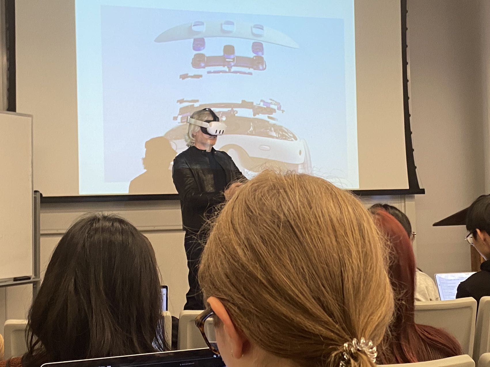
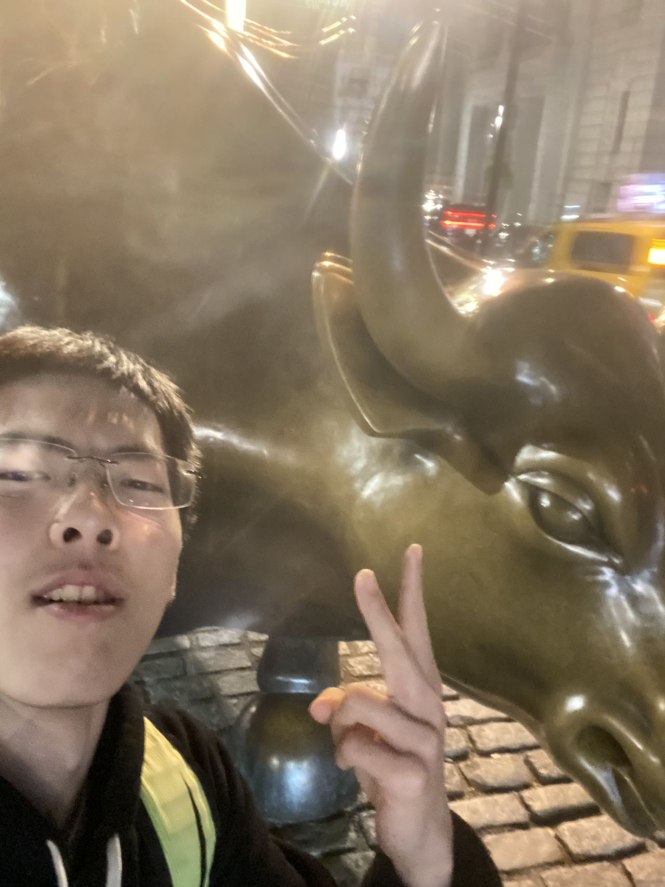
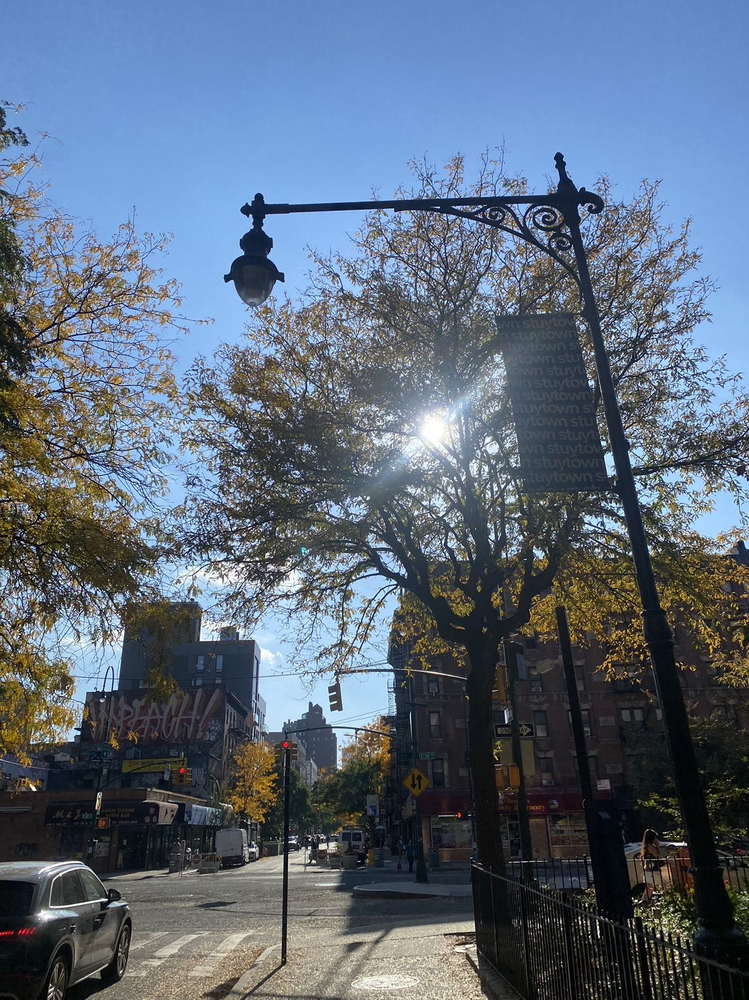
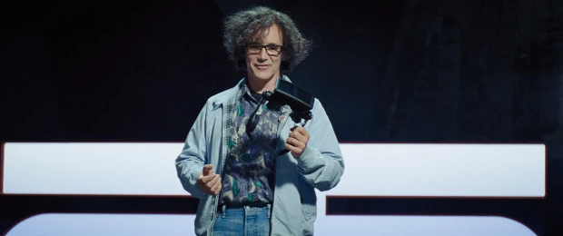

### 学了什么？ 
**学校课程。** *只说印象深的*。
CSO：简化版本的CSAPP，简要讲了下C和汇编和逻辑电路，相当简单但是也学的挺扎实。

### **mind and machines**
这门课是今年心智影响最大的课，也是几乎整个学期最有趣的一门课。我在这门课开始时预期会dive into discussion and elaborate on arguments。但是上过之后才发现lecture大多都是通过现有的科技设备进行一个metaphysics，value，epistemologics的大思考，并且argument都是点到为止，讲究的就是一个大而全而浅，后期真的太折磨了，让我对心灵哲学这部分一点都不在想继续深究了。（相当于是让你对哲学的基本问题有个认识，同时介绍了哲学史上一些有名的argument并且让你做一些小的辩证的思考）

虽然说上完之后几乎是打消了学习哲学的念头，但是这样的通俗介绍也非常不错，原因有以下几点： 
1. 首先像普通的哲学课一样他会不断地question你去思考一个argument是否正确。这样我深刻的认识到相信一个信条的代价是非常大的。
2. 同时面对他人几乎不过脑子的论断的时候，我们能几乎条件反射的指出其中他的预先假设中的不完备性。 

举个例子：在介绍“existence of the god”的问题上时，教授引入了一些曾经人们坚信不疑的arguments。其中一个argument通过世界是一个完美的design来证明神的存在。

> There exists so much intricate detail, design , and purpose in the world that we must suppose a creator. All of the sophistication and incredible detail we observe in nature could not have occurred by chance. 

这种argument在18世纪几乎是被当作dogma被很多人信奉的。但是我们这个祛魅已久，信奉科学价值观的世界一定会对其嗤之以鼻。

一些原因有：
* 出现了很多tech design并不是原先世界的构造（比如飞机）
* 也因为科学的出现使得我们意识到很多世界的design并不是完美的（比如病毒）。

因此可能并没有神创造这个世界。

2. 很多metaphysics的哲学观也让我对世界的认识多了一层黑盒和神秘的面纱，让自己的生活增加了更多的未知的乐趣。

举个例子: 如果世界是可以被模拟的（就像simscity一样，一个形象的比喻是我们的世界可能作为一个main function被一个电脑执行）。如果一个计算机有可能进行模拟的过程，那么至少有以下几种可能性：
可能会有很多的世界在被同时模拟着。
* 很多给模拟世界被压栈。
* 很多个“世界”程序并行执行（通俗的讲，你可以认为他们是**同时**的）。
* 有很多人在很多不同的计算机上做模拟。 

因此${w_(n_1)}$, ${w_(n_2)}$, ${w_(n_3)}$, ${w_(n_i)}$在被一台computer同时进行着。

当我们从世界${w_(n)}$回到上一个世界${w_(n - 1)}$的时候，很有可能这个世界也是被模拟的。那么统计学意义上来讲，我们作为最初的那个为被模拟的世界的概率是很小的。


*David Chalmers在用oculus来演示究竟有多沉浸哈哈哈哈哈哈哈*

3. 我比较在意的还有value相关的问题。（因为我也时常拷问我自己什么才是meaningful life）
什么才是meaningful life? 

在讨论实用主义的时候（实用主义 -> 让更多的人最大化他们的享乐），教授引入了一个很经典的实验来challenge实用主义 --> 电车难题

在讨论电车难题的时候，Richard我们TA，给出了好几个电车变种，课堂里的反应都不相同：
1. 难题1(最经典的)：大家都会拉下把手撞死另一个轨道上的哪一个人。
2. 难题2（你在一座桥上，面前是一个人，你如果把他推下去了，那5个在轨道上的人就不会死，但是你要切实地推下去）：教室里举起的手少了一半。
3. 难题3（假设有个很长很长的轨道你会让另外一条轨道上的人痛苦的死去）：教室里只有一个人举手了（是我哈哈哈哈哈哈）

总结我的体验来讲：人归根到底是自私的。当你选择痛下杀手为了让更多的人能有更多的幸福的时候（在统计学上来讲让更多的人活下来肯定是幸福感能增强，也就是承认了实用主义(Utilitarianism)）。但是当你承受了杀手的身份，罪名自然归结到自己身上的时候，那么一个人的作为便大不一样了。就像上面不断进化的难题一般，他不断地挑战着人能够承受的责任的极限。

倘若你因为种种原因选择了不拉下杠杆，你就是选择了让更多的人死去，那么实用主义就被证伪了。（让更多的人最大化他们的享乐）

除此之外还有一些难题能给出一些insight：
* 如果是5个模拟人，你会撞上去吗？还是拉下把手？ （课堂里大多数人都是不拉）
* 难题2变种：如果桥上的人是你的母亲，你还会推她下去吗？ （在我心里，我绝对不会）

因此我发觉，每个哲学命题的给出其实都有发掘其中insight的目的，是很有价值的。

**总体感受**：
* 我发现我对哲学的正确性的验证并没有很大的兴趣，因此基本排除了哲学作为minor的选项了。即使我内心认为增加自己的知识是令人开心的，但是在理解的过程中我的很多快乐都被带走了，就让我愚蠢的活好我的下半辈子吧。
* 不过这学期，哲学破除了我的很多迷思，也打碎了我坚定不移的物质主义。

### **cs杂类**

*此部分博文写于2023/11/08*

*今天真的是无聊的一天，起床就开始写哲学paper。*

**全栈**。一开始看了[FullStackOpen](https://fullstackopen.com/)这门课。

之后写道express的时候看的有点懵逼，就去看udemy的课了。[Node.js, Express, MongoDB & More: The Complete Bootcamp 2022](https://www.bilibili.com/video/BV1FY4y1H7ka/?spm_id_from=333.337.search-card.all.click)。

后者讲的相当详细并且非常适合入门后端开发，看的很开心。

**感受**。我认为全栈对一个编程入门学习者来说时非常有必要接触的领域。因为它帮助我
* 更加深入了解了一个软件开发的全过程。

* 得到了更大的视野。我是因为全栈开发需要用到很多库才有了 **框架，类库，数据库系统**。这种概念，也了解了为什么到底要开这一门课，对我来说是启发性很大的，心理大大的问号被解决的感觉。 

*此部分博文写于2023/11/25，感恩节，没课业压力爽的不行*
**OS**。看了CS162和MIT的OS课，也读了一些OS的前面部分。

我认为计算机系统的学习步骤其实是一个demystify的过程。因为一个人无法成为一个电脑，那么能做到的就是在学习像系统这样的课时已经尽可能的把上层抽象理解透彻了，比如学习全栈就几乎完全不要什么prerequisite一样，重要的事情都可以focus在业务逻辑和商业逻辑上。

因此我还是打算重温一下CSAPP这本书的6，9章，分别是cache和虚拟内存。对计算机组成还不是非常得心应手的时候，我认为还是需要一些项目做，现在再跟着做一个相当于温习CSAPP的项目[深入理解计算机系统](https://www.bilibili.com/video/BV1tz4y1y7JZ/)，与此同时的我打算同时启动NES模拟器的项目。支撑来继续我的系统之路。

**其他杂类有关cs的想法**：
人脑其实和一台计算机很像，一个人考前抱佛脚和在题目上耍小聪明其实就像框架代码，简化了很多步骤，但是换到另外一个方向就跑不通了。一些内功就像是你的软件，运行于什么样的架构之上，背后是什么操作系统，你的软件的好坏程度取决于你优化的时间，也就是你是如何调整自己思考的方式，如何改变自己认识事物的角度等等，我认为这是后天影响很多的，大部分是你的家境和运气，小部分由你的硬件决定的。而最最底层的我觉得就是智商和情商，其实就是你的硬件到底跑的有多块。或者换种说法是是基因，这种是先天决定大部分的，而后天也可以锻炼一部分的；就像CPU也要看是用多少材料堆的一样。

不过一个人的水平自然不能是只看其中的某一方面，比如智商，而是要看整体优化水平。因此这也就是种种非硬件因素play in的地方，拥有经济资源优势的人也许先天硬件不好，但是如果积极工作的确实能在框架和软件dev上做的很不错，更何况很多看似难的工作并不需要过高的硬件，either 情商 or 智商。不过总的来说如果受到的教育资源一致，并且都很吸收充分的话，基因就拉开差距了，但是我想这种情况只会在一个足够浪漫的梦里发生吧。

### **心态**：
* **不要焦虑**。
  * 自己不可能从仅仅4年蜕变成工程方向的巨神，对自己心里有个数。
  * 我相信一个熟练的工程师是可以达到的。因此，要**自信**。
  * 不要过度焦虑/ 也不要过度规划。我的性格容易往长远思考，但是这样是不太好的。因为**做永远比等待选择更重要。**

*此部分写于11.26，感恩节末期*。
生命有限，但是欲望是无穷无尽的。

昨天的时间几乎都用在了查阅一亩三分地和申请GSOC的事情上。 

论坛里的言论大多都是：

1. 计算机都是“坑”。 ------ 那我到底应该学什么呢？ 

2. job-oriented简历修改。----- 与之相比，我又不得不反思自己之前的学习系统的生活，这样学我还有什么用？如果学习这么多无用的东西，不能放在简历上的意义是什么？

经过这一天之后我开始思考这样做的成效，这样的做法不仅对幸福感是锐减的，并且成效也很有限。

从高中开始我的行动价值观是似乎是有惯性的，即使我的行为已经几乎完全摆脱了“完全追求世俗成功”的道路，但是属于你自己的世界的样子是什么，很大程度上还是取决于你怎么想怎么做。

如果把自己一天的身心都放在规划名利当中，那么其实生命力（想要活下去的欲望）是非常容易枯竭的，而且人也很容易陷入焦虑，痛苦，和虚无的意义之中，热爱会渐渐消失，生活就会变得枯燥乏味。

1. 但是不论如何, 追名逐利是这辈子少不了的一环。但是你的意识是完全可控的，可以把你的意识全部放在你的热爱上，之后再把追名逐利作为附带的东西的心态会让生活没那么绝望。

同时我意识到我真正发自内心所热爱的其实是无关乎他人的东西，是你喜欢的番剧，是你的吉他技巧，是你的编程技巧，是能够和你沟通心灵的朋友，是你的家。

2. 摆烂王！要知道自己的幸福这个东西是怎么也换不过来的，如果达不到也没关系的，毕竟有相当多的人舍弃了那么几年的。


### 生活的细节


TODO
* 健身。
* 游戏：打街霸和ff14

### 有关生活的想法。 
### 追求幸福
Ans：**幸福**。

对此，我认为：**因为多巴胺天平的存在，人一辈子的时间的“兴奋”的时间其实是有限的，但是人生的很长一段时间都可以保持“幸福”**。对于兴奋感，即使你什么事情都不做，甚至你认为的降低你的多巴胺（比如洗冷水澡），你的多巴胺（兴奋感）反而会上升。而但是幸福感不会，至少出于我的主观体验来讲，幸福感一直是**长期存在的**。

去真正的找一个真正的人而非利益的寄生虫开始相爱吧，你会收获幸福感。

**幸福是什么**？

找到同样喜欢一个文化的朋友一起聊天打游戏。

和自己的家人陪伴在一起做做饭吃吃烧烤，吹吹皮。

这种幸福感可能是和自己的伴侣一起相处的时光但是什么都不干；

可能是看到自己和自己孩子一起打游戏的照片而感到欣喜；

可能是自己的真正的好homie结婚找到你作为伴郎。

因为这些关系是基于真正的爱的而非利益关系，我想如果这些事情发生，我会感觉到的发自内心的幸福感。

### 如何保持一个良好的心态？
*此部分博文写于2023/11/08*
在很多时候我都遇到了动力缺失的问题。通常就是一天起来什么都不想干（内心会有一个很好的借口，比如自己的睡眠时间不够等等）。

吹哥（jonnason blow）介绍了他应对动力缺失的想法([应对动力缺失，虚弱感和抑郁的技巧](https://www.bilibili.com/video/BV1wW411T7Xu/?vd_source=7e02795fb03862e4a4b16860c697aa69))


我的insight：

1. Keep the condition of meditating while encounterting the negative state(anger, anxious, extreme happiness ... ), doing a introspection to you at that time. 
* make your body at condition of awareness. 
2. Your thoughts will not control your life because your thoughts are only a tiny part of your experience. 
3. Your sensations are completely neutrual, and it adds layers upon the sensations. 
No matter it is anxious feeling when you find mistakes, or sadness when encountering big failure, it is always important to control your mind.


用中文总结一下：

**人体的构成吹哥给出了一个较为可行的模型**：分为 --
1. Body sensation。人的感官知觉，这是最不可控的一部分。
2. 思想。这是你大脑中awareness的一部分，这是很可控的。
3. 情绪。这是你思想的反应，通过控制思想，这部分也会变得很可控。
  
我们的最终目的是获得幸福感，一切消极的思想只会让幸福感消失，那么我们该怎么做呢？
* 当动力缺失，陷入抑郁时候：
  
  1. 观察身体。通常这不需要，但是你可以用一种中性的角度去审视肉体。
  2. 观察心理。同样的，用中性的角度去审视。如果有负面情绪，那么就保持这种introspection，这样负面情绪会很快消失。
  3. 值得提出的是：上学期上的冥想课中，提到了可以通过深呼吸专注在呼吸上，如果自己的感觉自己的注意力转移到了别的情绪上时，你就可以观察它。和上面是一个道理。

一个很棒的心态是：
* 负面的意识除了拖累自己之外其实并不会让你的生活变得更好，而是能带着负面情绪继续向前走的话，你的基本盘才会越来越扎实，所以控制好你的心情很重要。

某种程度上来说就是什么都不做，不要急着做事，不要生气大喊大叫，不要马上玩游戏，而是停下来冥想审视自己。

我自己的其他经验是：当自己缺少动力时，通常可以散散心，做很简单的事情：
1. 整理自己的房间。
2. 约自己的好朋友

## 做好自己，不要比较。
做好自己。不要跟周围的人比较。

**原因**：比较太让人难受了，让自己难受的感觉（焦虑）倍增，调整正常意识回来的成本变高，生活对我来说约等于什么都不变就是最幸福的。

**说来简单但是很难。**

对我来说，我总是不自觉地想要关注别人。不论是找人和自己的成就比较啊，还是别人的游戏玩的比我好啊，还是别人有更加幸福的生活啊自己要不要也要试一试啊等等。

**细则**：
1. 面对别人的幸运，不要心生嫉妒，而是脚踏实地地活好自己的日子。
2. 面对别人的强大，不要心生畏忌，而是脚踏实地地做好自己力所能及的。
3. 面对别人的强大，逃避也是可以的啊！不是自己的那一份就不要取，懂得舍得。
4. 面对别人生活的光鲜，不要心生羡慕，而是自己去尝试是否符合自己的性格。

5. 同时一天以内减少不良信息的入脑，自由逛社交媒体的时间只能有10分钟，更多的时间放在自己的身上。
6. 也不要和除了自己密友以外的人多交流。

## 95%的时间活在当下。
未来的方向怎么想都想不明白。机会转瞬即逝是大概率事件。因此市场的变化是难以预测的，好的运气可以是你的基本盘，但是没人能够完全相信自己有好运气。

所以作为一个普通人类。做好自己力所能及的，不论是系统基础，系统设计，还是算法，还是数学，打好自己的基本盘。好好实习，好好写项目就够了。

扩散自己的意识到周围的东西上，去爱这个世界。

*此部分写于11.17*。

晚上玩了街霸，又开心也有失落，我感觉我越来越不喜欢竞技游戏了，我打算彻底不玩竞技游戏了，是时候放下所有的竞技游戏了，但是我会继续玩其他类型的游戏，因为他们带来的感觉是完全不同的。

竞技游戏菜是原罪。很明显我越来越没时间玩竞技游戏了，热爱更是比不上职业选手。除此之外主要是竞技游戏带来的刺激感稍纵即逝，和长期的幸福感不同。

我宁愿花这个时间来进行冥想，写代码，学数学，写blog，健身，成就感反而更强。

冥想让我重新体会到生活的感觉。就像小孩子那样，把自己的意识充分的扩展到周围。

数学和代码自己的大脑思维更加活跃，同时能创造出自己的作品我就会很满足。

写blog就不说了，和写代码差不多。

健身可以拥有一个健康的身材，同时每次经历过自己设定的目标时都会感觉自己更加强壮了。 

### 你想要什么样的生活？ 
*此部分博文写于2023.10.14，求职季末期。*
我几乎在每个时间点都会对生活大概会是什么样有一种心理映像。

```
* 青春期 -> 我要的生活就一定要消费的更高才行（显卡，游戏，旅行等等）

* 成年第一年（去年） -> 必须要比现在的生活质素更加复杂，多样。（去各种博物馆，小众的游戏消费品，显得自己有个性）
 ```
**总结来讲就是：**
**之前** -> 越多越好的虚荣，钱财，名声。

而**现在** -> 能够扛住一定风险的钱财和名声，健康，内心的幸福感。

其实从最底层的追求一直没变 -- 一直是追求**人相对幸福的一生**，只不过是追求的方式和方向变了 -- 更加注重**内心**，注重**低风险和抗压能力**。

在纽约留学的生活，难道不应该是周末到处吃喝玩乐该玩玩，该学学，看看风景嘛？

虽然说我同样有很好的朋友，我们同样会hang out，除此之外我想我的生活在别人看来就是无聊至极的生活，一个人对着电脑敲敲打打创造自己的世界，空闲时候就登上ff14随便玩玩。

如此这般，想必和很多人都会嗤之以鼻吧。

流媒体所灌输的“理想生活 -- 去全世界旅行，和名人成为搭子，得到了和某个学术界/工业界/ 。。 大牛的合影。即使真正过上了这种生活，我就更加幸福了吗？**对我来说**不是的。

我是真的不喜欢，虽然说漫展，ufc我也都去看了，但是你要我提起别的，通俗的，大家都喜欢干的事情（看演唱会啊，去图书馆学习啊，跟某个明星合影啊，citywalk啊什么的），那我是真的搞不来。但如果我内心叫我这么做了，那我就会去做这件事（除非有其他功利的）。就像这篇blog，即使除了我之外没一个人看我也不会后悔，我乐于书写文字，既然我喜欢，那我就会去做这件事。

#### 总结下来我新收获的价值观。
1. **抗压抗风险是一定要做的事情**，同时这件事情决定了我们一生的自由程度，是我们所处的这个世界的**必须达成**的一个目标。

**不达成的话你就寄了，还谈什么理想**。

对我来说呆在美国无非大多数都是写码，connect更多人，写更多的码，创更多的业whatever。

当然cs这门学科是很有意思的。对我来说并不仅仅是工作了。 

2. “**关注自己的心灵体验，而非物质生活**。” -- 这个观点很接近berkeley的idealism。用一句话来说就是自己的perception才是现实（reality）。 启示 -> 留一部分生活给热爱自由生长就好。
```
以前有一段时间我会去固定时间学习更多的编程知识。
为了达成这一系列的目标，我常常会约束自己 -- 每天积极学习固定的时间，不能吃油腻的食物，禁止自己玩自己喜欢玩的游戏等等。
 ```
直到我做出最决绝的一步 -- **把自己的游戏库全部删光**。

我以为我一定能成为更好的自己时，其实我的生活变得更糟糕了。因为我的心灵一直在否定我现在所选择的生活。到头来，当我发现我把我小时候的kof97重新下回来，我的ff3，我的轩辕剑天之痕重新通关之后，我发现我的生活又重新开始焕发光彩了。

我觉得value的考量上上idealism其实很重要。我觉得人的一生中，真正值得关注的不是自己的物质生活，而是自己的心灵，因为心灵永远是最懂你的，要诚实。

注意，我并没有否定物质生活，他人，甚至是虚荣心的重要性。我只是更加强调了自己心灵是否真正的感受到了。

* 如果你是真的喜欢虚荣带给你的感觉，那就去做那些带给你虚荣的事情。

* ps5能带给你更多的享受吗，如果是的话，那就去买吧。但是如果只是别人在玩而是你羡慕了呢？那就不要再买啦，那浪费的都是自己的钱和时间。

### 有关梦想
*这个板块写于求职中期，具体时间忘了，大概原因是压力过大想总结一下。*
*因为上一个板块对我的热爱介绍太少了，大多都是一个理论上的总结。这里我简要介绍一下我的热爱。*

同时我真正地发现了对我来说，我的热爱就是**游戏** -- 如果这个世界上没有游戏的存在的话，我的人生是不会有光彩的。

我相信 -- **人的个性其实是在很早很早的时候，在探索世界时，塑造自己的性格的时候就塑造的差不多了。** 而当我回顾我的少年时光时：最棒的时间永远是与游戏相处的时光。

* **我非常乐于想象游戏的场景**。我会和我的表弟一起角色扮演我想象出来出来的场景。我会想象我们存在在某一个异世界当中。我们可能是其中的两大主角，很像魂斗罗的兰斯和比尔一起打败异世界中的怪物，虽然在现实中我们只是一起在玩泥巴而已。

* * **我非常乐于改善一个世界的设计**。我会在小学到下课的时候，我总是会积极加入已有的游戏小组中进行游戏，比如鬼抓人，并且不断地丰富着规则。
  * 我还写过类似DND的小说和选择向的迷宫，每次能找到一个参与者到我的游戏当中来，我就兴奋不已。
  * 直到现在我还是ff14的积极玩家，我非常乐意给国服制作组提意见啥的。

* **我几乎所有类型的游戏都玩**。动作，fps，格斗，mmorpg，普通的rpg，策略等等。

以至于当我年岁渐长，开始意识到有**责任**这个东西存在之后，我还是选择了和“**游戏**”或者“**玩游戏**”最接近的计算机。我热爱造东西，我更加热爱编织一个属于我的一个世界。当我开始反思为什么会同样这么喜欢cs，我发现 -- 对我来说研究某个系统，对其进行优化提出更好的设计，又或者是对于某个产品，你能做出更好的性能，维护好更大的用户量，这对我来说就是一种现实的**游戏**，而我对其乐此不彼。

游戏这个东西对我来说是**最为纯洁的几乎不沾一丝利益的东西**。几乎我的所有心灵生活几乎都脱离不开游戏的存在，细细品味之后，我的身上也总是能够找到游戏的影子。（计算机对我来说也许不是，因为我学习的动机有一部分是功利的）

一个人最大的能够支撑自己对生活其实是**希望**。

这个希望有可能是幻想，有可能是还未被实现的理想。但是只要一个人有希望，我想这个人一定是幸福的。

这个希望在我的人生里就是游戏，我希望能做出很棒的游戏，设计出很棒的系统，我希望真正的OASIS能够被实现出来，我希望我能成为James Haliday。

因为游戏的存在，我的心灵才有了生机。这也是为什么我会觉得自己的心灵，相比于别人的生活，是最重要的。

我是游戏人。
*我想在这里感谢我的老爸，因为他也同样很喜欢游戏，我非常感谢我的游戏人生之中能够有他的影子存在。*

> 对于热爱，其实很早很早一颗种子就在少年时期埋下了，作为成年人的自己除了要肩负巨大的责任之外，对于自己的热爱，真的只要静静地坐下来，和少年的自己聊聊而已。

### 小总。
*这个板块写于2023.10.29，在准备CSO mid的前夕。（因为实在是太无聊了）*
**生活的节奏。**
* **每天努力到一个度，持续地做**。慢慢地，踏实地，这样不会磨损幸福度，也会有很好的未来。
很多时候你每天努力的更多一点点反而只会让自己的幸福程度锐减。你努力的更多，也许会让你的未来稍微好点，但是这个度也许很小。[周信静](https://zhuanlan.zhihu.com/p/360390223)的例子告诉我们一切事情只要每天做,一直做。就能达到其他人都无法超越的高度。

* 获得幸福的人生重要的是**心态**。[毕导](https://www.bilibili.com/video/BV19c411o7os/?spm_id_from=333.337.search-card.all.click&vd_source=7e02795fb03862e4a4b16860c697aa69)的例子也告诉我们并不是只有一条道路可以走，即使是达到了原本难以攀爬的高峰，依旧会有心魔会不断的拷问自己。其实最终只要自己内心放下了，自然一切都会自洽起来。

**希望**：
* 设计出更棒的系统，写好更好的Code。
* 设计出更棒的，大家都想玩的游戏。
* 成为一个更好的SF6玩家。

**每天小期待**： 
* 吃好睡好，身体健康。
* 和真正爱的人相处好。
* 能保持对未知的好奇。
* 能确保找到份码工的工作。

**感恩**。