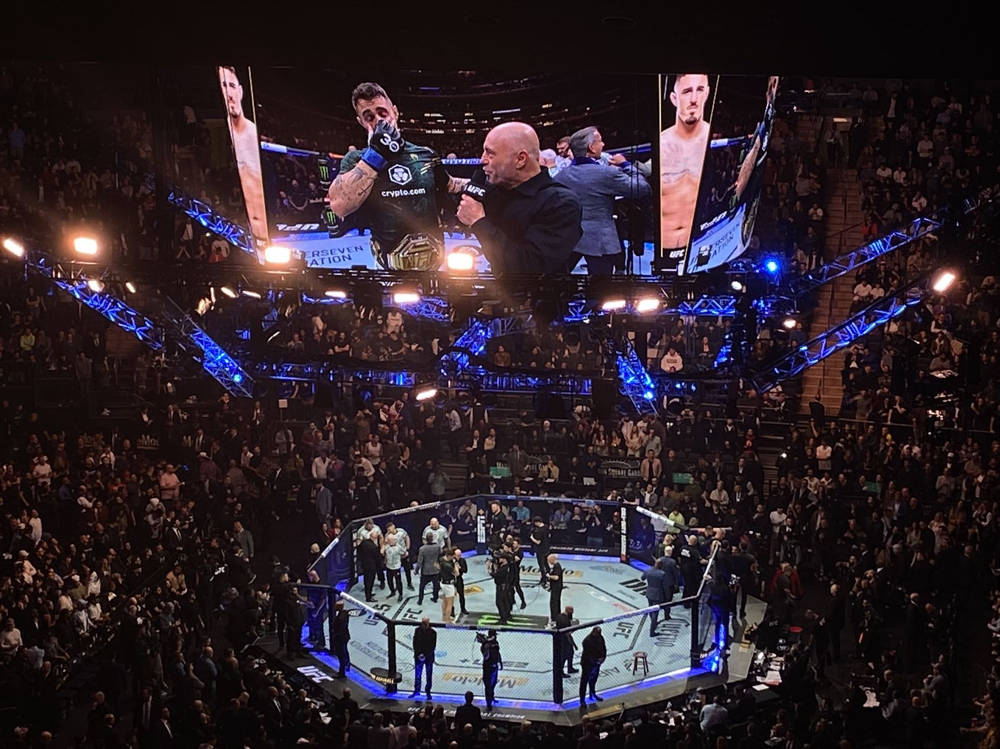
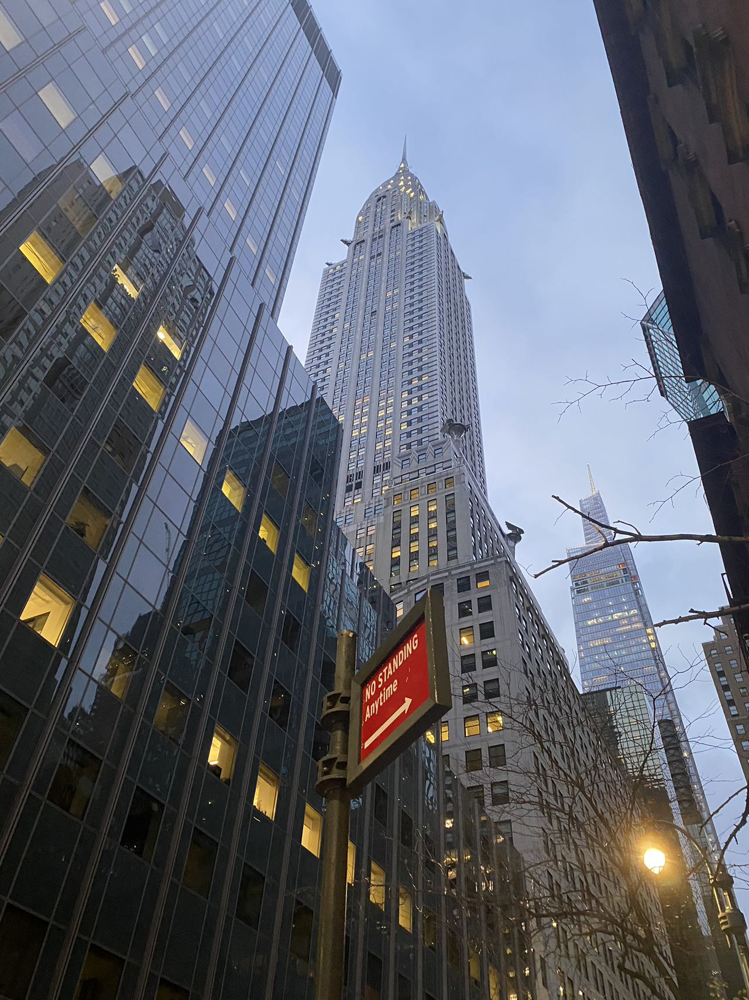
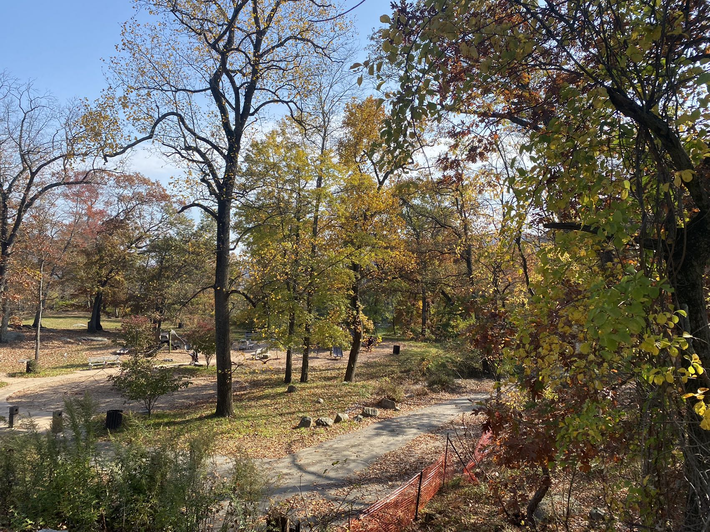

## 学了什么？

### **mind and machines**


### **cs杂类**

_2023/11/08_

**全栈**。一开始看了[FullStackOpen](https://fullstackopen.com/)这门课。

之后写到express的时候看的有点懵逼，就去看udemy的课了。[Node.js, Express, MongoDB & More: The Complete Bootcamp 2022](https://www.bilibili.com/video/BV1FY4y1H7ka/?spm_id_from=333.337.search-card.all.click)。

后者讲的相当详细并且非常适合入门后端开发，看的很开心。

**感受**。我认为全栈对一个编程入门学习者来说时非常有必要接触的领域。因为它帮助我

- 更加深入了解了一个app开发的全过程。

- 得到了更大的视野。我是因为全栈开发需要用到很多库才有了 **框架，数据库系统**。这种概念，也了解了为什么到底要开这一门课，对我来说是启发性很大的，心理大大的问号被解决的感觉。

_2023/11/25，感恩节_
**OS**。看了CS162和MIT的OS课，也读了一些OS的前面部分。

感受：我认为计算机系统的学习步骤其实是一个demystify的过程。因为一个人无法成为一个电脑，那么能做到的就是在学习像系统这样的课时已经尽可能的把上层抽象理解透彻了，比如学习全栈就几乎完全不要什么prerequisite一样，重要的事情都可以focus在业务逻辑和商业逻辑上。

因此我还是打算重温一下CSAPP这本书的6，9章，分别是cache和虚拟内存。对计算机组成还不是非常得心应手的时候，我认为还是需要一些项目做，现在再跟着做一个相当于温习CSAPP的项目[深入理解计算机系统](https://www.bilibili.com/video/BV1tz4y1y7JZ/).打算同时启动NES模拟器的项目，学习之后不知道会不会真的喜欢上系统这个方向吧，现在全是凭着兴趣学。

杂思考：**一个cs学生真正有价值的地方在于那里**？

从proj的搭建过程来说：

大抵流程是：question -> idea -> implement -> debug -> idea -> implement -> debug ... -> done.

我认为：cs学生真正有价值的地方在于解决一件事 --- 提出好的问题, 对idea有可行性的思考, 有快速掌握知识和实现和debug的能力。

1. 有关效率。

- 有关单兵作战能力：**快速掌握知识和实现和debug的能力**

不论是什么技术/math or engineering，重要的基石都是依靠科学的做事标准，实事求是的态度。

人脑其实和一台计算机很像，一个人考前抱佛脚和在题目上耍小聪明其实就像框架代码，简化了很多步骤，但是换到另外一个方向就跑不通了。一些内功就像是你的软件，运行于什么样的架构之上，背后是什么操作系统，你的软件的好坏程度取决于你优化的时间，也就是你是如何调整自己思考的方式，如何改变自己认识事物的角度等等，我认为这是后天影响很多的，大部分是你的家境和运气，小部分由你的硬件决定的。而最最底层的我觉得就是智商和情商，其实就是你的硬件到底跑的有多块。或者换种说法是是基因，这种是先天决定大部分的，而后天也可以锻炼一部分的；就像CPU也要看是用多少材料堆的一样。

不过一个人的水平自然不能是只看其中的某一方面，比如智商，而是要看整体优化水平。因此这也就是种种非硬件因素play in的地方，拥有经济资源优势的人也许先天硬件不好，但是如果积极工作的确实能在框架和软件dev上做的很不错，更何况很多看似难的工作并不需要过高的硬件，either 情商 or 智商。不过总的来说如果受到的教育资源一致，并且都很吸收充分的话，基因就拉开差距了。

- 组织能力/ lead的能力: 重要，但是缺乏经验所以不说。

2. 如何得到一个好的idea。

3. 怎么提出一个好的问题。

**有关知识本身**。了解知识重要的在于理解知识之间的联系，理解了逻辑才是真正的成长。
TODO

### 去了哪？

基本都呆在纽约了。


ufc295埃斯皮纳尔/佩雷拉夺冠 -- 主赛全部tko/ko见证历史。







- 健身。
- 游戏：街霸/ff14

## 生活 -- 我的一些价值准则。

### 追求幸福
对此，我认为：**因为多巴胺天平的存在，人一辈子的时间的“兴奋”的时间其实是有限的，但是人生的很长一段时间都可以保持“幸福”**。对于兴奋感，即使你什么事情都不做，甚至你认为的降低你的多巴胺（比如洗冷水澡），你的多巴胺（兴奋感）反而会上升。而但是幸福感不会，至少出于我的主观体验来讲，幸福感一直是**长期存在的**。

**对我来说幸福是什么**？

找到同样喜欢一个文化的朋友一起聊天打游戏。

和自己的家人陪伴在一起做做饭吃吃烧烤，听班卓琴。

这种幸福感可能是和自己的伴侣一起相处的时光但是什么都不干；

可能是看到自己和自己孩子一起打游戏的照片而感到欣喜；

可能是自己的真正的好homie结婚找到你作为伴郎。

因为这些关系是基于真正的爱的而非利益关系，我想如果这些事情发生，我会感觉到的发自内心的幸福感。

### **不要焦虑**。

- 自己不可能从仅仅4年蜕变成工程方向的巨神，对自己心里有个数。我相信一个优秀的入门工程师是可以达到的。因此，要**自信**。
- 不要过度焦虑/ 也不要过度规划。在短期内不断调整自己的状态，在已知的方向上随着惯性持续的努力是成就感最大的。

### 有关专业选择。

_此部分写于11.26，感恩节末期_。
生命有限，但是欲望是无穷无尽的。

case：不要拘泥于负面言论
昨天的时间几乎都用在了查阅一亩三分地和申请GSOC的事情上。

论坛里的言论大多都是：

1. 计算机都是“坑”。 ------ 那我到底应该学什么呢？

2. job-oriented简历修改。----- 与之相比，我又不得不反思自己之前的学习系统的生活，这样学我还有什么用？如果学习这么多无用的东西，不能放在简历上的意义是什么？

经过这一天之后我开始思考这样做的成效，这样的做法不仅对幸福感是锐减的，并且成效也很有限。

从高中开始我的行动价值观是似乎是有惯性的，即使我的行为已经几乎完全摆脱了“完全追求世俗成功”的道路，但是属于你自己的世界的样子是什么，很大程度上还是取决于你怎么想怎么做。

如果把自己一天的身心都放在规划一个遥远的目标当中的时候，那么其实生命力（想要活下去的欲望）是非常容易枯竭的，而且人也很容易陷入焦虑，痛苦，和虚无的意义之中，热爱会渐渐消失，生活就会变得枯燥乏味。

1. 但是不论如何, 追名逐利是这辈子必不可少的一环。但是你的意识是完全可控的，可以把你的意识全部放在你的热爱上，之后再把追名逐利作为附带的东西的心态会让生活没那么绝望。

同时我发现我并不期待有特别特别多的钱，因为如果到了能够完全cover掉自己的risk之后钱就没那么重要了。我发现其实能够自由地学习自己喜欢的东西，去完成某些革新性的工作就是我最理想的生活了，因此我还是主要以**简朴**的生活为标准继续生活。

同时我意识到我真正发自内心所热爱的其实是**无关乎陌生人**的东西。重要的是你本身和你所在的“附近” --- 是喜欢的番剧，是你的吉他技巧，是你的编程技巧，是能够和你沟通心灵的朋友，是你的家人。

2. 摆烂在心，卷在行动。经过试验，这是比较健康的行为模式。

摆烂在心：

- 在稀松平常的生活中不要看一亩三分地或者知乎增加焦虑！不要看！不要看！大部分的帖子还是一个空想的大目标，具体这个对身心摧残多糟糕我就不说了。

卷在行动：在做这件事情上多下功夫，好好挑选一个自己真正喜欢的项目，不要问自己“为什么”这种问题，把大目标拆分成可行的小目标进行操作。

- 宏大叙事少接触，看个乐子就行。以一个宏大叙事去急匆匆地规划人生是一种统计学上不严谨，对自己的人生不负责任的行为。真实的社会是复杂系统，它总是会以一种你意想不到，但是十分真实的方式影响你的生活，仅仅凭灵长类大脑是无法理解的。稳定自己的基本盘而不是空思考。

### 做好自己，不要比较。

杜绝消费主义：做好自己感兴趣的，够了就不要买了。在物质上不要跟周围的人进行物质/虚荣的比较。

**心态**：你的努力不是为了让谁的生活**以逊色**，也不是让自己的生活**更体面**，而是为了让自己的生活更加有幸福感。

1. 面对别人的幸运，不要心生嫉妒，而是脚踏实地地活好自己的日子。

2. 面对别人的强大，不要心生畏忌，而是脚踏实地地做好自己力所能及的。

3. 面对别人的强大，逃避也是可以的啊！不是自己的那一份就不要取，懂得舍得。

4. 面对别人生活的光鲜，不要心生羡慕，而是自己去尝试是否符合自己的性格。

### 如何调整自己以获得动力 -- 冥想。

在很多时候我都遇到了动力缺失的问题。

吹哥（jonnason blow）介绍了他应对动力缺失的想法([应对动力缺失，虚弱感和抑郁的技巧](https://www.bilibili.com/video/BV1wW411T7Xu/?vd_source=7e02795fb03862e4a4b16860c697aa69))

我的insight：
**人体的构成吹哥给出了一个较为可行的模型**：分为 --

1. Body sensation。人的感官知觉，这是最不可控的一部分。
2. 思想。这是你大脑中awareness的一部分，这是很可控的。
3. 情绪。这是你思想的反应，通过控制思想，这部分也会变得很可控。

我们的最终目的是获得幸福感，一切消极的思想只会让幸福感消失，那么我们该怎么做呢？

- 当动力缺失，陷入抑郁时候：
  1. 观察身体。通常这不需要，但是你可以用一种中性的角度去审视肉体。
  2. 观察心理。同样的，用中性的角度去审视。如果有负面情绪，那么就保持这种introspection，这样负面情绪会很快消失。
  3. 值得提出的是：上学期上的冥想课中，提到了可以通过深呼吸专注在呼吸上，如果自己的感觉自己的注意力转移到了别的情绪上时，你就可以**观察**呼吸本身，这和上面是一个道理。

一个很棒的心态是：

- 负面的意识除了拖累自己之外其实并不会让你的生活变得更好，而是能带着负面情绪继续向前走的话，你的基本盘才会越来越扎实，所以控制好你的心情很重要。

某种程度上来说就是什么都不做，不要急着做事，不要生气大喊大叫，不要马上玩游戏，而是停下来冥想审视自己。

_2023/12/6_
其他经验是：在自己缺少动力：

1. 做很简单但是必要的事情：整理自己的房间/ 认真做一次饭。
2. 心灵的放松：约自己心性相似的好朋友聊聊天。

一周的行动要有一个大概的印象：

3. 每周我大概只有5天的时间能够全力以赴地学习，其余的时间我都是用来寻找自己或者给自己一些真正感觉到活着的时间 -- 自由的玩自己想玩的游戏，听想听的播客，读一份源码，读一些文字，去一个地方吹吹风等等。这些对我来说是必要的，我清晰地认识到我没有那些程序员大神那样热爱。

### 有关睡觉的问题。

睡觉是非常重要的，它影响了一天的效率。我认为需要把睡觉当成是一件非常重要的事情。

但是不能把意识放在睡觉这件事情上，该睡觉的时候 --- 保持一种起床时候“洋洋散散”爬不起来的感觉是最时候入眠的。

以下是警戒线，睡前千万不能干：（其实**平时也最好不要干/在工作日跟别人也少谈这些事情（除放假）**。）

- 大喜大悲。
- 高刺激：打竞技游戏/ 性生活这种。
- 高焦虑：看知乎/一亩三分地这种论坛/ 或者是规划自己的未来。（少干这些事，并不会带来多大变化。）

睡前读书其实是最棒的选择。对我来说催眠效果第一/ 而且安静的环境读书太爽了。

### 正式quit所有强竞技游戏。

_此部分写于11.17/ 12.1_。
我越来越不喜欢竞技游戏了。

因为我发现我真正喜欢玩的element其实只是竞技游戏的很小一部分而已 --- 合作社交，一起攻克难关。但是却不是为了击败另一个队伍/另一个人，享受碾压别人的快感/或者是胜利的快感，这些感觉我并不是很能感觉到，而且我觉得这种感觉是有点病态的。除此之外主要是竞技游戏带来的刺激感稍纵即逝，和长期的幸福感不同。

因此我打算彻底不玩竞技游戏了，但是我肯定会继续玩其他类型的游戏。

玩和别人合作的，有趣的游戏（比如dnd跑团这种），练练吉他，冥想，写代码，写个哲学证明，写blog反思记录生活，健身，成就感对我来说更强，是一种长期的幸福感。

冥想让我重新体会到生活的感觉。就像小孩子那样，把自己的意识充分的扩展到周围。

数学和代码自己的大脑思维更加活跃，同时能创造出自己的作品我就会很满足。

写blog就不说了，和写代码差不多，并且长文字对我来说有特殊的意义，他总是能承载朋友圈承载不了的东西。

健身可以拥有一个健康的身材，并且每次我都能感觉持续进步的感觉。

### 你想要什么样的生活？

_此部分博文写于2023.10.14，求职季末期。_
_2023/12/6修改_

1. 赚钱不是为了更高级的消费而享乐 -- 而是为了抗压抗风险，因为有家人。抗压抗风险是一定要做的事情，因为它决定了我对自由的感知能力（越多的抗风险能力，越能感觉到自由），这是大多数人在我们所处的这个世界的**必须达成**的一个目标。（除非你真正意义上只为了自己活着，那么抗风险的要求很小。）

2. “**关注自己的心灵体验，而非大部分行为**。” -- 这个观点很接近berkeley的idealism。用一句话来说就是自己的perception才是现实（reality）。这带给我的启示是 -- 需要通过心灵 + 理性 来规划自己的生活，而不能二极管完全逼着自己做事情，那么意义感将会消失。

Case:

```
以前有一段时间我会去固定时间学习更多的编程知识。
为了达成这一系列的目标，我常常会约束自己 -- 每天积极学习固定的时间，不能吃油腻的食物，禁止自己玩自己喜欢玩的游戏等等。
```

直到我做出最决绝的一步 -- **把自己的游戏库全部删光**。

我以为我一定能成为更好的自己时，其实我的生活变得更糟糕了。因为我的心灵一直在否定我现在所选择的生活。到头来，当我发现我把我小时候的kof97重新下回来，我的ff3，我的轩辕剑天之痕重新通关之后，我发现我的生活又重新开始焕发光彩了。

我觉得在value相关问题上idealism的观点很重要。因为我觉得人的一生中，如果一定要有一个价值标准来和衡量一件事情**值不值得**做 --- 那就是自己的心灵，因为心灵永远是最懂你的，要诚实。

我并没有否定物质生活，他人，甚至是虚荣心。我只是更加强调了自己心灵是否真正的感受到了。

- 如果你是真的喜欢虚荣带给你的感觉，那就去做那些带给你虚荣的事情。

- ps5能带给你更多的享受吗，如果是的话，那就去买吧。但是如果只是别人在玩而是你羡慕了呢？那就不要再买啦，那浪费的都是自己的钱和时间。


### 人生的意义到底是什么？

**哲学的意义**。对我来说哲学和写作就像是搭建自己的认知大厦的过程，我是为了让自己的生活而思考的。写哲学的过程也就是为了让自己整个思考过程更加具有逻辑，就像磨刀一样。

**意义是什么？**
意义的定义必须规定一个人的时候才有意义，这是我对它的定义。一个东西本身并不承载任何的意义。一个人人生的意义和人类存在的意义是什么是完全不同的问题。。因此单单的问人生的意义没什么用，而是要问“我的人生意义是什么？”

**人类的意义是什么。**
从自然的角度来讲，这个问题的答案是非常绝望的 --- 人类的存在意义很小，唯一的意义就是为了让自然这个系统继续运作下去。这也是为什么很多科幻和自然纪录片都展现在自然面前人类很渺小，因为事实就是如此。

**我的人生的意义是什么**。
从一个人的角度来讲，尤其是一个人的感官所及之处是自己所处的生活的时候，那么意义这份东西是伟大的。因为就一个人的经验来谈，他能够理解的最深的东西无非是自己的周边的事情，自己喜欢的知识领域，自己的社区。

就世界是怎么运作的来讲我是机械唯物论者，虽然这个学说还是充满了决定论的色彩，让自由意志显得没那么自由。虽然人类看似是一个和计算机一样的“冰冷的机器”，但是我仍然认为首先
1. 人类的构造至少是地球上最复杂最美丽的系统。
2. 其次这种系统诞生了自我意识和语言，让人类系统1和人类系统23456能够组成社区，产生社会，产生情感。

在太阳系之外人类极大概率会被更高级的物种薄纱。如果人是蠢b的话其实没什么问题，问题是我们人类具有想象力，即使接触不到我们也能够幻想并且合理化这种生物的存在。假设你有足够大的想象力和胆子，你就可以这么假设这种生物其实一直活在和自己宇宙一起的生活中，客观来讲我们之于山外的世界是非常渺小的。因此竞争的意义同样也是很小的，当绝对的差距摆在眼前时，单纯的竞争其实是没什么意义的。

**观点：你的经验极限很有可能就是太阳系。**
不过你要知道，你的这辈子很有可能只能接触到人类社会，即使是竞争本身的价值并不能被你的想象轻易的碾碎的。

**思考意义的意义本身？**
大多数时候思考使人痛苦。我思考的原因是因为思考能够让我理解很多东西更深刻，而且不理解很多东西我就会很难受。faker开一把游戏的时候可能完全不会思考自己为什么要开一把游戏，没人知道为什么。但我认为这就是热爱，他背后的源动力有时候并不需要过多的追问，因为热爱本身就是一个人的意义。

因此如果当有一件事情，你甚至不用规划就可以去做的时候，我认为这就是不需要思考意义所在这个问题，因为他是热爱本身。

**当我们思考是否要打游戏的时候，我们会追问电子竞技的意义**
如果你从赛事承办方的角度来看，电子竞技的意义就是一些人追逐奖金，吸引选手的流量赚钱嘛。但是如果分到每一个人的头上的时候，你就可以理解电子竞技的意义究竟是什么了：

--- faker为什么会被称作是神中神。他被称作神是因为前三座s赛奖杯，无人能敌。最后一座奖杯是他作为一个充满意志力的人的象征，所以他被称作神中神。

如果你去这么理解，你从faker的电子竞技故事中读出来的其实是一种抵抗命运的态度，它的赛事承载了faker惊人的意志力的意义。电子竞技因此又被赋予了全新的意义。而如果一个人认为高段位才有资格打这个游戏的时候，他认为的电子竞技的意义自然是强者为王，那么坚持电子竞技的意义只有成为最强，但是比你强的人永远是有的，所以坚持的意义其实是很淡的。

所以，你是否要打算玩电子竞技，取决于电子竞技对你的意义是什么，相比于其他活动更有意义吗？

**当我们思考是否要继续坚持，我们会追问坚持的意义**

Q：在岁月的宿命面前（年龄），坚持重要吗？
从faker的例子来讲 --- 偏好决定论的反驳者会说faker会坚持拿到第四冠，他的努力的性质也是命中注定的，那么既然这样，他这样努力的态度也并不值得被赞颂。

我认为这是错误的。我的观点是，即使是一个及其复杂的机器，他被做出来能够做到所有机器都做不到的事情，那它就是有价值的。而我认为，人类这个机器在某种时刻，在计算自己的认知的时刻，它能够理解自己是在努力，并且可能传给自己的大家称之为“自由意志”的神经元来处理决策信息，这个自由意志神经元也许和自己的经验神经元做一些交互，在反复挣扎之下最后做出了“继续努力”的行为。Faker这个人类系统做的好自然是因为他自己，所有的媒体都会尝试艺术的方式神话这些人，就是因为他们有一些特质是所有人类都没有的。（从自然的角度来看）而这自然是相当值得赞美的。

因此，我相信李哥是因为一些特殊的东西打算继续坚持的（友情，成就，或者是纯粹的喜欢玩）。而这对我们来说结论是一样的，如果你喜欢某个东西，不论出于什么动机（好奇，友情，成就）

**于是，解构生活，然后挑选充满意义的部分再重组** 
* 玩游戏的意义？
对我来说挺多的。
1. 好奇。通过游戏体验一些现实中无法体验的事情，比如星际拓荒，ff14，它带给我的体验远超读一本科幻小说。
2. 休息。跟一些人聊聊天（本质是和作者）

* 你想继续电子竞技吗？
但是我玩竞技游戏的心态基本完全不是为了好玩或者好奇，纯粹是为了变得更强或者是比更多人强，而这种意义付出的代价太大，我要损耗我原本可以满足我好奇心和其他美好东西的时间去在一个项目上比别人更强，我认为不值得。但是打算继续观看一些人追梦的故事也很爽，其实就相当于看电影吧。

* 你想继续挑战自己吗？挑战自己的极限的意义在哪里？ 
挑战极限这件事情取决于领域。如果是做一件自己完全感到绝望的事情，那无非是拿自己的生活遭罪，但如果是因为自己喜欢的事情（动机无所谓，可以是好奇、信仰、为了和某人的约定，），我觉得我大部分的驱动还是好奇，好奇我这么做之后会有什么样的体验，好奇跨越这座大山之后我能真正看到什么样的风景，好奇大多数人会因为这样变得有多好。那么坚持就有了意义；如果是为了吃苦而吃苦的话，那意义很浅薄。

* 学AI吗？ 
我认为理解AI其实是人类尝试理解自己的一个过程。我其实还是对人类的认知产生比较感兴趣，所以偏向于选这个方向。其实我学计算机的动机也差不多，我其实更多是为了理解一个系统美丽的设计，我也希望创造出一个像xv6这么精美的艺术品。

* 有没有可能产生超过人类的物种？ 
我认为人类 -- 在短期的时间里还是无法造就比自己牛逼的多的生物，即使是llm他们也仅仅是统计学的精华罢了。当牛逼的多的生物到来的时候，我们就必须直面恐惧了，但是这在我眼里，并不可能，毕竟想要模拟人类智能你必须理解所有大脑状态的变化，以及状态和状态之间的变化规律。

* 如果有可能，你想成为另一个物种吗？
在我有限的生命里，我只想作为一个人类活着，体验人类的感情 -- 热爱，痛苦，悲伤，相爱，这些是我生命中最靓丽的颜色，我想这样活到死亡为止。

* 我的生活需要社群。
我想认识一样喜欢一件事情的朋友对话，现在来看我的归宿其实就是挑战自己智力的极限去做一些更困难和更有挑战性的事情但同时也保持自己的好奇心，和更聪明的人讨论这件事情。我想要家庭，我不会忘记我的家庭的经济付出。我也想尽可能地尝试新的事情，我非常好奇做完这些事情之后我的感觉是什么样的，我的经验会是什么样的？

* 生活需要搞怪和期待，否则它是索然无味的。
搞怪：大病 / 做一些很神经病的事情出来（做炸弹 / 做一些很智力很抽象的事情（当黑客））
期待：挑战自己智力极限，探索一些精妙的系统 / 去一些以前没去过的地方（地球上的奇景 / 想做宇宙飞船）

### 你所期待的生活是什么？
**总结来讲就是：**
**之前** -> 消费主义。

**现在** -> 能够扛住一定风险的钱财和名声，健康，内心的幸福感。

其实从最底层的追求一直没变 -- 一直是追求**人相对幸福的一生**，只不过是追求的方式和方向变了 -- 更加注重**内心真正想要什么**，注重**低风险和抗压能力**。

流媒体所灌输的“理想生活” -- 去全世界旅行，和名人成为搭子，得到了和某个学术界or工业界大牛的合影。即使真正过上了这种生活，我就更加幸福了吗？**对我来说**不是的。**我的内心在拒绝**。

就像这篇blog，即使除了我之外没一个人看我也不会后悔，我乐于书写文字，既然我喜欢，那我就会去做这件事。**我的内心在微笑**。

如果它在微笑，那么不论我在哪个国家，在国内还是在国外，在幽闭的小房子里还是在豪宅里，在空无一人的房间还是在朋友的环绕下，我都是幸福的。

### 有关喜欢的东西。

_这个板块写于求职中期，修改于2023/12/6_

_2023/12/6_

#### **模拟**

之前的文字说的太决绝了，我认为一个人的组成是多元的，但总是能找到一些关键词来概括真正感到热爱的事物。

我天然比较喜欢的东西就是**模拟**。我特别喜欢在身处另外一个世界的感觉。如果这个世界上没有RPG游戏，魔戒，DND，有世界观的动漫的存在的话，我认为我的人生是不会有光彩的。在小时候和发小玩的时候，我会想象我们存在在某一个异世界当中。我们可能是其中的两大主角，很像魂斗罗的兰斯和比尔一起打败异世界中的怪物，虽然在现实中我们只是一起在玩泥巴；我会在小学到下课的时候，我总是会积极加入已有的游戏小组中进行游戏，比如鬼抓人，并且不断地丰富着规则。

我喜欢编织一个世界的规则。

我发现我喜欢计算机的很大原因也是因为它对我来说是一个接近构建世界的工具。

一个人最大的能够支撑自己对生活其实是**希望**。这个希望有可能是幻想，有可能是还未被实现的理想。但是只要一个人有希望，我想这个人一定是幸福的。

这个希望在我的人生里就是模拟，我希望真正的OASIS能够被一众程序员实现出来，我也希望我能接近成为像John Carmack这种创新程序员的角色。

_我想在这里感谢我的老爸，因为他也同样很喜欢游戏，我非常感谢我的人生之中能够有他的存在，我的很大一部分性格塑造都是和他的回忆。_


#### **冥想**
TODO：care about yourself
茶。
VA-HALL-11A。
海风和流水声。
心流。

#### 人脑。
TODO
#### 星际拓荒和va-hall-11a。
TODO
_2023/12/11_
最近玩了星际拓荒和va-hall-11a。这两个游戏都治愈了我。

##### 星际拓荒以及人生的价值。

这个游戏和其他游戏很不一样，我体会到的感觉都是“原始的”。像是一种存在于我们诞生时刻就有的情感，是一种扎根在人类心里的情感。因为游戏的死亡机制是强根植于系统的并且不能自杀，这种设计也强化了我对死亡的恐惧；因为游戏的叙事不是线性而是鼓励你“漫步”，我也没有第三方的指引，于是我就是在这种漫步中获得了随机的“惊喜” --- 在第一次遇到安康鱼时候的好奇和恐惧，第一次堕入深海中但又无可奈何的绝望，第一次到达破碎星的对美景的震撼。

游玩的过程中感触很深。每次我驾驶着小飞船回首望去母星的时候我才强烈的意识到我们是唯二诞生生命的星球，这个信念在我宇宙中驾驶着飞船的时候不断地被加强了。

我的世界观变化没有很大，但是我对世界观价值的看法变了很多。至今我仍旧大概率偏向机械唯物论，我也理解了被束缚的自由这套言论。但是，大多数初次认识到这个观点的人很难接受它 --- 他某种程度上杀死了我们的存在。但是，这种决定论真的有这么无奈吗？失去了自己选择的自由真的有这么绝望吗？我们生活的状态一定得是自由的吗?

计算机本身运作状态机的迁移（计算机的状态可以被抽象成很多寄存器，内存，并且随着指令不断地更改状态），但是人的身体何尝不是呢？（不否定二元论，但是即使二元论是正确的身心大概率也可以被抽象成一种状态）

现实中我们其实相当渺小，在这浩瀚宇宙中，人类的意识本就是微不足道的。而我认为，一个人的精神成长的重要一步就是理解并且接受了自己的渺小，这种谦卑是一种精神上的强大。

当我们占了小利沾沾自喜时，当我们沉沦于爱恨情仇时，当我们尝试辩论我们精巧的意识并尝试做出比我们更复杂精巧的智能体时，不要忘记，到头来我们终究要成为尘土变成自然的一部分，或者说，我们本就是自然的一部分。

你我都是星星的孩子。请不要被社会太过于规训，而是随性荒诞的生活下去吧。（我可要发大病了噜）

##### va-hall-11a。

va-hall-11a，赛博朋克酒保行动，这个游戏相当的温馨，包容。

_作者在一开始的时候就告诉你要边吃零食边玩。:D_

Cyberpunk, punk，朋克精神，放荡不羁的朋克精神，怎么就跟温馨一词搭上边了? 听我娓娓道来。

文字冒险游戏最重要的部分就是他的氛围（绘画，BGM）和文字。

这个游戏最吸引我的是文字。

迎面走来的顾客论种族有人类，lilim（游戏设定中的像人类的智能体），还有嵌入各种智能系统的人类。社会身份有每次喝的烂醉尝试用黄色笑话遮掩悲伤过去的人，也有杀人如麻但是内心温暖的人类杀手，有满口黄腔，把卖淫当作一番事业的可爱lilim，也有为了歌迷愿意奉献自己一生去当偶像的lilim。

在过去的哲学课上Chalmers教授一直提醒过的objection就是沙文主义。在很多围绕价值的哲学问题上，比如电车难题总是能做出一些魔改，让哲学家们思考机器产生意识的时候，他们存在的价值相比于人类的存在是什么。

而这个游戏给我的观点就是：对表现得极像人类的机器来讲，我们最好把他们当作人类。当然这个观点还是太过于抽象，我认为和现实还是脱节过大。

除此之外这个游戏有种相当洒脱的气质，这个气质主要来自于主人公jill。

虽然va-hall-11a是一个充满“狗尿和肥皂”味道的酒吧，但是jill的服务总是和理想中的服务员的状态不同。她只展露她最真实的一面。

jill的很多话都给了深夜疲惫不堪的我不少的慰藉。比如jill当上调酒师的经历就不是什么中二的远大理想，而是因为生活受阻，但是又想做自己稍微感兴趣一些的事情的妥协。而对此jill只会说，这没什么大不了的。

我对赛博朋克酒保行动中朋克的理解就是 --- jill平平淡淡的语句，平平淡淡但是真实的生活打破了人对世界中二的幻想，接受了身处于赛博世界中的平淡，这其实就是一种朋克精神。

### 小总。

_这个板块写于2023.10.29，在准备midterm的前夕/ 修改于2023/12/06_

**生活的节奏。**

- **每天努力到一个度，持续地做**。和很多神不一样，我感觉我的精力很有限（我认为这是生理构造的原因），很多时候我每天努力的更多一点点反而只会让我的幸福程度锐减。但是[周信静](https://zhuanlan.zhihu.com/p/360390223)的例子告诉我们一切事情只要每天做,一直做。就能达到其他人都无法超越的高度。

- 获得幸福的人生重要的是**心态**。把“成为大牛”作为目标的话失败是大概率事件，不要因为这个而沮丧，你尽了自己的全力就已经做得很好了，你还有爱着你的朋友和家人。

**希望**：

- 有饭吃，和平健康，感受生命力。
- 成为hacker, 在解决世界上最难的问题上尽一份力。
