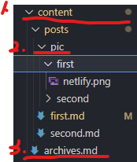

*preword*: I built this static web site for compiling notes of knowledge. I dont want to focus too much on "deeper magic" on website building technology but just write notes. (/smile)

I assume you've installed hugo, git correctly. 

## Resources
[Getting Started With Hugo | FREE COURSE](https://www.youtube.com/watch?v=hjD9jTi_DQ4&t=1455s)

[paperMod theme](https://themes.gohugo.io/themes/hugo-papermod/)


## preknowledge recap 
**quick github recap**.
```md
git remote add <github remote repo name> <repo url (better ssh since it caused several error using http)>  
git remote remove <github remote repo name>
```

## buildup this website
**set up your blog directories**. 
```hugo new site <sitename> -f yml``` will create static website. 

**loading theme**.
Here I am using papermod theme, so I clone their repo into my ./themes/ folder/
```git clone https://github.com/adityatelange/hugo-PaperMod themes/PaperMod --depth=1```

Add in config.yml:
```theme: "PaperMod"``` and theme is automatically set. 

### setup of configuration file. (config.yml)

You can find them in github pages of your own theme's developer. Usually they will give their costomized guidence in their page. Below is my .yml file. 
``` yml 
baseURL: "https://flappyhimself.netlify.app/" # your netlify net 
languageCode: en-us # lang 
title: FlappyHimself 
theme: PaperMod

params: 
  homeInfoParams:
    Title: "hi, here's my notes repo ( ｡ớ ₃ờ) " 

  socialIcons:
    - name: github
      url: "https://github.com/FlappyBob"
    - name: twitter
      url: "https://twitter.com/FlappyHimself"

  cover:
    linkFullImages: true 

  ShowBreadCrumbs: true 

  ShowReadingTime: true

  ShowShareButtons: true   
menu: 
  main:
      - identifier: categories
        name: Categories
        tag: /categories/
        weight:  10
      - identifier: tags
        name: Tags
        tag: /tags/
        weight: 20
      - identifier: archives
        name: Archives
        tag: /archives/
        weight: 30 
```


**content structure.**

``` m

.
├── config.yml
├── content/
│   ├── archives.md   <--- Create archive.md here
│   └── posts/
├── static/
└── themes/
    └── PaperMod/
```

1. mother folder that contains all real data that shows up in one blog.
2. pic (sub folder) that holds picture references in one blog. The directories' names are named as the blog name. 
3. categories' names. 

**How a typical content is made of.**
``` m
---
title: "Notes on how to build up this site using hugo"  
date: 2023-08-22T23:51:11-04:00
draft: false
cover:
    image: first/hello.png
    caption: 'game -- ff14 of my avatar on behalf of getting through 5.x '
tags: ["blog"]
categories: ["blog"]
---
```

### Connect to a real website.  
**netlify service setup**
Netlify is a service that builds up webpage using your existing github repository, and it automatically renews as you push contents to your github repo. 

1. write config as following 


2. write environment variable of your hugo version like below. 


**add a domain name**.  
If you are interested in publishing your website to the public, then posting your knowledge with a customed domain name is a good idea. 


### workflow
Here the workflow becomes smooth as silk.  
1. create markdown flie and find a comfortable text editor  ```hugo new posts/<file name.md>```
2. write a script that upload your recent change, mostly I don't care about the commit message when writing my own blog. (I am windows, so create a .bat file)
``` bat 
git add ./
git commit -m "finish setting"  
git push blog main
```
3. run the script and see changes on your website (usually take a few seconds)
