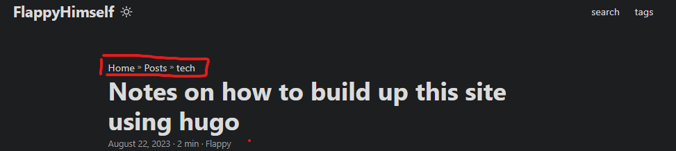
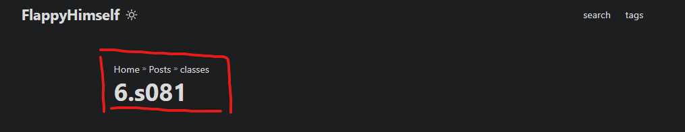
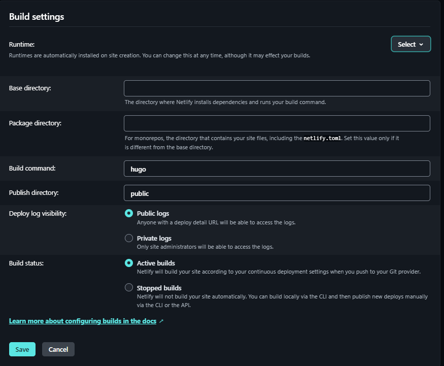

*preword*: I built this static website for compiling notes of knowledge. I dont want to focus too much on "deeper magic" on website-building technology but just write notes about computer science and other types of knowledge. (/smile)

**precondition**: Installed hugo, git  

## Resources
[Getting Started With Hugo | FREE COURSE](https://www.youtube.com/watch?v=hjD9jTi_DQ4&t=1455s)

[paperMod theme](https://themes.gohugo.io/themes/hugo-papermod/)

## preknowledge recap 
**quick github recap**.
```md
git remote add <github remote repo name> <repo url (better ssh since it caused several error using http)>  
git remote remove <github remote repo name>
```

## buildup this website
**set up your blog directories**. 
```hugo new site <sitename> -f yml``` will create static website. 

**loading theme**.
Here I am using papermod theme, so I clone their repo into my ./themes/ folder/
```git clone https://github.com/adityatelange/hugo-PaperMod themes/PaperMod --depth=1```

Add in config.yml:
```theme: "PaperMod"``` and theme is automatically set. 

### setup of configuration file. (config.yml)

You can find them in github pages of your own theme's developer. Below is my .yml file. 
``` yml 
baseURL: "https://flappyhimself.netlify.app/"
languageCode: en-us
title: FlappyHimself
theme: PaperMod

enableInlineShortcodes: true 
enableEmoji: true 
enableRobotsTXT: true 
hasCJKLanguage: true 

buildDrafts: false
buildFuture: false
buildExpired: false
paginate: 15   
minify:
    disableXML: true

permalinks: 
  post: "/:title/"
defaultContentLanguage: en
defaultContentLanguageInSubdir: true

languages:
    en:
      languageName: "English"
      # contentDir: content/english
      weight: 1
      profileMode:
        enabled: true
        title: This is my note compilation. 
        subtitle: "learn and practice"
        imageUrl: "http://p0.itc.cn/q_70/images03/20200905/3c619b233f9f44f6865c919f49b75478.jpeg" 
        imageWidth: 100
        imageHeight: 100
        buttons:
          - name: tech
            url: posts/tech
          - name: life
            url: posts/life
          - name: class
            url: posts/classes
      menu:
        main:
          - identifier: search
            name: search
            url: search
            weight: 1
          - identifier: tags
            name: tags
            url: tags
            weight: 3

outputs:
    home:
        - HTML
        - RSS
        - JSON

params:
    env: production 
    author: Flappy
    defaultTheme: auto  #
    disableThemeToggle: false
    ShowShareButtons: true
    ShowReadingTime: true
    displayFullLangName: true
    ShowPostNavLinks: true
    ShowBreadCrumbs: true
    ShowCodeCopyButtons: true
    hideFooter: false 
    ShowWordCounts: true
    VisitCount: true
    ShowLastMod: true 
    ShowToc: true 
    TocOpen: true 
    comments: true
    
    socialIcons:
        - name: github
          url: "https://github.com/FlappyBob"
        - name: twitter
          url:  "https://twitter.com/FlappyHimself"


fuseOpts:
    isCaseSensitive: false
    shouldSort: true
    location: 0
    distance: 1000
    threshold: 0.4
    minMatchCharLength: 0
    keys: ["title", "permalink", "summary", "content"]
```


**Content structure, and its relationship with config file**
``` m
.
├── config.yml 
├── content/
│   ├── archives.md   <--- Create archive.md here
│   └── posts/ ────│tech  
│                   │
│                   └── first/
│                           └── pic/
│                           └── index.md/
│                   └── second/
│                           └── pic/
│                           └── index.md/
├── static/ ────│tech  
│                   │
│                   └── first/
│                           └── background picture1/
│                   └── second/
│                           └── background picture12/
└── themes/
    └── PaperMod/

``` 

1. content is the mother folder that contains all real data that shows up in one blog.
2. pic (sub folder) that holds picture references in one blog. The directories' names are named as the blog name. 

I usually manage my file strucuture like this:
1. I will split several categories in my posts. Accordingly, **life/ tech/ classes**. (I will split subfolder even further, like **MIT6.s081/ CSAPP** notes in subfolder classes. )
2. Then create _index.md file for each folder that is a mother folder, except the folder that holds the article.
3. In an article folder, there is one index markdown file that contains the artiocle and there is another pic folder that contains the pictures. 
4. I use the static folder to contains cover pictures. 


Below is the example frame that I use. 

**How a typical content is made of.**
``` m
---
title: "How to build up site using hugo"
date: 2023-08-22T23:51:11-04:00
showToc: true # show the directoreis of the article. 
TocOpen: true 
cover:
    image: tech/first/hello.png
    caption: 'game(ff14) -- my avatar on behalf of thinking hard'
tags: 
- "blog"
---
```

### Connect to a real website.  
**netlify service setup**
Netlify is a service that builds up webpage using your existing github repository, and it automatically renews as you push contents to your github repo. 

1. write config as following 



2. write environment variable of your hugo version like below. 


3. **add a domain name**.  


## workflow
Here the workflow becomes smooth as silk.  
1. create markdown flie and find a comfortable text editor  ```hugo new posts/<file name.md>```
2. write a script that upload your recent change, mostly I don't care about the commit message when writing my own blog. (I am windows, so create a .bat file)
``` bat 
git add ./
git commit -m "finish setting"  
git push blog main
```
3. run the script and see changes on your website (usually take a few seconds)