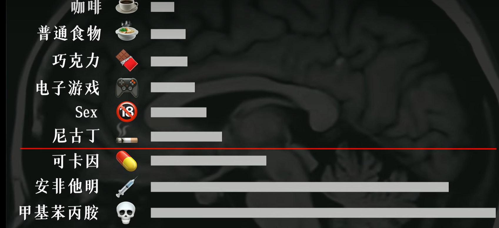
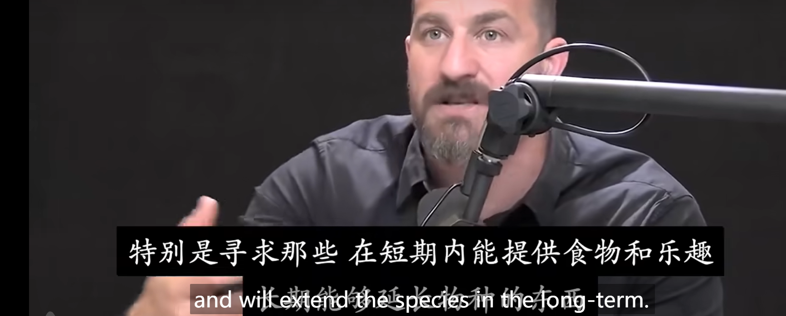

*这篇文章会浅浅总结多巴胺的来源和目的，以及它如何优化我们的生活。*
## 资源
[【快感上瘾?】如何欺骗大脑做困难的事!](https://www.bilibili.com/video/BV1CP4y1H7SB/?vd_source=7e02795fb03862e4a4b16860c697aa69)
[多巴胺 动力、专注力&满足感【Huberman Lab Ep. 39】](https://www.bilibili.com/video/BV1nB4y1Y7jW/?vd_source=7e02795fb03862e4a4b16860c697aa69)

### 引子。
大多数人步入成年之后，最重要的事情就是脱离了父母的管教，成为了自由之身。在这个物欲横流的年代，很多人常常陷入存在主义危机又或是因为失控的奖励系统的危机让自己陷入了财力危机，或是陷入抑郁症的风险。这个时候培养一个严肃地对待周围娱乐的自控系统就相当重要，这是度过众多sustainable，happy的生活的关键。

但是人本质是一个化学物质组成的生物，我们人为的意志可以利用一些造物主的设计来过上幸福和有意义感的人生，这其中关键的一步就是调理好 **多巴胺的水平**。

**最终目的：尽可能地提高多巴胺基准线的水平，并且依旧获得高峰的感觉。**

### 一些多巴胺的机制。
多巴胺主要作用是：唤醒你对某样事物的 **渴望程度**。而肾上腺素几乎是 **能量**的代名词。
*仅仅总结一下Huberman说的结论。*
1. 感性层面上多巴胺释放的程度取决于自己的期望。期望越高，多巴胺释放越多。
``` m
你如果喜欢游泳，那么游泳者除了客观游泳这项活动之外，多巴胺回路会再次被强化。（但是这种强化是可持续性的）
 ```

2. 每个人都客观的存在一个多巴胺基准线。这个基准线决定了一个人对生活的渴望程度。

3. 多巴胺是肾上腺素的原料。肾上腺素会随着多巴胺的增加减少增加减少。
   
4. 基准线和最高点的互动规则：
   a. 基准线会下降到和最高量的长度成正比关系。也就是升得越多，降得越多。（中期内，长期依旧会回复到原来的基准线）
    为什么？ （原因是：多巴胺存在一个叫做多巴胺池的地方，而它剩余的量和释放出来的量必须形成一个稳定的状态，否则就是缺乏的状态）

**一些造物主的规则**。造物主制定了这些规则导致了多巴胺系统和我们行为的互动。
1. 物质层面上与生活息息相关的几种典型的行为会短暂提升多巴胺基准线水平。

* 咖啡因。
TODO

### 多巴胺从何而来？
从远古时期人类的多巴胺系统是一个很好的适应狩猎生存的系统，据研究发现大多数哺乳动物都有多巴胺系统。在Hurberman教授的播客中，Huberman说这种机制是为了更好地让人类的种族存活下来的设计。多巴胺的提升能让人注意到能量丰富的果子，吃完之后就会有“愉悦”的感觉，人们会记住这种感觉，同时也会陷入更加饥饿的时候，多巴胺基准线又下降了，这样吃一个果子后，人又会觉得非常好。这一切都是造物主根据文明史前的环境设计出的我们的人体。

*btw，生物系统真的是如果背后真的有一个设计者的至高意志存在的话，那真的是非常的精妙。*




### 那么如何优化？
这是重头戏。有用的知识才是我写这个博客的最大的目的。

**多洗冷水澡。**这个是0成本提升自己多巴胺水平的最好方法。
